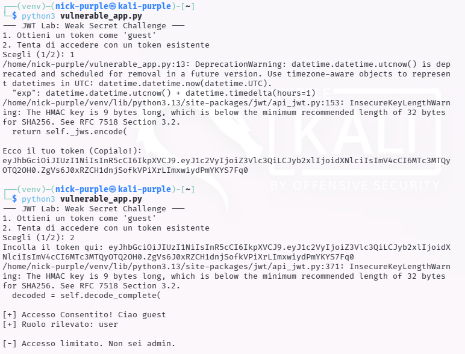
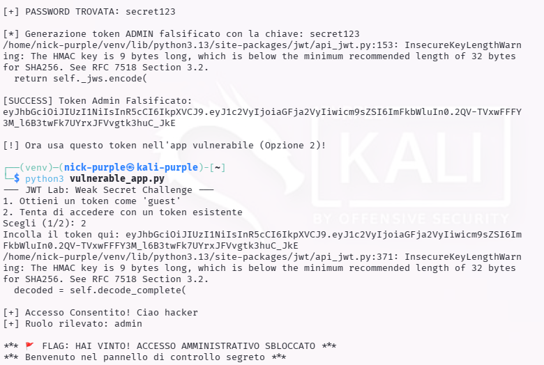

# JWT Authentication Mechanism

---

## 1 Executive Summary

Durante l'analisi del meccanismo di autenticazione dell'applicazione target, è stata individuata una vulnerabilità critica nella gestione dei token di sessione (JWT - JSON Web Tokens).

L'applicazione utilizza una chiave segreta debole ("Weak Secret") per firmare digitalmente i token. Questo ha permesso all'analista di effettuare un attacco di forza bruta offline, recuperare la chiave segreta e generare token arbitrari.

Impatto: Un attaccante può impersonare qualsiasi utente, incluso l'amministratore, ottenendo il controllo completo dell'applicazione (Privilege Escalation & Account Takeover).

---

## 2 Dettagli Tecnici della Vulnerabilità
Descrizione

L'applicazione rilascia token JWT firmati con l'algoritmo HS256 (HMAC con SHA-256). Questo è un algoritmo simmetrico, il che significa che la stessa chiave viene usata sia per firmare che per verificare il token.

La sicurezza di HS256 dipende interamente dalla complessità della chiave segreta (`SECRET_KEY`). L'analisi ha rivelato che la chiave utilizzata era una stringa semplice presente in comuni dizionari di password (`secret123`).

Vettore d'Attacco

- Raccolta: L'attaccante richiede un token legittimo come utente "guest".



- Analisi: Il token viene analizzato. L'header {`"alg": "HS256"`} conferma l'uso di crittografia simmetrica.
- Cracking: Viene lanciato uno script di brute-force (`jwt_cracker.py`) che tenta di verificare la firma del token usando un elenco di password comuni.


- Forging (Falsificazione): Una volta trovata la password (`secret123`), l'attaccante modifica il payload del token cambiando il ruolo da `user` a `admin` e ricalcola la firma valida.

Proof of Concept (PoC)

Token Originale (Guest):

```JSON
Header: {"alg": "HS256", "typ": "JWT"}
Payload: {"user": "guest", "role": "user"}
Signature: [Firma valida con 'secret123']
```

Token Falsificato (Admin):

```JSON
Header: {"alg": "HS256", "typ": "JWT"}
Payload: {"user": "hacker", "role": "admin"}  <-- MODIFICATO
Signature: [Nuova firma calcolata dall'attaccante]
```

Quando il token falsificato viene inviato all'applicazione, questa lo accetta come autentico e garantisce i privilegi amministrativi, mostrando il messaggio: FLAG: HAI VINTO! .



---

## 3 Root Cause Analysis (Codice Vulnerabile)

Di seguito l'analisi del codice Python responsabile della vulnerabilità.

Codice Vulnerabile (Hardcoded Weak Secret)

L'errore risiede nell'utilizzo di una stringa breve, prevedibile e hardcodata nel codice sorgente.

```Python
# VULNERABILE
import jwt

# 1. La chiave è troppo breve e semplice (suscettibile a brute-force)
# 2. La chiave è hardcodata nel codice (visibile se il codice trapela)
SECRET_KEY = "secret123" 

def create_token(user):
    payload = {"user": user, "role": "user"}
    return jwt.encode(payload, SECRET_KEY, algorithm="HS256")
```

---

## 4 Remediation (Secure Coding)

Per mitigare questa vulnerabilità, si raccomandano due approcci possibili.

#### Soluzione A: Strong Secret (Se si mantiene HS256)

Se si deve usare HS256, la chiave deve essere una stringa casuale ad alta entropia (minimo 32-64 caratteri) e non deve mai essere scritta nel codice, ma caricata da variabili d'ambiente.

```Python
# SICURO (Approccio Simmetrico)
import jwt
import os

# Carica la chiave dalle variabili d'ambiente o genera un errore
# In produzione: export JWT_SECRET='lunga_stringa_casuale_e_complessa_!@#123'
SECRET_KEY = os.environ.get("JWT_SECRET")

if not SECRET_KEY or len(SECRET_KEY) < 32:
    raise ValueError("La chiave segreta JWT è assente o troppo debole!")

def create_token(user):
    # ... logica uguale ...
```

#### Soluzione B: Crittografia Asimmetrica (RS256) - Consigliata

L'approccio migliore per sistemi distribuiti è usare una coppia di chiavi (Privata per firmare, Pubblica per verificare). Anche se un attaccante trova la chiave pubblica, non può creare nuovi token.

```Python
# SICURO (Approccio Asimmetrico)
# private_key.pem -> Usata SOLO dal server di autenticazione per FIRMARE
# public_key.pem  -> Distribuita ai servizi per VERIFICARE

with open("private_key.pem", "rb") as f:
    PRIVATE_KEY = f.read()

def create_token(user):
    payload = {"user": user, "role": "user"}
    # RS256 usa la chiave privata
    return jwt.encode(payload, PRIVATE_KEY, algorithm="RS256")
```

---

## 5 Conclusioni

L'utilizzo di "secret" deboli nei JWT vanifica l'intero scopo della firma crittografica. La facilità con cui è possibile eseguire il brute-force offline (senza allertare il server con traffico di rete) rende questa vulnerabilità estremamente pericolosa.

Si raccomanda l'immediata rotazione delle chiavi crittografiche e l'adozione di variabili d'ambiente per la gestione dei segreti.