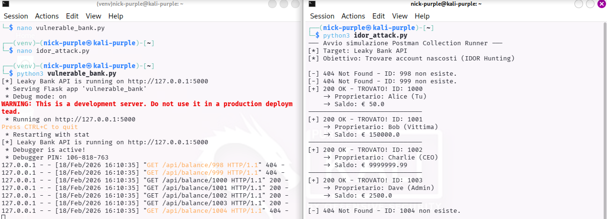

# API Broken Object Level Authorization (BOLA/IDOR)

---

## 1 Executive Summary

Durante l'attività di Security Assessment condotta sulle API dell'applicazione bancaria target, è stata individuata una vulnerabilità critica di tipo IDOR (Insecure Direct Object Reference), classificata nella OWASP API Top 10 come API1:2023 - Broken Object Level Authorization.

L'API permette di accedere ai dettagli del conto corrente (saldo, IBAN, nome proprietario) semplicemente conoscendo o indovinando l'ID numerico del conto.

Utilizzando tecniche di automazione (simulazione Postman Collection Runner), è stato possibile enumerare ed esfiltrare i dati finanziari di tutti gli utenti presenti nel database, inclusi conti privilegiati (CEO/Admin), senza alcuna autorizzazione.

Impatto di Business: Violazione massiva della privacy (GDPR), perdita di dati finanziari, danno reputazionale irreparabile.

---

## 2 Dettagli Tecnici della Vulnerabilità
Descrizione

L'endpoint `/api/balance/<account_id>` accetta un parametro intero (`account_id`) nell'URL per identificare la risorsa da restituire.

Il backend non verifica se l'utente che effettua la richiesta è effettivamente il proprietario di quel conto. Si affida esclusivamente all'input fornito dal client.

Vettore d'Attacco

- Discovery: L'analista ha identificato l'endpoint tramite analisi della documentazione o traffico di rete.
- Test Manuale: È stato verificato che cambiando l'ID da `1000` (utente legittimo) a `1001`, l'API restituiva i dati di un altro utente invece di un errore "403 Forbidden".
- Automazione (Fuzzing): È stato utilizzato uno script di automazione (equivalente a Postman Collection Runner) per iterare un range di ID (da 998 a 1005).

Proof of Concept (PoC) & Evidenze

L'attacco automatizzato ha permesso di esfiltrare i seguenti dati sensibili in pochi millisecondi:

- ID 1001: Bob (Vittima) - Saldo: € 150.000
- ID 1002: Charlie (CEO) - Saldo: € 9.999.999
- ID 1003: Dave (Admin) - Saldo: € 2.500



---

## 3 Root Cause Analysis (Codice Vulnerabile)

Analisi del codice sorgente (`vulnerable_bank.py`) che ha causato la falla.

Il problema risiede nella mancanza di un controllo di autorizzazione (Authorization Check) prima di restituire l'oggetto.

```Python
@app.route('/api/balance/<int:account_id>', methods=['GET'])
def get_balance(account_id):
    # ERRORE: L'API si fida ciecamente dell'ID passato nell'URL.
    # Non c'è nessun controllo su CHI sta facendo la richiesta.
    account = accounts.get(account_id)
    
    if account:
        return jsonify(account) # Restituisce i dati a chiunque!
```

---

## 4 Remediation (Secure Coding)

Per correggere questa vulnerabilità, è necessario implementare un meccanismo di controllo degli accessi basato sull'identità dell'utente loggato (Session o JWT).

L'API deve confrontare l'ID richiesto con l'ID dell'utente autenticato.

```Python
# IPOTESI: Usiamo una libreria come Flask-Login o JWT Extended
from flask_jwt_extended import get_jwt_identity, jwt_required

@app.route('/api/balance/<int:requested_account_id>', methods=['GET'])
@jwt_required()  # 1. Richiede che l'utente sia loggato
def get_balance_SECURE(requested_account_id):
    
    # 2. Otteniamo l'ID dell'utente che sta facendo la richiesta (dal Token/Sessione)
    current_user_id = get_jwt_identity() 
    
    # 3. CONTROLLO DI SICUREZZA (Authorization Check)
    # "L'utente loggato È il proprietario del conto richiesto?"
    if current_user_id != requested_account_id:
        # Se prova a chiedere un ID diverso dal suo -> BLOCCO
        return jsonify({"error": "Forbidden: You cannot access this account"}), 403

    # Se il controllo passa, restituisci i dati
    account = accounts.get(requested_account_id)
    return jsonify(account)
```

Raccomandazioni aggiuntive:

- Use UUIDs: Sostituire gli ID sequenziali (1000, 1001...) con UUID (`es. a1b2-c3d4...`). Questo rende impossibile per un attaccante "indovinare" il numero del conto successivo (Enumeration defense), anche se non risolve il problema di autorizzazione alla radice.
- Rate Limiting: Implementare un limite alle richieste (es. 10 richieste al minuto) per bloccare tentativi di scansione automatizzata come quello effettuato con Postman/Python.

---

## 5 Conclusioni

La vulnerabilità IDOR rilevata è critica e permette la totale compromissione della riservatezza dei dati bancari. L'assenza di controlli di autorizzazione orizzontale è un errore comune ma devastante.

Si raccomanda il deploy immediato della patch proposta (Controllo di Ownership) e l'esecuzione di un nuovo ciclo di test con Postman per verificare la risoluzione.