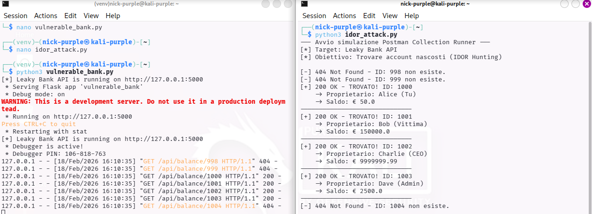

> [English](README.en.md) | **Italiano**

# API Broken Object Level Authorization (BOLA/IDOR)

> - **Fase:** Web Attack - API Security (REST/IDOR)
> - **Visibilita:** Bassa - richieste HTTP legittime verso endpoint autenticato, solo l'ID risorsa cambia
> - **Prerequisiti:** Account utente valido con accesso all'API, endpoint che accetta ID risorsa nel path URL, token di autenticazione
> - **Output:** Accesso ai dati finanziari di tutti gli utenti (saldo, IBAN), esfiltrazione massiva, violazione GDPR, finding WEB-014

---

**ID Finding:** `WEB-014` | **Severity:** `Critico` | **CVSS v3.1:** 9.1

---

## 1 Executive Summary

Durante l'attività di Security Assessment condotta sulle API dell'applicazione bancaria target, è stata individuata una vulnerabilità critica di tipo IDOR (Insecure Direct Object Reference), classificata nella OWASP API Top 10 come API1:2023 - Broken Object Level Authorization.

L'API permette di accedere ai dettagli del conto corrente (saldo, IBAN, nome proprietario) semplicemente conoscendo o indovinando l'ID numerico del conto.

Utilizzando tecniche di automazione (simulazione Postman Collection Runner), è stato possibile enumerare ed esfiltrare i dati finanziari di tutti gli utenti presenti nel database, inclusi conti privilegiati (CEO/Admin), senza alcuna autorizzazione.

Impatto di Business: Violazione massiva della privacy (GDPR), perdita di dati finanziari, danno reputazionale irreparabile.

---

## 2 Dettagli Tecnici della Vulnerabilità
Descrizione

L'endpoint `/api/balance/<account_id>` accetta un parametro intero (`account_id`) nell'URL per identificare la risorsa da restituire.

Il backend non verifica se l'utente che effettua la richiesta è effettivamente il proprietario di quel conto. Si affida esclusivamente all'input fornito dal client.

Vettore d'Attacco

- Discovery: L'analista ha identificato l'endpoint tramite analisi della documentazione o traffico di rete.
- Test Manuale: È stato verificato che cambiando l'ID da `1000` (utente legittimo) a `1001`, l'API restituiva i dati di un altro utente invece di un errore "403 Forbidden".
- Automazione (Fuzzing): È stato utilizzato uno script di automazione (equivalente a Postman Collection Runner) per iterare un range di ID (da 998 a 1005).

Proof of Concept (PoC) & Evidenze

L'attacco automatizzato ha permesso di esfiltrare i seguenti dati sensibili in pochi millisecondi:

- ID 1001: Bob (Vittima) - Saldo: € 150.000
- ID 1002: Charlie (CEO) - Saldo: € 9.999.999
- ID 1003: Dave (Admin) - Saldo: € 2.500



---

## 3 Root Cause Analysis (Codice Vulnerabile)

Analisi del codice sorgente (`vulnerable_bank.py`) che ha causato la falla.

Il problema risiede nella mancanza di un controllo di autorizzazione (Authorization Check) prima di restituire l'oggetto.

```Python
@app.route('/api/balance/<int:account_id>', methods=['GET'])
def get_balance(account_id):
    # ERRORE: L'API si fida ciecamente dell'ID passato nell'URL.
    # Non c'è nessun controllo su CHI sta facendo la richiesta.
    account = accounts.get(account_id)
    
    if account:
        return jsonify(account) # Restituisce i dati a chiunque!
```

---

## 4 Remediation (Secure Coding)

Per correggere questa vulnerabilità, è necessario implementare un meccanismo di controllo degli accessi basato sull'identità dell'utente loggato (Session o JWT).

L'API deve confrontare l'ID richiesto con l'ID dell'utente autenticato.

```Python
# IPOTESI: Usiamo una libreria come Flask-Login o JWT Extended
from flask_jwt_extended import get_jwt_identity, jwt_required

@app.route('/api/balance/<int:requested_account_id>', methods=['GET'])
@jwt_required()  # 1. Richiede che l'utente sia loggato
def get_balance_SECURE(requested_account_id):
    
    # 2. Otteniamo l'ID dell'utente che sta facendo la richiesta (dal Token/Sessione)
    current_user_id = get_jwt_identity() 
    
    # 3. CONTROLLO DI SICUREZZA (Authorization Check)
    # "L'utente loggato È il proprietario del conto richiesto?"
    if current_user_id != requested_account_id:
        # Se prova a chiedere un ID diverso dal suo -> BLOCCO
        return jsonify({"error": "Forbidden: You cannot access this account"}), 403

    # Se il controllo passa, restituisci i dati
    account = accounts.get(requested_account_id)
    return jsonify(account)
```

Raccomandazioni aggiuntive:

- Use UUIDs: Sostituire gli ID sequenziali (1000, 1001...) con UUID (`es. a1b2-c3d4...`). Questo rende impossibile per un attaccante "indovinare" il numero del conto successivo (Enumeration defense), anche se non risolve il problema di autorizzazione alla radice.
- Rate Limiting: Implementare un limite alle richieste (es. 10 richieste al minuto) per bloccare tentativi di scansione automatizzata come quello effettuato con Postman/Python.

---

## 5 Conclusioni

La vulnerabilità IDOR rilevata è critica e permette la totale compromissione della riservatezza dei dati bancari. L'assenza di controlli di autorizzazione orizzontale è un errore comune ma devastante.

Si raccomanda il deploy immediato della patch proposta (Controllo di Ownership) e l'esecuzione di un nuovo ciclo di test con Postman per verificare la risoluzione.

---

## Analisi a Basso Livello: IDOR/BOLA e Authorization Patterns

### Perche IDOR e la Vulnerabilita #1 nelle API (OWASP API Top 10:2023)

```
Architettura di una richiesta API con IDOR:

Client (Alice, user_id=1000):
GET /api/balance/1001         <- richiede dati di Bob (user_id=1001)
Authorization: Bearer <token_alice>

Server VULNERABILE:
1. Verifica: token valido? -> Si (Alice e autenticata)
2. Legge account_id dal path -> 1001
3. Query: SELECT * FROM accounts WHERE id = 1001
4. Restituisce dati di Bob -> {name: "Bob", balance: 150000}
   ERRORE: non ha verificato se Alice == proprietario di 1001

Server SICURO:
1. Verifica: token valido? -> Si (Alice e autenticata)
2. Estrae user_id dal token -> 1000
3. Legge account_id dal path -> 1001
4. Verifica: 1000 == 1001? -> NO
5. Restituisce 403 Forbidden
```

### Pattern di ID Predicibili vs UUID

```
ID Sequenziali (vulnerabili a enumeration):
/api/balance/1000  -> Alice
/api/balance/1001  -> Bob
/api/balance/1002  -> Charlie
Pattern: +1 per ogni nuovo account -> facile da iterare

UUID v4 (resistenti a enumeration):
/api/balance/550e8400-e29b-41d4-a716-446655440000  -> Alice
/api/balance/6ba7b810-9dad-11d1-80b4-00c04fd430c8  -> Bob
Pattern: 2^122 combinazioni possibili -> impossibile da indovinare

ATTENZIONE: UUID non risolve IDOR, solo l'enumeration.
Se l'attaccante ottiene l'UUID di Bob (da un altro leak),
puo comunque accedere ai dati senza authorization check.
La vera fix e SEMPRE il controllo di ownership lato server.
```

### Automazione del Fuzzing IDOR con Collection Runner

```
Postman Collection Runner (o equivalente curl loop):

1. Creare una Collection con la richiesta:
   GET /api/balance/{{account_id}}
   Authorization: Bearer <token>

2. Creare un Data File (CSV):
   account_id
   998
   999
   1000
   1001
   1002
   ...

3. Runner esegue N iterazioni (una per riga CSV)
4. Risultato: tabella con tutte le risposte

Equivalente curl:
for id in $(seq 998 1005); do
  echo "=== Account $id ==="
  curl -s -H "Authorization: Bearer $TOKEN" \
    http://target/api/balance/$id | python3 -m json.tool
done
```

---

## Esperienza di Laboratorio

L'automazione con il Collection Runner (simulato via script) ha dimostrato la velocita con cui un attaccante puo esfiltrare tutti i dati: 8 account in meno di un secondo. In un'applicazione reale con migliaia di utenti, lo stesso script con `seq 1 100000` esfilerebbe l'intero database in pochi minuti, generando traffico indistinguibile da richieste legittime (stesso endpoint, stesso formato, stesso token valido).

La scoperta dell'account CEO (ID 1002, saldo 9.999.999 EUR) ha evidenziato l'impatto reale dell'IDOR: non si tratta solo di leggere i dati di altri utenti, ma di accedere a informazioni finanziarie di dirigenti con account privilegiati. In un contesto bancario reale, questo sarebbe sufficiente per insider trading, estorsione, o vendita di informazioni sul dark market.

Il codice vulnerabile (`accounts.get(account_id)` senza ownership check) e un pattern molto comune nei backend Flask/Express/Django: il framework gestisce l'autenticazione (chi sei?) ma non l'autorizzazione (a cosa puoi accedere?). La fix richiede esattamente 3 righe di codice aggiuntive (estrai user_id dal token, confronta con account_id richiesto, ritorna 403 se diversi), ma la sua assenza espone l'intero database utenti.

---

## Mappatura MITRE ATT&CK

| Tattica | Tecnica | ID MITRE | Descrizione dell'Azione |
| :--- | :--- | :--- | :--- |
| Discovery | Account Discovery | `T1087` | Enumerazione degli ID account sull'endpoint `/api/balance/<id>` da 998 a 1005 per mappare tutti gli utenti presenti nel sistema (WEB-014) |
| Collection | Data from Information Repositories | `T1213` | Accesso ai dati finanziari sensibili (saldo, nome) di Bob, Charlie/CEO e Dave/Admin senza alcuna autorizzazione tramite IDOR (WEB-014) |
| Lateral Movement | Valid Accounts | `T1078` | Utilizzo del token di autenticazione di un utente ordinario per accedere ai dati di account con privilegi superiori (CEO, Admin) (WEB-014) |

---

> **Nota:** Il finding WEB-014 e stato documentato su un'applicazione Flask/Python di laboratorio
> locale (`vulnerable_bank.py`) sviluppata per simulare un'API bancaria vulnerabile. L'IDOR/BOLA
> e la vulnerabilita numero 1 nell'OWASP API Top 10:2023 per frequenza e impatto. La sua semplicita
> di exploitation (cambiare un numero nell'URL) contrasta con la gravita dell'impatto: violazione
> massiva GDPR e reputazionale per l'organizzazione colpita.