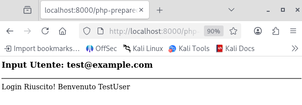
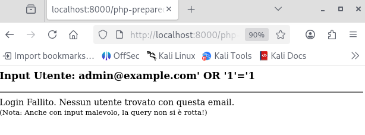

> **English** | [Italiano](README.md)

# SQL Injection - Post-Remediation Verification

> - **Phase:** Secure Coding - Post-Remediation Verification (SQL Injection)
> - **Visibility:** Zero - local test on PHP application with local SQLite/MySQL database
> - **Prerequisites:** Vulnerable code identified, fix implemented with Prepared Statements (PDO), test environment configured
> - **Output:** Confirmation that the SQLi payload no longer bypasses authentication, secure code documented with technical explanation

---

## 1 Executive Summary

Previously, the login module was vulnerable to SQL Injection, allowing an attacker to manipulate database queries and gain administrative access without valid credentials.

A fix based on Prepared Statements (PDO) was implemented. Verification tests confirm that SQL command injection is no longer possible.

---

## 2 Fix Details (Secure Coding)

#### Before (Vulnerable)

The code directly concatenated user input into the SQL string. The database could not distinguish between the legitimate command and the malicious data.

```PHP
// CODICE INSICURO
$sql = "SELECT * FROM users WHERE email = '" . $_POST['email'] . "'";
// Risultato query: SELECT * FROM users WHERE email = 'admin' OR '1'='1'
```



#### After (Secure - Prepared Statements)

The PDO Prepared Statements pattern was adopted.

The query is sent to the database with placeholders (`:email`), and the data is sent separately ("Bind"). This way, any input is treated strictly as text, never as an executable command.

```PHP
// CODICE SICURO IMPLEMENTATO
$stmt = $pdo->prepare("SELECT ... FROM users WHERE email = :email");
$stmt->execute(['email' => $user_email]);
```

---

## 3 Verification (Proof of Defense)

A manual penetration test was conducted against the patched code to verify the resilience of the fix.

- Attack Vector: URL/GET Parameter
- Injected Payload: `admin@example.com' OR '1'='1`
- Attack Objective: Bypass authentication by making the SQL condition always true (`1=1`).

Test Result:

- User Input: `admin@example.com' OR '1'='1`
    
    Server Result: `Login Failed. No user found with this email.`



Analysis:

The system interpreted the entire payload `' OR '1'='1` as part of the literal email address, searching for it in the database. Since no user has that email, access was correctly denied.

The attack was neutralized.

---

## 4 Conclusions

The implementation of Prepared Statements has completely eliminated the attack surface for SQL Injection on this endpoint.

The code is now compliant with OWASP security standards.

---

## MITRE ATT&CK Mapping

| Tactic | Technique | MITRE ID | Description (Defensive - Mitigation) |
| :--- | :--- | :--- | :--- |
| (Mitigation) | Exploit Public-Facing Application | `T1190` | Implementation of PDO Prepared Statements that separates the SQL structure from user data, completely neutralizing the SQL Injection vector (CWE-89) |

---

> **Note:** The documented fix (PDO Prepared Statements) is the standard remediation pattern
> recommended by OWASP for SQL Injection. The proof of effectiveness (Proof of Defense) demonstrates
> that the payload `admin@example.com' OR '1'='1` is now treated as literal text,
> correctly failing authentication. Re-testing after every patch is a fundamental practice
> in the DevSecOps cycle.
