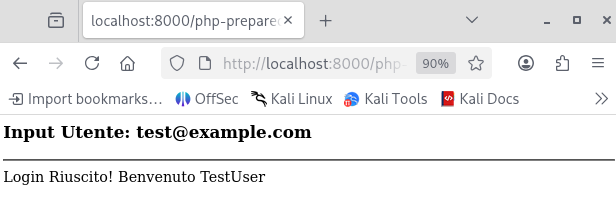
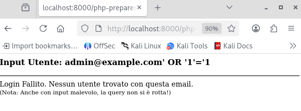

# SQL Injection

---

## 1 Executive Summary

In precedenza, il modulo di login era vulnerabile a SQL Injection, permettendo a un attaccante di manipolare le query al database e ottenere l'accesso amministrativo senza credenziali valide.

È stata implementata una correzione basata su Prepared Statements (PDO). I test di verifica confermano che l'iniezione di comandi SQL non è più possibile.

---

## 2 Dettagli della Correzione (Secure Coding)

#### Prima (Vulnerabile)

Il codice concatenava direttamente l'input utente nella stringa SQL. Il database non poteva distinguere tra il comando legittimo e i dati malevoli.

```PHP
// CODICE INSICURO
$sql = "SELECT * FROM users WHERE email = '" . $_POST['email'] . "'";
// Risultato query: SELECT * FROM users WHERE email = 'admin' OR '1'='1'
```



#### Dopo (Sicuro - Prepared Statements)

È stato adottato il pattern PDO Prepared Statements.

La query viene inviata al database con dei segnaposto (`:email`), e i dati vengono inviati separatamente ("Bind"). In questo modo, qualsiasi input viene trattato rigorosamente come testo, mai come comando eseguibile.

```PHP
// CODICE SICURO IMPLEMENTATO
$stmt = $pdo->prepare("SELECT ... FROM users WHERE email = :email");
$stmt->execute(['email' => $user_email]);
```

---

## 3 Verifica (Proof of Defense)

È stato condotto un test di penetrazione manuale contro il codice patchato per verificare la resilienza della correzione.

- Vettore d'Attacco: URL/GET Parameter
- Payload Iniettato: `admin@example.com' OR '1'='1`
- Obiettivo Attacco: Bypassare l'autenticazione rendendo la condizione SQL sempre vera (`1=1`).

Risultato del Test:

- Input Utente: `admin@example.com' OR '1'='1`
    
    Risultato Server: `Login Fallito. Nessun utente trovato con questa email.`



Analisi:

Il sistema ha interpretato l'intero payload `' OR '1'='1` come parte dell'indirizzo email letterale, cercandolo nel database. Poiché nessun utente ha quell'email, l'accesso è stato negato correttamene.

L'attacco è stato neutralizzato.

---

## 4 Conclusioni

L'implementazione dei Prepared Statements ha eliminato completamente la superficie di attacco per SQL Injection su questo endpoint.

Il codice è ora conforme agli standard di sicurezza OWASP.