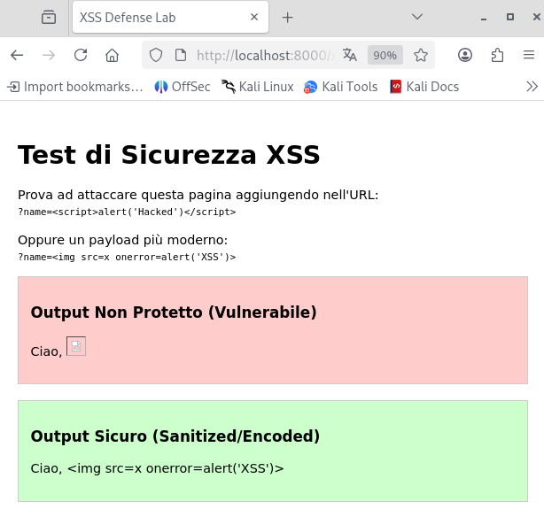

# Cross-Site Scripting (XSS)

---

## 1 Executive Summary

Durante l'analisi del codice sorgente dell'applicazione web, è stata individuata una vulnerabilità di tipo Reflected XSS nel parametro GET `name`.

Questa vulnerabilità permetteva a un attaccante di iniettare codice JavaScript arbitrario che veniva eseguito nel browser della vittima.

È stata implementata una correzione basata su Output Encoding (codifica dell'output). I test confermano che il codice malevolo viene ora neutralizzato e visualizzato come testo innocuo.

---

## 2 Analisi della Vulnerabilità

Descrizione Tecnica

L'applicazione accettava input utente tramite l'URL e lo stampava direttamente nella pagina HTML senza alcuna sanificazione o codifica. Questo permetteva al browser di interpretare i caratteri speciali (`<`, `>`, `"`) come tag HTML validi.

Vettore d'Attacco (Proof of Concept)

- Endpoint: `http://localhost:8000/xss-defense.php`
- Parametro Vulnerabile: `name`
- Payload: `<script>alert('Hacked')</script>` oppure ``


Evidenza dell'Attacco:

L'esecuzione del payload ha generato un popup JavaScript ("Hacked"), confermando l'esecuzione di codice non autorizzato nel contesto del browser.

---

## 3 Root Cause Analysis (Codice Vulnerabile)

Il difetto risiedeva nell'uso dell'istruzione `echo` direttamente su una variabile controllata dall'utente.

```PHP
<div class="box bad">
    <p>Ciao, <?php echo $_GET['name']; ?></p>
</div>
```

L'input `<script>...` viene scritto tal quale nel DOM, attivando l'esecuzione.

---

## 4 Remediation (Secure Coding)

Per mitigare la vulnerabilità, è stata applicata la tecnica di Context-Aware Output Encoding.

In PHP, questo si ottiene utilizzando la funzione `htmlspecialchars()`, che converte i caratteri speciali in Entità HTML (es. `<` diventa `&lt;`).

```PHP
<div class="box good">
    <p>Ciao, 
    <?php 
        // Converte i caratteri speciali in entità HTML sicure
        echo htmlspecialchars($_GET['name'], ENT_QUOTES, 'UTF-8'); 
    ?>
    </p>
</div>
```

---

## 5 Verifica della Correzione (Verification)

È stato rieseguito lo stesso attacco contro il blocco di codice patchato.

- Test: Iniezione del payload ``.
- Risultato Atteso: Il codice JavaScript non deve essere eseguito.
- Risultato Ottenuto: Il browser ha visualizzato il payload come semplice testo. Non è apparso alcun popup e il layout della pagina non è stato compromesso.




Evidenza della Mitigazione:

Lo screenshot mostra chiaramente la differenza: il box rosso (vulnerabile) mostra un'icona di errore (tentativo di esecuzione), mentre il box verde (sicuro) mostra la stringa testuale sanificata.

---

## 6 Conclusioni

L'implementazione di `htmlspecialchars()` ha eliminato efficacemente la vulnerabilità XSS su questo endpoint. Il sistema ora tratta l'input utente come dati (testo) e non come codice eseguibile.

Si raccomanda di estendere questa pratica di "Output Encoding" a tutte le variabili stampate nell'applicazione.