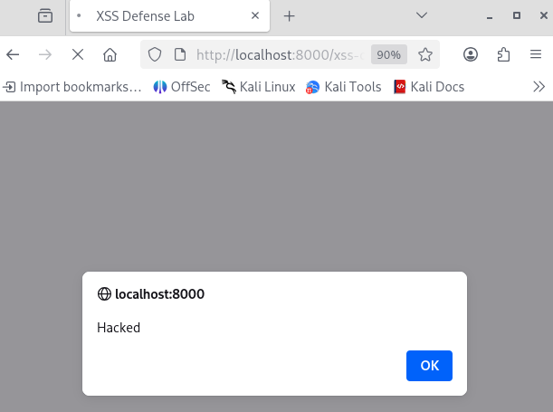
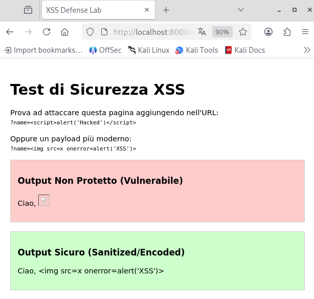

> [English](README.en.md) | **Italiano**

# Cross-Site Scripting (XSS) - Post-Remediation Verification

> - **Fase:** Secure Coding - XSS Mitigation (Output Encoding)
> - **Visibilita:** Zero - analisi locale e test in ambiente PHP locale (`localhost:8000`)
> - **Prerequisiti:** Codice vulnerabile identificato (echo diretto), fix implementato con `htmlspecialchars()`, server PHP locale per i test
> - **Output:** Conferma che il payload XSS non viene piu eseguito ma visualizzato come testo sicuro, codice sicuro documentato

---

## 1 Executive Summary

Durante l'analisi del codice sorgente dell'applicazione web, è stata individuata una vulnerabilità di tipo Reflected XSS nel parametro GET `name`.

Questa vulnerabilità permetteva a un attaccante di iniettare codice JavaScript arbitrario che veniva eseguito nel browser della vittima.

È stata implementata una correzione basata su Output Encoding (codifica dell'output). I test confermano che il codice malevolo viene ora neutralizzato e visualizzato come testo innocuo.

---

## 2 Analisi della Vulnerabilità

Descrizione Tecnica

L'applicazione accettava input utente tramite l'URL e lo stampava direttamente nella pagina HTML senza alcuna sanificazione o codifica. Questo permetteva al browser di interpretare i caratteri speciali (`<`, `>`, `"`) come tag HTML validi.

Vettore d'Attacco (Proof of Concept)

- Endpoint: `http://localhost:8000/xss-defense.php`
- Parametro Vulnerabile: `name`
- Payload: `<script>alert('Hacked')</script>` oppure ``



Evidenza dell'Attacco:

L'esecuzione del payload ha generato un popup JavaScript ("Hacked"), confermando l'esecuzione di codice non autorizzato nel contesto del browser.

---

## 3 Root Cause Analysis (Codice Vulnerabile)

Il difetto risiedeva nell'uso dell'istruzione `echo` direttamente su una variabile controllata dall'utente.

```PHP
<div class="box bad">
    <p>Ciao, <?php echo $_GET['name']; ?></p>
</div>
```

L'input `<script>...` viene scritto tal quale nel DOM, attivando l'esecuzione.

---

## 4 Remediation (Secure Coding)

Per mitigare la vulnerabilità, è stata applicata la tecnica di Context-Aware Output Encoding.

In PHP, questo si ottiene utilizzando la funzione `htmlspecialchars()`, che converte i caratteri speciali in Entità HTML (es. `<` diventa `&lt;`).

```PHP
<div class="box good">
    <p>Ciao, 
    <?php 
        // Converte i caratteri speciali in entità HTML sicure
        echo htmlspecialchars($_GET['name'], ENT_QUOTES, 'UTF-8'); 
    ?>
    </p>
</div>
```

---

## 5 Verifica della Correzione (Verification)

È stato rieseguito lo stesso attacco contro il blocco di codice patchato.

- Test: Iniezione del payload ``.
- Risultato Atteso: Il codice JavaScript non deve essere eseguito.
- Risultato Ottenuto: Il browser ha visualizzato il payload come semplice testo. Non è apparso alcun popup e il layout della pagina non è stato compromesso.




Evidenza della Mitigazione:

Lo screenshot mostra chiaramente la differenza: il box rosso (vulnerabile) mostra un'icona di errore (tentativo di esecuzione), mentre il box verde (sicuro) mostra la stringa testuale sanificata.

---

## 6 Conclusioni

L'implementazione di `htmlspecialchars()` ha eliminato efficacemente la vulnerabilità XSS su questo endpoint. Il sistema ora tratta l'input utente come dati (testo) e non come codice eseguibile.

Si raccomanda di estendere questa pratica di "Output Encoding" a tutte le variabili stampate nell'applicazione.

---

## Analisi a Basso Livello: Output Encoding e Context-Aware Defense

### Come htmlspecialchars() Neutralizza il Payload

La funzione trasforma i caratteri pericolosi in HTML entities che il browser renderizza come testo:

```
Input attaccante: <script>alert('XSS')</script>
    |
    v
htmlspecialchars($input, ENT_QUOTES, 'UTF-8'):
    < -> &lt;
    > -> &gt;
    " -> &quot;
    ' -> &#039;
    & -> &amp;
    |
    v
Output nel DOM: &lt;script&gt;alert(&#039;XSS&#039;)&lt;/script&gt;
    |
    v
Browser renderizza: <script>alert('XSS')</script>  (come TESTO visibile)
Il tag <script> NON viene interpretato come codice
```

### Framework con Auto-Escaping

I framework moderni applicano l'encoding automaticamente, eliminando il rischio di dimenticanze:

| Framework | Sintassi sicura (auto-escaped) | Sintassi pericolosa (raw) |
| :--- | :--- | :--- |
| **Twig** (PHP) | `{{ name }}` | `{{ name\|raw }}` |
| **Blade** (Laravel) | `{{ $name }}` | `{!! $name !!}` |
| **React** (JSX) | `<p>{name}</p>` | `dangerouslySetInnerHTML` |
| **Jinja2** (Python) | `{{ name }}` | `{{ name\|safe }}` |
| **Django** | `{{ name }}` | `{{ name\|safe }}` |

La regola: usare sempre la sintassi di default (auto-escaped). La sintassi raw deve essere giustificata e il dato deve provenire da una fonte trusted.

---

## Esperienza di Laboratorio

Il confronto visivo tra il box rosso (vulnerabile) e il box verde (sicuro) nello stesso screenshot e stato la dimostrazione piu efficace: lo stesso payload produce esecuzione di codice nel primo caso e testo innocuo nel secondo, con una sola riga di codice di differenza (`echo` vs `echo htmlspecialchars()`).

La scelta dei parametri `ENT_QUOTES` e `'UTF-8'` e stata importante da comprendere: senza `ENT_QUOTES`, gli apici singoli non vengono encoded, lasciando aperto un vettore in contesti come `<input value='DATO'>`. Senza `'UTF-8'`, encoding multi-byte (come UTF-7) possono bypassare il filtro. La combinazione completa (`htmlspecialchars($input, ENT_QUOTES, 'UTF-8')`) e il pattern canonico OWASP.

Il test con `` ha verificato un vettore diverso da `<script>`: anche senza tag script, l'event handler `onerror` esegue JavaScript. Il fix con `htmlspecialchars()` blocca entrambi i vettori perche converte sia `<` che `>` in entities, impedendo al browser di creare qualsiasi elemento HTML dall'input utente.

---

## Mappatura MITRE ATT&CK

| Tattica | Tecnica | ID MITRE | Descrizione dell'Azione (Difensiva - Mitigazione XSS) |
| :--- | :--- | :--- | :--- |
| (Mitigazione) | Exploit Public-Facing Application | `T1190` | Implementazione di `htmlspecialchars($_GET['name'], ENT_QUOTES, 'UTF-8')` che converte i caratteri speciali (`<`, `>`, `"`, `'`) in entita HTML sicure, neutralizzando il vettore XSS Reflected (CWE-79) |

---

> **Nota:** Il fix documentato (htmlspecialchars + ENT_QUOTES + UTF-8) e il pattern di remediation
> raccomandato da OWASP per l'Output Encoding nei contesti HTML. La combinazione dei parametri
> `ENT_QUOTES` e `'UTF-8'` garantisce la protezione anche contro varianti di encoding e character
> set attacks. La verifica post-patch con `` conferma che il
> payload viene ora visualizzato come testo, non eseguito come codice.