# Command & Control (C2) Infrastructure & Post-Exploitation

- Target: Macchina Windows 10 Home (IP: 192.168.0.109)
- Attaccante (C2 Server): Kali Linux Purple
- Framework Utilizzato: PowerShell Empire 5 & Starkiller GUI

---

## Executive Summary

Il presente documento dettaglia l'esecuzione di un attacco simulato finalizzato all'ottenimento di un Initial Access su una workstation Windows e alla successiva fase di Situational Awareness.

L'operazione ha previsto il dispiegamento di un'infrastruttura Command & Control (C2) avanzata basata su PowerShell Empire.

A fronte di malfunzionamenti dell'interfaccia grafica (GUI) e incompatibilità dei moduli automatizzati del framework, si è reso necessario un adattamento tattico, effettuando un "pivot" verso tecniche manuali di Living off the Land (LotL). Sfruttando i binari nativi del sistema operativo bersaglio, è stato possibile completare con successo la ricognizione bypassando le limitazioni dei tool offensivi.

---

## Fase 1: Setup dell'Infrastruttura C2

La fase iniziale ha richiesto l'attivazione del server C2 sulla macchina attaccante (Kali-Purple).

Durante le fasi di avvio, è stata riscontrata un'evoluzione nell'architettura del tool: il client testuale monolitico legacy di PowerShell Empire, essendo deprecato nelle versioni recenti, ha restituito un errore di sintassi durante il tentativo di connessione locale.

Questa limitazione tecnica ha imposto un rapido adattamento, portando all'installazione e all'utilizzo di Starkiller, l'interfaccia grafica moderna (GUI) che comunica con l'API RESTful di Empire.

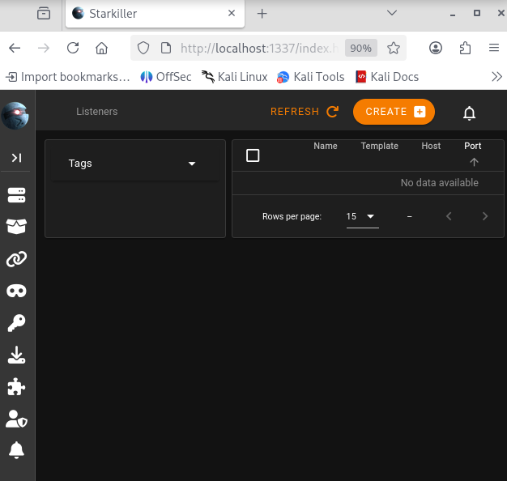

Una volta stabilita la connessione al server, è stato configurato un Listener HTTP sulla porta 8080. Questo componente risulta cruciale poiché funge da "faro" in ascolto, mascherando il traffico malevolo sotto forma di normali richieste web GET/POST.

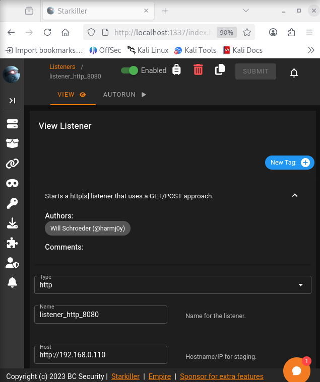

---

## Fase 2: Weaponization & Initial Access

Con il Listener attivo, è stato generato uno Stager (`windows/launcher_bat`). Questo file batch funge da "dropper": una volta eseguito dal target, lancia un comando PowerShell offuscato che inietta l'Agent direttamente nella memoria RAM del bersaglio, senza lasciare artefatti sul disco rigido (tecnica Fileless).

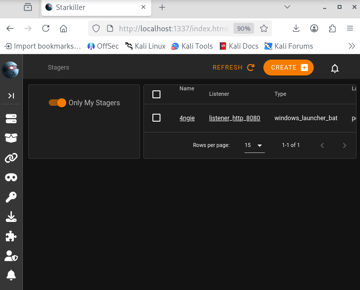

A seguito della simulazione di interazione dell'utente (esecuzione manuale del file `.bat` sulla VM Windows), l'operazione ha registrato un successo critico.

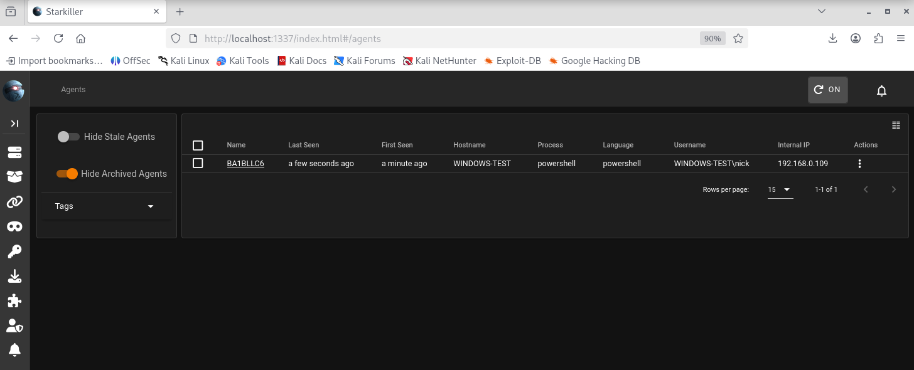

Il server C2 ha validato la chiave pubblica RSA dell'Agent e ha stabilito un canale di comunicazione crittografato e asincrono (Beaconing). L'Initial Access è stato pertanto formalmente acquisito.

---

## Fase 3: Post-Exploitation e l'Esperienza "Living off the Land"

### Primi passi e interazione con l'Agent

È stato immediatamente stabilito il controllo tramite la console interattiva dell'Agent `BA1BLLC6`. Per verificare l'identità del contesto compromesso, è stato inviato il comando raw `shell whoami`, confermando l'accesso come utente standard `WINDOWS-TEST\nick`.

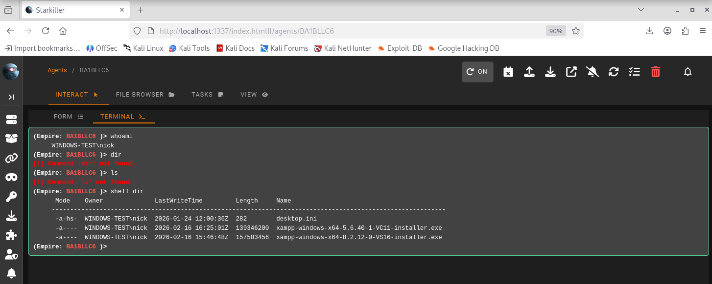

### Il fallimento dell'automazione (Troubleshooting)

L'obiettivo successivo è consistito nell'esecuzione di una Situational Awareness completa. Sebbene la dottrina standard preveda l'uso di moduli precompilati per raccogliere dati in modo silente, la ricerca e l'avvio del modulo `winenum` all'interno della libreria di Starkiller non hanno prodotto l'esito sperato.

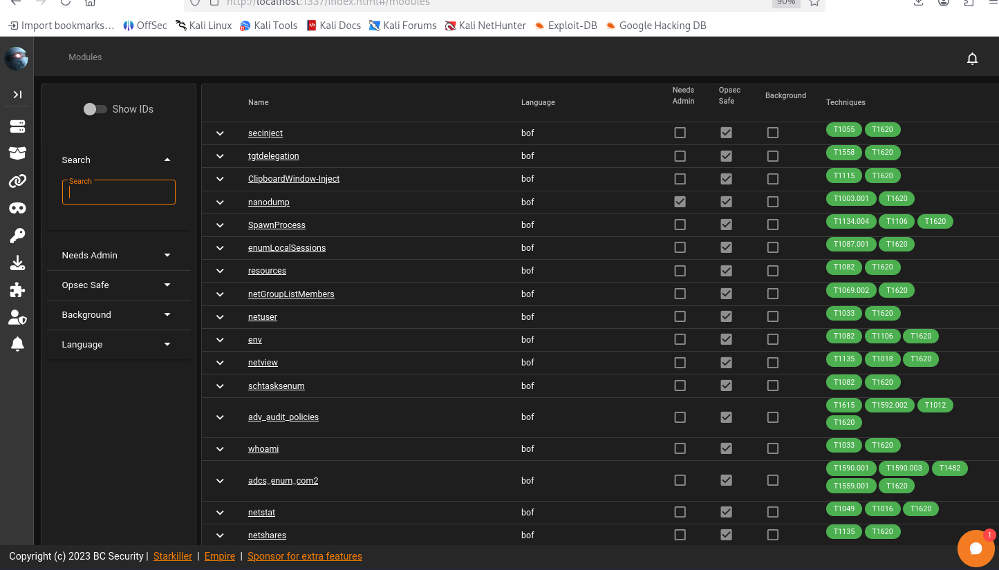

La sicurezza intrinseca di Empire ha bloccato l'esecuzione del modulo, rilevando un'incompatibilità (presumibilmente dovuta alla mancanza di privilegi amministrativi sull'Agent).

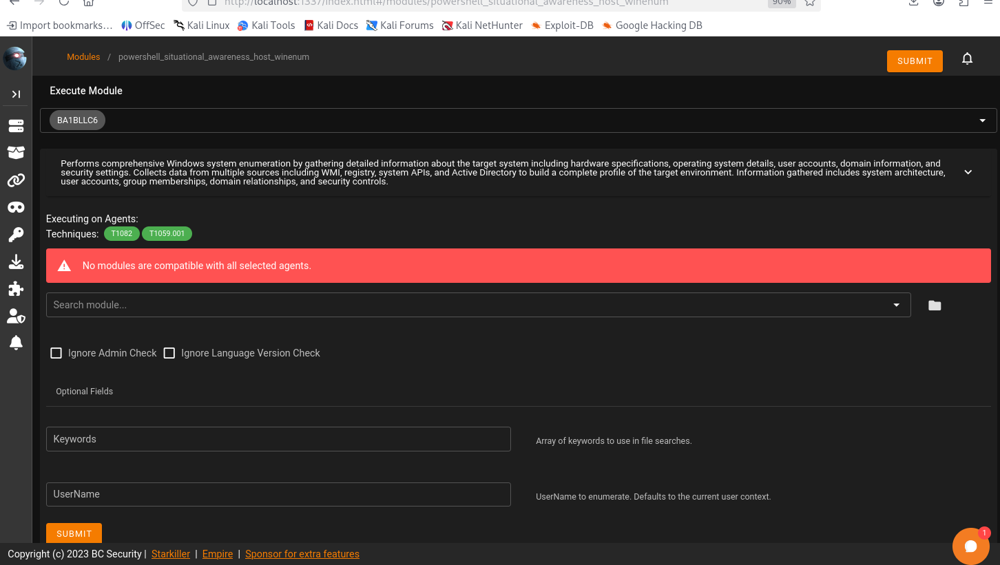

È stato effettuato un tentativo di forzare l'esecuzione ignorando i controlli di sicurezza (`Ignore Admin Check`), che tuttavia ha attivato un bug noto dell'interfaccia grafica Starkiller, causando un crash visivo della tabella dei moduli ("No data available").

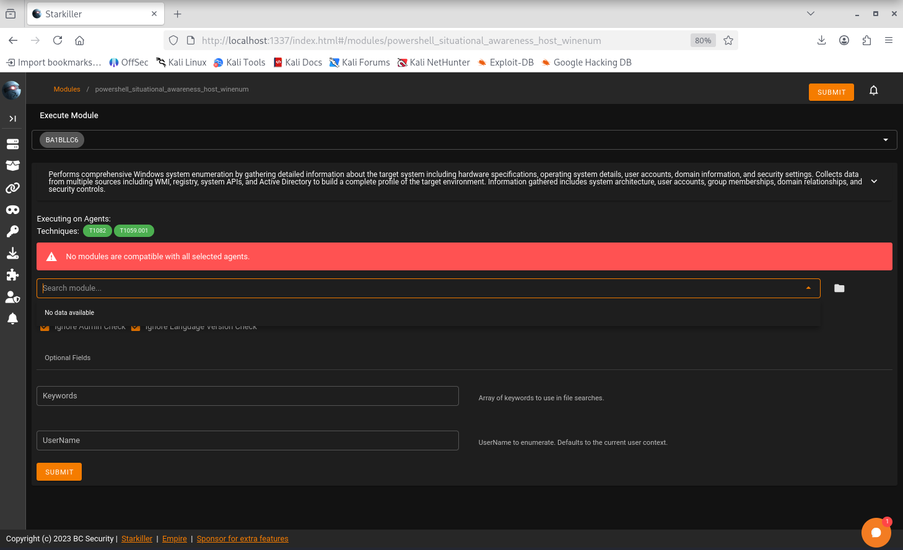

Per aggirare l'ostacolo grafico, si è proceduto ad operare dal terminale a riga di comando dell'Agent, tentando di richiamare il modulo `powershell/situational_awareness/host/winenum` manualmente. Un ulteriore aggiornamento architetturale di Empire ha però generato un errore "Modulo non trovato".

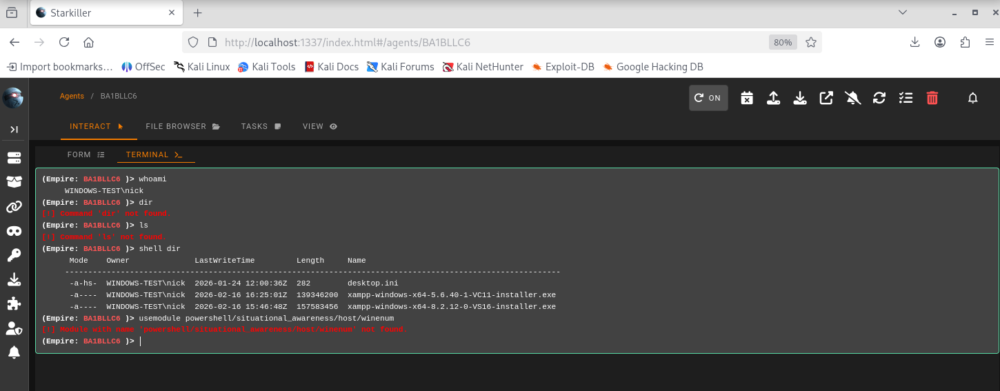

### L'approccio LotL (Living off the Land)

Per ovviare ai limiti tecnici del tool offensivo, è stata adottata la tattica Living off the Land (LotL), basata sull'utilizzo dei programmi legittimi già presenti su Windows per estrarre le informazioni richieste, istruendo l'Agent tramite la direttiva `shell`.

Questa tecnica ha avuto pieno successo.

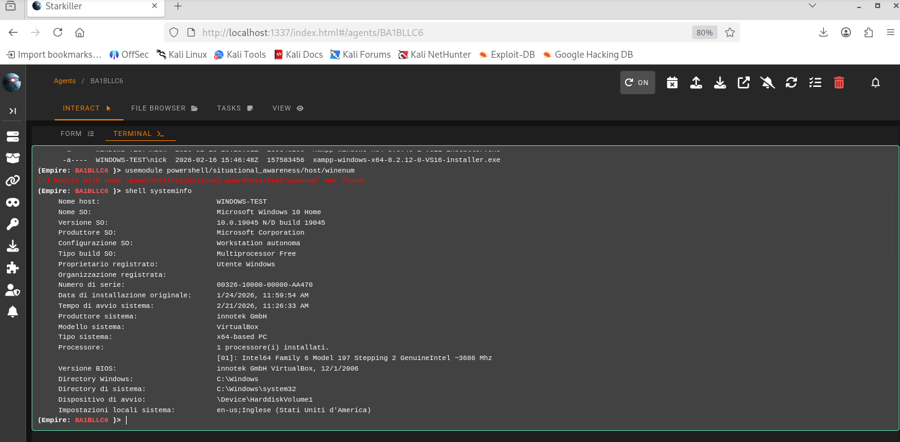

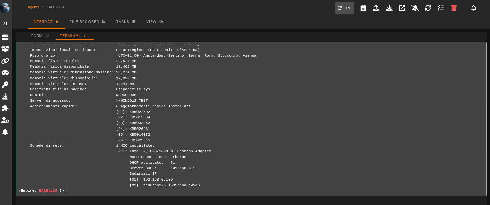

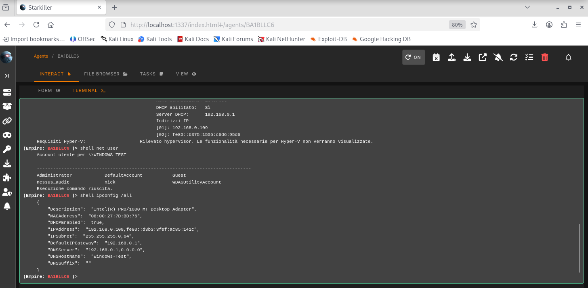

---

## Analisi dell'Intelligence Raccolta

La ricognizione manuale ha prodotto un quadro dettagliato del target, essenziale per pianificare il movimento laterale o l'escalation dei privilegi:

- Informazioni sull'Host:
    - OS: Microsoft Windows 10 Home (10.0.19045)
    - Hostname: `WINDOWS-TEST`
    - Ambiente: Workstation autonoma (non associata a un Dominio Active Directory), virtualizzata.

- Enumerazione Rete:
    - Indirizzo IP Locale: `192.168.0.109`
    - Gateway e DHCP: `192.168.0.1` (indica una probabile rete NATata di laboratorio).

- Enumerazione Utenti (`net user`):
    - Oltre all'utente corrente (`nick`), è stata confermata la presenza degli account `Administrator`, `nessus_audit` e `WDAGUtilityAccount`. La presenza dell'account `nessus_audit` suggerisce che questa macchina potrebbe essere utilizzata per test di vulnerabilità interni.

---

## Conclusioni e Prossimi Passi

L'infrastruttura C2 ha dimostrato la sua efficacia nel mantenere una persistenza in memoria asincrona. L'esperienza diretta in questo scenario conferma che i framework automatizzati sono soggetti a instabilità (versioning, bug della GUI) e che la reale efficacia in operazioni di Red Teaming risiede nella capacità di comprendere le logiche operative dei tool per poterne replicare il comportamento in modo nativo e manuale.

Vettori di Attacco Futuri Raccomandati:

Essendo l'utente attuale privo di privilegi elevati su una macchina Windows 10 autonoma, i prossimi step logici dell'operazione prevedono:

- Privilege Escalation: Ricerca di vulnerabilità locali (es. Unquoted Service Paths o bypass UAC) per ottenere privilegi `SYSTEM`.
- Credential Dumping: Una volta ottenuti privilegi amministrativi, iniezione in RAM di tool come Mimikatz nel processo LSASS per estrarre le password in chiaro degli altri utenti (come `nessus_audit` o `Administrator`).
- Persistenza: Creazione di un'operazione pianificata (Scheduled Task) o manipolazione delle chiavi di Registro (`HKCU\Software\Microsoft\Windows\CurrentVersion\Run`) per garantire che lo Stager venga rieseguito in modo silente ad ogni avvio della macchina vittima.

---

## Ampliamento: Test sui 6 Pillar della Post-Exploitation

Per valutare la postura di sicurezza del sistema compromesso e l'efficacia dei controlli difensivi, si è proceduto con il test metodologico dei sei pillar operativi della Post-Exploitation. Anche in questa fase, a causa di incompatibilità dei moduli nativi del framework C2, si è adottato l'approccio LotL (Living off the Land) mediante l'utilizzo dei binari del sistema operativo.

### 1 Situational Awareness (Rilevamento EDR/AV)

Si è tentato di interrogare il namespace WMI (`\\root\SecurityCenter2`) per identificare la soluzione AntiVirus installata. Il comando non ha generato output visibile. Questo comportamento indica tipicamente una limitazione dei permessi di lettura WMI per i processi a bassa/media integrità o l'intercettazione della query da parte dei sistemi di monitoraggio locali.

### 2 Privilege Escalation (Enumerazione)

È stata condotta un'analisi dei gruppi locali per identificare i percorsi di Privilege Escalation. L'interrogazione tramite `net localgroup administrators` ha evidenziato che l'account correntemente compromesso (`nick`) appartiene al gruppo degli Amministratori Locali. 

### 3 Credential Harvesting (Test dei controlli di sicurezza)

Conoscendo l'appartenenza dell'utente al gruppo Amministratori, si è tentata l'estrazione manuale del database locale delle password (hive SAM) utilizzando il comando nativo `reg save HKLM\SAM sam.save`. 

L'operazione è fallita senza output. Questo fallimento documenta il corretto funzionamento dello User Account Control (UAC) di Windows: sebbene l'utente sia nominalmente un amministratore, il processo malevolo (Agent) opera in un contesto di "Medium Integrity" e necessita di un esplicito bypass dell'UAC per elevare l'integrità del token a "High" e accedere a file di sistema critici.

### 4 Collection (Raccolta Dati)

Nel corso dell'operazione, la raccolta dati si è concentrata sull'estrazione di informazioni di sistema e configurazioni di rete tramite `systeminfo` e `ipconfig`, che hanno fornito un quadro completo della topologia di rete della vittima, vitale per le successive fasi di attacco.

### 5 Persistence (Creazione di una Backdoor)

Per garantire la sopravvivenza dell'Agent ai riavvii della macchina bersaglio, è stata stabilita una persistenza a livello utente ("Userland Persistence"). Modificando l'hive del registro dell'utente corrente (`HKCU`), non sottoposto a restrizioni UAC, è stata inserita una chiave nella sezione `Run` di Windows. 

Il comando `reg add HKCU\Software\Microsoft\Windows\CurrentVersion\Run /v "WindowsUpdate_C2" [...]` ha avuto esito positivo ("Operazione completata"), garantendo l'esecuzione del payload a ogni successivo login dell'utente compromesso.

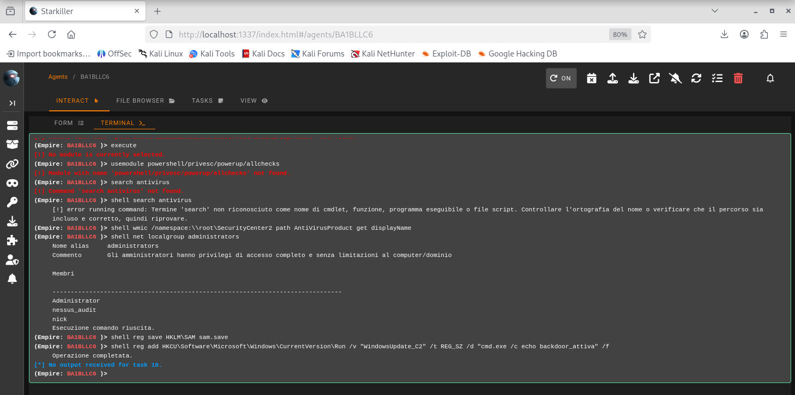

### 6 Lateral Movement (Valutazione)

I dati di intelligence raccolti, combinati con la persistenza appena ottenuta, creano i presupposti per il Lateral Movement. Il blocco del Credential Harvesting da parte dell'UAC ha momentaneamente precluso l'accesso agli hash NTLM degli altri account (es. `nessus_audit`). 

Il prossimo step operativo potrebbe essere l'utilizzo di una tecnica di UAC Bypass silente per elevare i privilegi, estrarre le credenziali e sfruttare protocolli nativi come SMB (tramite PsExec) o WMI per diffondere l'infezione verso il Default Gateway (`192.168.0.1`) o altri host sulla subnet locale.