# Command & Control (C2) Infrastructure & Post-Exploitation

> - **Fase:** System Exploitation - C2 Framework & Post-Exploitation
> - **Visibilita:** Alta - il beaconing HTTP genera traffico di rete identificabile da IDS/NDR; lo stager .bat viene scritto su disco (artefatto endpoint)
> - **Prerequisiti:** Accesso fisico o vettore di consegna del payload alla macchina target (es. phishing, USB drop); Kali Linux con PowerShell Empire 5 installato; connettivita di rete tra attaccante e target
> - **Output:** EXPLOIT-001 (Initial Access fileless via Empire Agent, severity Alto); EXPLOIT-002 (Persistenza via Registry Run Key HKCU, severity Alto); shell interattiva sulla macchina Windows 10 con contesto utente standard

- Target: Macchina Windows 10 Home (IP: 192.168.0.109)
- Attaccante (C2 Server): Kali Linux Purple
- Framework Utilizzato: PowerShell Empire 5 & Starkiller GUI

---

## Executive Summary

Il presente documento dettaglia l'esecuzione di un attacco simulato finalizzato all'ottenimento di un Initial Access su una workstation Windows e alla successiva fase di Situational Awareness.

L'operazione ha previsto il dispiegamento di un'infrastruttura Command & Control (C2) avanzata basata su PowerShell Empire.

A fronte di malfunzionamenti dell'interfaccia grafica (GUI) e incompatibilità dei moduli automatizzati del framework, si è reso necessario un adattamento tattico, effettuando un "pivot" verso tecniche manuali di Living off the Land (LotL). Sfruttando i binari nativi del sistema operativo bersaglio, è stato possibile completare con successo la ricognizione bypassando le limitazioni dei tool offensivi.

---

## Fase 1: Setup dell'Infrastruttura C2

La fase iniziale ha richiesto l'attivazione del server C2 sulla macchina attaccante (Kali-Purple).

Durante le fasi di avvio, è stata riscontrata un'evoluzione nell'architettura del tool: il client testuale monolitico legacy di PowerShell Empire, essendo deprecato nelle versioni recenti, ha restituito un errore di sintassi durante il tentativo di connessione locale.

Questa limitazione tecnica ha imposto un rapido adattamento, portando all'installazione e all'utilizzo di Starkiller, l'interfaccia grafica moderna (GUI) che comunica con l'API RESTful di Empire.

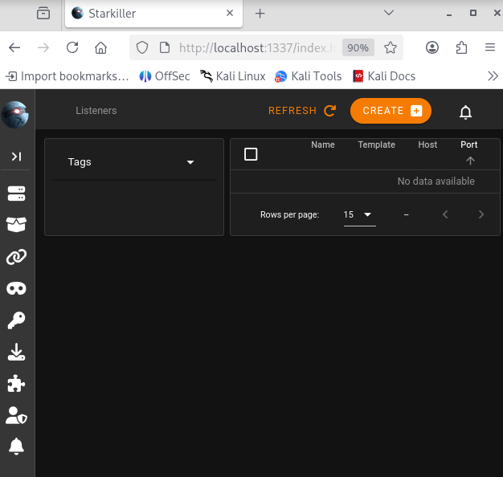

Una volta stabilita la connessione al server, è stato configurato un Listener HTTP sulla porta 8080. Questo componente risulta cruciale poiché funge da "faro" in ascolto, mascherando il traffico malevolo sotto forma di normali richieste web GET/POST.

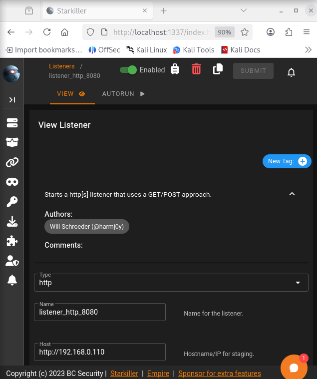

---

**ID Finding:** `EXPLOIT-001` | **Severity:** `Alto`

## Fase 2: Weaponization & Initial Access

Con il Listener attivo, è stato generato uno Stager (`windows/launcher_bat`). Questo file batch funge da "dropper": una volta eseguito dal target, lancia un comando PowerShell offuscato che inietta l'Agent direttamente nella memoria RAM del bersaglio, senza lasciare artefatti sul disco rigido (tecnica Fileless).

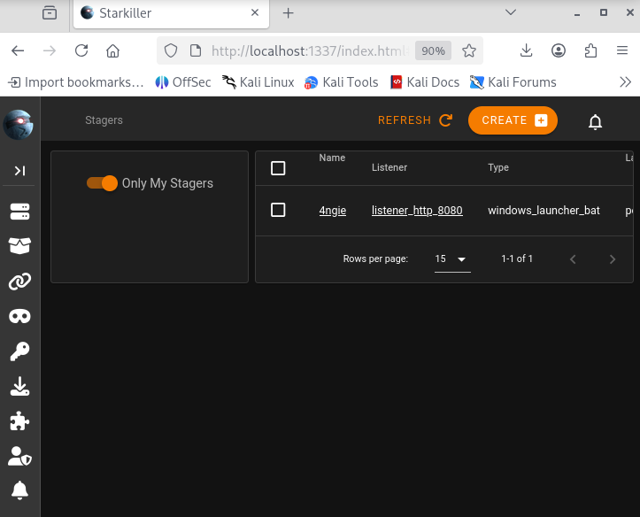

A seguito della simulazione di interazione dell'utente (esecuzione manuale del file `.bat` sulla VM Windows), l'operazione ha registrato un successo critico.

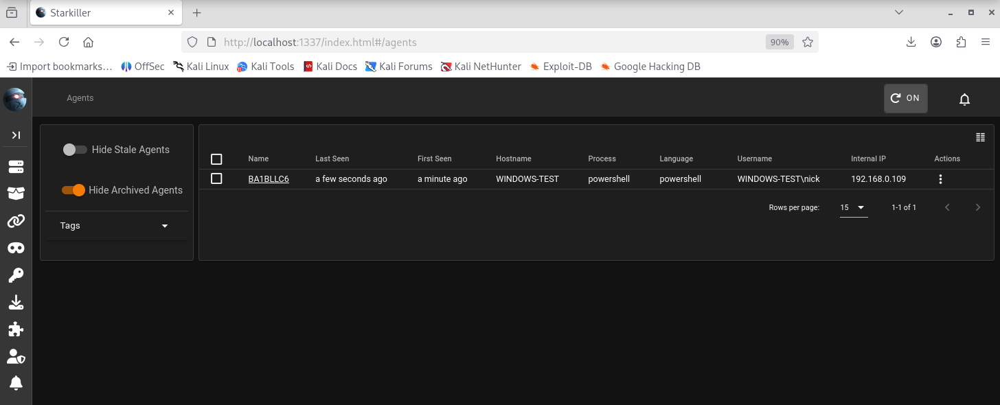

Il server C2 ha validato la chiave pubblica RSA dell'Agent e ha stabilito un canale di comunicazione crittografato e asincrono (Beaconing). L'Initial Access è stato pertanto formalmente acquisito.

---

## Fase 3: Post-Exploitation e l'Esperienza "Living off the Land"

### Primi passi e interazione con l'Agent

È stato immediatamente stabilito il controllo tramite la console interattiva dell'Agent `BA1BLLC6`. Per verificare l'identità del contesto compromesso, è stato inviato il comando raw `shell whoami`, confermando l'accesso come utente standard `WINDOWS-TEST\nick`.

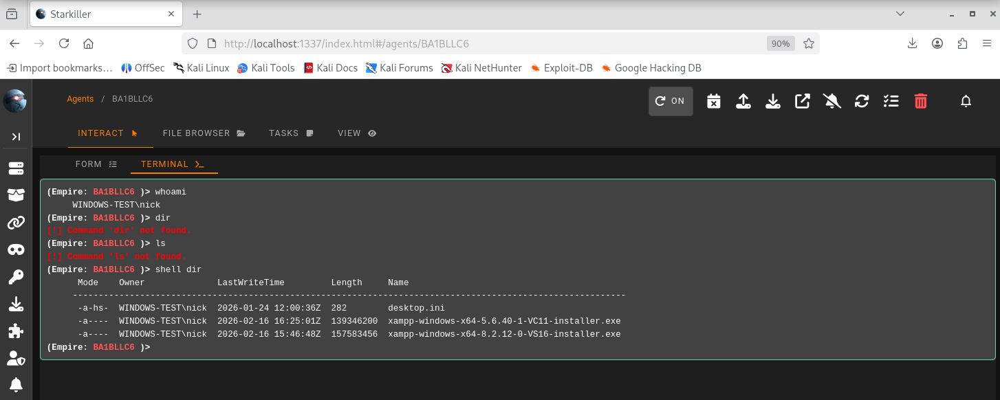

### Il fallimento dell'automazione (Troubleshooting)

L'obiettivo successivo è consistito nell'esecuzione di una Situational Awareness completa. Sebbene la dottrina standard preveda l'uso di moduli precompilati per raccogliere dati in modo silente, la ricerca e l'avvio del modulo `winenum` all'interno della libreria di Starkiller non hanno prodotto l'esito sperato.

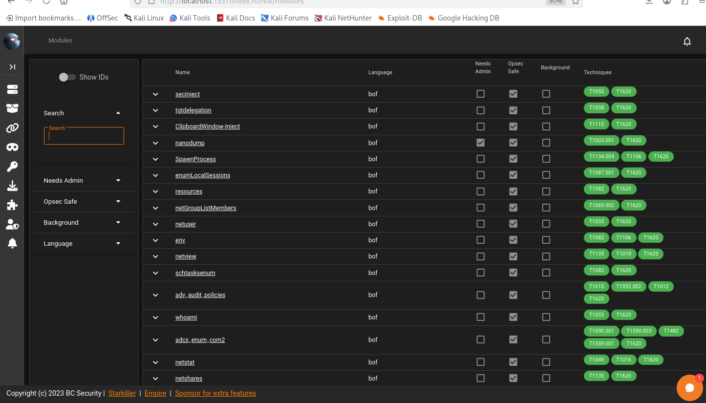

La sicurezza intrinseca di Empire ha bloccato l'esecuzione del modulo, rilevando un'incompatibilità (presumibilmente dovuta alla mancanza di privilegi amministrativi sull'Agent).

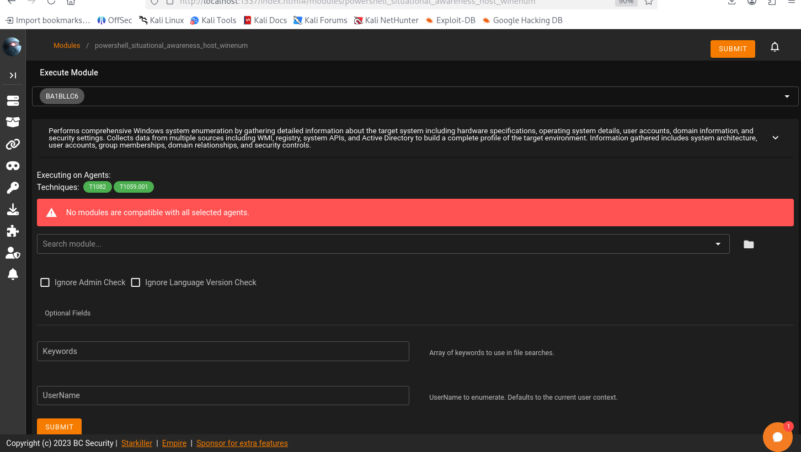

È stato effettuato un tentativo di forzare l'esecuzione ignorando i controlli di sicurezza (`Ignore Admin Check`), che tuttavia ha attivato un bug noto dell'interfaccia grafica Starkiller, causando un crash visivo della tabella dei moduli ("No data available").

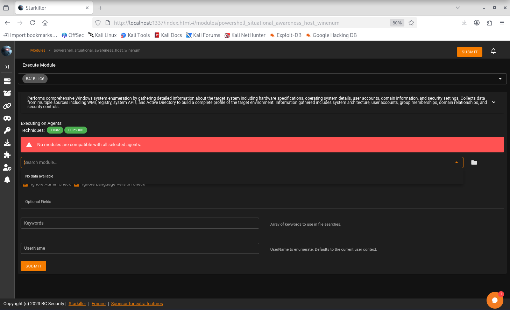

Per aggirare l'ostacolo grafico, si è proceduto ad operare dal terminale a riga di comando dell'Agent, tentando di richiamare il modulo `powershell/situational_awareness/host/winenum` manualmente. Un ulteriore aggiornamento architetturale di Empire ha però generato un errore "Modulo non trovato".

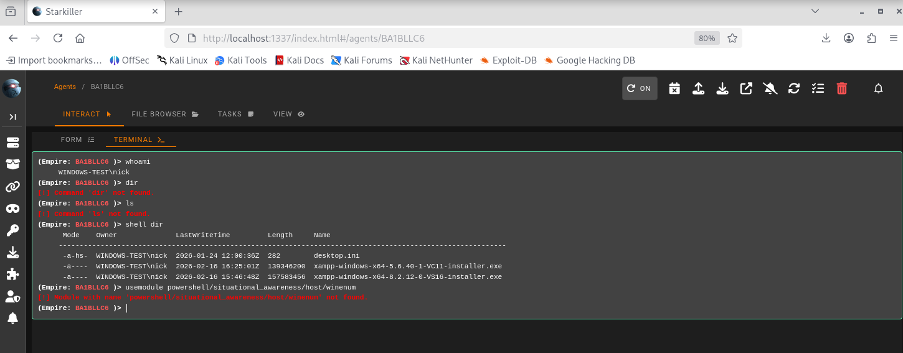

### L'approccio LotL (Living off the Land)

Per ovviare ai limiti tecnici del tool offensivo, è stata adottata la tattica Living off the Land (LotL), basata sull'utilizzo dei programmi legittimi già presenti su Windows per estrarre le informazioni richieste, istruendo l'Agent tramite la direttiva `shell`.

Questa tecnica ha avuto pieno successo.

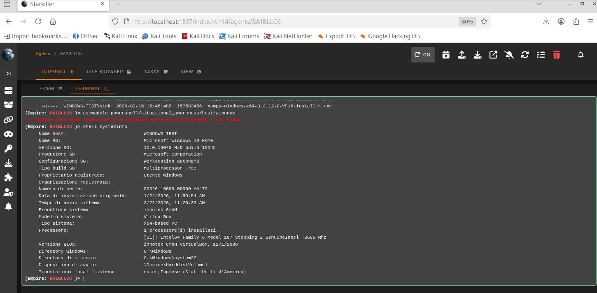

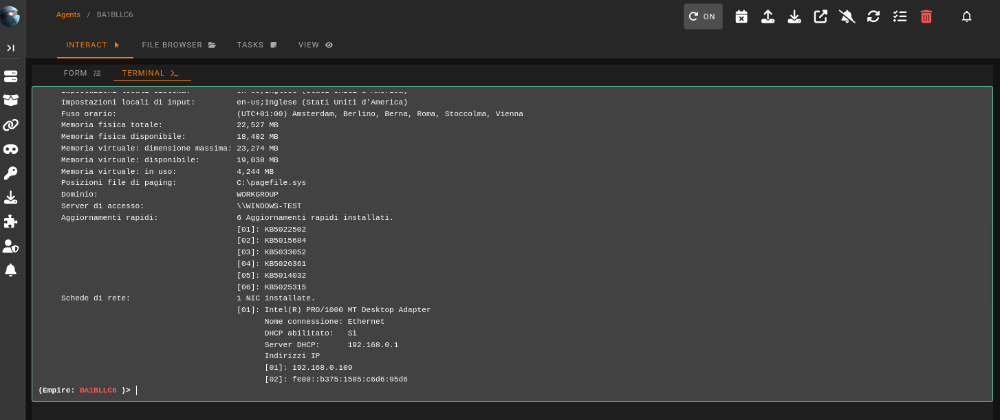

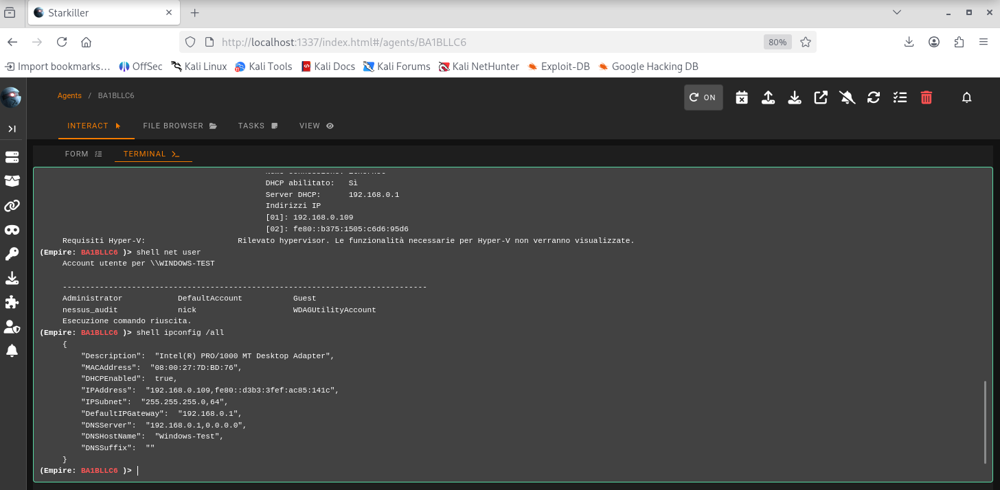

---

## Analisi dell'Intelligence Raccolta

La ricognizione manuale ha prodotto un quadro dettagliato del target, essenziale per pianificare il movimento laterale o l'escalation dei privilegi:

- Informazioni sull'Host:
    - OS: Microsoft Windows 10 Home (10.0.19045)
    - Hostname: `WINDOWS-TEST`
    - Ambiente: Workstation autonoma (non associata a un Dominio Active Directory), virtualizzata.

- Enumerazione Rete:
    - Indirizzo IP Locale: `192.168.0.109`
    - Gateway e DHCP: `192.168.0.1` (indica una probabile rete NATata di laboratorio).

- Enumerazione Utenti (`net user`):
    - Oltre all'utente corrente (`nick`), è stata confermata la presenza degli account `Administrator`, `nessus_audit` e `WDAGUtilityAccount`. La presenza dell'account `nessus_audit` suggerisce che questa macchina potrebbe essere utilizzata per test di vulnerabilità interni.

---

## Conclusioni e Prossimi Passi

L'infrastruttura C2 ha dimostrato la sua efficacia nel mantenere una persistenza in memoria asincrona. L'esperienza diretta in questo scenario conferma che i framework automatizzati sono soggetti a instabilità (versioning, bug della GUI) e che la reale efficacia in operazioni di Red Teaming risiede nella capacità di comprendere le logiche operative dei tool per poterne replicare il comportamento in modo nativo e manuale.

Vettori di Attacco Futuri Raccomandati:

Essendo l'utente attuale privo di privilegi elevati su una macchina Windows 10 autonoma, i prossimi step logici dell'operazione prevedono:

- Privilege Escalation: Ricerca di vulnerabilità locali (es. Unquoted Service Paths o bypass UAC) per ottenere privilegi `SYSTEM`.
- Credential Dumping: Una volta ottenuti privilegi amministrativi, iniezione in RAM di tool come Mimikatz nel processo LSASS per estrarre le password in chiaro degli altri utenti (come `nessus_audit` o `Administrator`).
- Persistenza: Creazione di un'operazione pianificata (Scheduled Task) o manipolazione delle chiavi di Registro (`HKCU\Software\Microsoft\Windows\CurrentVersion\Run`) per garantire che lo Stager venga rieseguito in modo silente ad ogni avvio della macchina vittima.

---

## Ampliamento: Test sui 6 Pillar della Post-Exploitation

Per valutare la postura di sicurezza del sistema compromesso e l'efficacia dei controlli difensivi, si è proceduto con il test metodologico dei sei pillar operativi della Post-Exploitation. Anche in questa fase, a causa di incompatibilità dei moduli nativi del framework C2, si è adottato l'approccio LotL (Living off the Land) mediante l'utilizzo dei binari del sistema operativo.

### 1 Situational Awareness (Rilevamento EDR/AV)

Si è tentato di interrogare il namespace WMI (`\\root\SecurityCenter2`) per identificare la soluzione AntiVirus installata. Il comando non ha generato output visibile. Questo comportamento indica tipicamente una limitazione dei permessi di lettura WMI per i processi a bassa/media integrità o l'intercettazione della query da parte dei sistemi di monitoraggio locali.

### 2 Privilege Escalation (Enumerazione)

È stata condotta un'analisi dei gruppi locali per identificare i percorsi di Privilege Escalation. L'interrogazione tramite `net localgroup administrators` ha evidenziato che l'account correntemente compromesso (`nick`) appartiene al gruppo degli Amministratori Locali. 

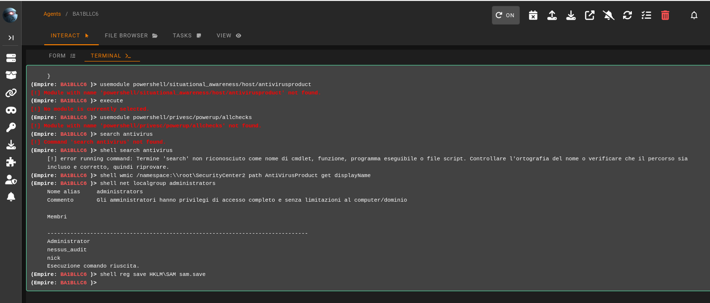

### 3 Credential Harvesting (Test dei controlli di sicurezza)

Conoscendo l'appartenenza dell'utente al gruppo Amministratori, si è tentata l'estrazione manuale del database locale delle password (hive SAM) utilizzando il comando nativo `reg save HKLM\SAM sam.save`. 

L'operazione è fallita senza output. Questo fallimento documenta il corretto funzionamento dello User Account Control (UAC) di Windows: sebbene l'utente sia nominalmente un amministratore, il processo malevolo (Agent) opera in un contesto di "Medium Integrity" e necessita di un esplicito bypass dell'UAC per elevare l'integrità del token a "High" e accedere a file di sistema critici.

### 4 Collection (Raccolta Dati)

Nel corso dell'operazione, la raccolta dati si è concentrata sull'estrazione di informazioni di sistema e configurazioni di rete tramite `systeminfo` e `ipconfig`, che hanno fornito un quadro completo della topologia di rete della vittima, vitale per le successive fasi di attacco.

**ID Finding:** `EXPLOIT-002` | **Severity:** `Alto`

### 5 Persistence (Creazione di una Backdoor)

Per garantire la sopravvivenza dell'Agent ai riavvii della macchina bersaglio, è stata stabilita una persistenza a livello utente ("Userland Persistence"). Modificando l'hive del registro dell'utente corrente (`HKCU`), non sottoposto a restrizioni UAC, è stata inserita una chiave nella sezione `Run` di Windows. 

Il comando `reg add HKCU\Software\Microsoft\Windows\CurrentVersion\Run /v "WindowsUpdate_C2" [...]` ha avuto esito positivo ("Operazione completata"), garantendo l'esecuzione del payload a ogni successivo login dell'utente compromesso.

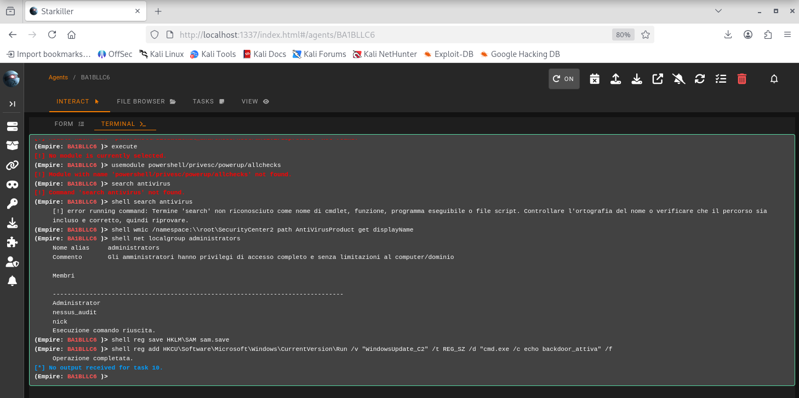

### 6 Lateral Movement (Valutazione)

I dati di intelligence raccolti, combinati con la persistenza appena ottenuta, creano i presupposti per il Lateral Movement. Il blocco del Credential Harvesting da parte dell'UAC ha momentaneamente precluso l'accesso agli hash NTLM degli altri account (es. `nessus_audit`). 

Il prossimo step operativo potrebbe essere l'utilizzo di una tecnica di UAC Bypass silente per elevare i privilegi, estrarre le credenziali e sfruttare protocolli nativi come SMB (tramite PsExec) o WMI per diffondere l'infezione verso il Default Gateway (`192.168.0.1`) o altri host sulla subnet locale.

---

---

## Tool di riferimento

| Tool | Tipo | Tecnica/Accesso | Caso d'uso principale |
| :--- | :--- | :--- | :--- |
| `PowerShell Empire 5` | C2 Framework | CLI + RESTful API | Framework C2 open-source per post-exploitation su Windows, moduli PowerShell |
| `Starkiller` | GUI per Empire | Web UI | Interfaccia grafica moderna per Empire, gestione Agent e moduli visuale |
| `msfvenom` | Payload generator | CLI | Generazione stager alternativi (exe, dll, ps1) per Empire o Metasploit |
| `Havoc C2` | C2 Framework | CLI + Web UI | Alternativa moderna a Empire, scritto in C, evasione EDR avanzata |
| `Sliver` | C2 Framework | CLI | C2 open-source in Go, supporta mTLS, HTTP, DNS; alternativa a Cobalt Strike |
| `Covenant` | C2 Framework | Web UI | C2 .NET con implant in C#, integrazione con Grunt agents |
| `netcat` | Shell listener | CLI | Listener semplice per reverse shell senza framework C2 |

---

## Scenario Reale: Proiezione Post-Exploitation

> Questa sezione descrive come EXPLOIT-001 ed EXPLOIT-002 si inserirebbero in un engagement reale, dal punto di vista dell'attaccante e del difensore.

### Prospettiva Attaccante (Red Team)

**Punto di partenza:** Agent Empire attivo su WINDOWS-TEST con contesto utente standard (nick, Medium Integrity); persistenza garantita via Registry Run Key HKCU.

**Kill Chain proiettata:**
```
EXPLOIT-001: Agent Empire attivo (nick - utente standard)
        |
        v
UAC Bypass (es. fodhelper.exe, eventvwr hijack) -> High Integrity token
        |
        v
Mimikatz sekurlsa::logonpasswords -> hash NTLM Administrator locale
        |
        v
Pass-the-Hash su altri host della LAN -> movimento laterale
        |
        v
EXPLOIT-002: persistenza HKCU assicura sopravvivenza ai riavvii
        |
        v
Raccolta dati sensibili (documenti, credenziali browser) -> esfiltrazione
        |
        v
Ransomware deployment (LockBit 3.0 / BlackCat) via Empire task schedulati
```

**Impatto potenziale:** in un contesto aziendale reale, un Agent C2 attivo con persistenza garantisce all'attaccante il tempo necessario per mappare la rete interna, estrarre credenziali privilegiate e diffondere l'infezione lateralmente prima che il SOC rilevi l'anomalia. Il tempo medio di permanenza (dwell time) di un attaccante APT e stimato in 16 giorni (IBM X-Force 2024).

**Vettori di monetizzazione tipici:**
- Ransomware-as-a-Service (RaaS): cifratura di file server e workstation + riscatto in criptovaluta (range tipico: 50.000 - 5.000.000 USD)
- Double extortion: riscatto per il decriptatore + riscatto separato per non pubblicare i dati esfiltrati
- Access Broker: rivendita dell'accesso iniziale a gruppi APT su forum underground (range: 500 - 50.000 USD per foothold aziendale)

### Prospettiva Difensore (Blue Team)

**Rilevamento:** il beaconing HTTP dell'Agent genera connessioni uscenti periodiche verso un IP esterno non classificato (Event ID 5156 - Windows Filtering Platform). Un SIEM con regola su "connessioni HTTP periodiche verso IP non in whitelist in orario notturno" avrebbe triggerato un alert. L'EDR avrebbe dovuto rilevare l'iniezione in memoria del PowerShell offuscato tramite AMSI.

**Indicatori di Compromissione (IOC):**
- Chiave di registro: `HKCU\Software\Microsoft\Windows\CurrentVersion\Run` - valore `WindowsUpdate_C2`
- Processo: `powershell.exe` con argomenti offuscati (base64 encoded) lanciato da `cmd.exe`
- Traffico di rete: connessioni HTTP periodiche su porta 8080 verso IP attaccante
- Artefatto disco: file `launcher.bat` in percorso utente (Downloads, Desktop, Temp)

**Contenimento:** isolamento immediato della workstation dalla rete (quarantena VLAN o blocco switch port); terminazione del processo `powershell.exe` sospetto; revoca sessione utente nick.

**Hardening strutturale:**
- Deployare EDR con protezione AMSI abilitata (Microsoft Defender for Endpoint, CrowdStrike)
- Abilitare PowerShell Constrained Language Mode tramite AppLocker/WDAC
- Bloccare l'esecuzione di script `.bat` e `.ps1` non firmati da percorsi utente tramite GPO
- Monitorare le chiavi Run/RunOnce via Sysmon (Event ID 13 - Registry value set)
- Implementare DNS filtering (Cisco Umbrella, Pi-hole) per bloccare beacon verso IP non categorizzati

---

## Mappatura MITRE ATT&CK

Per facilitare l'ingegnerizzazione dei rilevamenti (Detection Engineering) da parte del Blue Team, le azioni condotte durante l'operazione sono state mappate secondo il framework MITRE ATT&CK:

| Tattica | Tecnica | ID MITRE | Descrizione dell'Azione |
| :--- | :--- | :--- | :--- |
| Execution | Command and Scripting Interpreter | `T1059.003` | Esecuzione del payload iniziale tramite file batch (`.bat`) e comandi `cmd.exe`. |
| Execution | PowerShell | `T1059.001` | Iniezione in RAM dell'Agent C2 tramite script PowerShell offuscato. |
| Persistence | Registry Run Keys / Startup Folder | `T1547.001` | Creazione della chiave `WindowsUpdate_C2` in `HKCU\Software\Microsoft\Windows\CurrentVersion\Run`. |
| Discovery | System Information Discovery | `T1082` | Utilizzo del binario nativo `systeminfo` per estrarre la build del sistema operativo. |
| Discovery | Permission Groups Discovery | `T1069.001` | Utilizzo di `net localgroup administrators` per l'enumerazione dei privilegi. |
| Discovery | Security Software Discovery | `T1518.001` | Tentativo di enumerazione dell'AV tramite query WMI al SecurityCenter2. |
| Command and Control | Web Protocols | `T1071.001` | Beaconing asincrono dell'Agent verso il Listener su protocollo HTTP (porta 8080). |

---

## Indicators of Compromise (IOCs) & Artifacts

Di seguito si riportano gli artefatti generati durante l'emulazione della minaccia, utili per attività di Threat Hunting e tuning degli EDR:

Network Indicators:
- IP C2 (Attaccante): `192.168.0.110` (Kali Linux)
- Porta / Protocollo: `8080 / HTTP`
- Comportamento Rete: Connessioni HTTP asincrone (Beaconing) con intervalli regolari, mascherate da traffico web standard verso le API RESTful del C2.

Host/Endpoint Indicators:
- Artefatti su Disco: File dropper iniziale `.bat` (nome variabile, nel test: `launcher.bat`).
- Modifiche al Registro: Path: `HKCU\Software\Microsoft\Windows\CurrentVersion\Run`
    - Value Name: `WindowsUpdate_C2`
    - Data: `cmd.exe /c echo backdoor_attiva`
- Comportamenti Anomali (Process Tree): Esecuzione anomala di comandi di discovery (`wmic`, `systeminfo`, `net user`, `reg save`) originati da processi figlio di `powershell.exe` o `cmd.exe`.

---

## Remediation & Mitigation Strategy

Sulla base delle vulnerabilità logiche e operative sfruttate in questa simulazione, si raccomandano le seguenti azioni di mitigazione (Remediation Plan):

1.  Endpoint Detection & Response (EDR) e AMSI: Assicurarsi che le soluzioni di sicurezza siano configurate per monitorare attivamente l'Antimalware Scan Interface (AMSI). La maggior parte degli stager generati di default da Empire può essere intercettata da AMSI prima dell'iniezione in RAM.

2.  Hardening del Registro di Sistema: Implementare policy GPO (Group Policy Object) per limitare o monitorare la modifica delle chiavi di registro note per la persistenza utente, in particolare il path `\CurrentVersion\Run`.

3.  Restrizione dell'Esecuzione Script: Attivare l'AppLocker o Windows Defender Application Control (WDAC) per impedire l'esecuzione di script non firmati (`.bat`, `.ps1`, `.vbs`) da percorsi non attendibili (es. cartella Downloads dell'utente).

4.  Principle of Least Privilege (PoLP): Sebbene l'UAC abbia impedito l'estrazione degli hash SAM, è buona norma rimuovere l'utente standard (`nick`) dal gruppo degli Amministratori Locali, fornendo credenziali separate e isolate (es. tramite LAPS) qualora siano necessarie operazioni amministrative.

---

> **Nota:** Tutte le attivita documentate sono state condotte in un ambiente di laboratorio virtualizzato (VirtualBox, rete NAT). Le tecniche descritte sono state applicate esclusivamente su una macchina virtuale Windows 10 Home di proprieta dell'autore (IP: 192.168.0.109). Nessuna tecnica e stata applicata a sistemi reali o di terze parti senza autorizzazione esplicita.