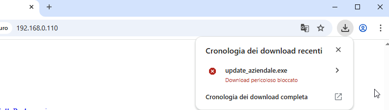
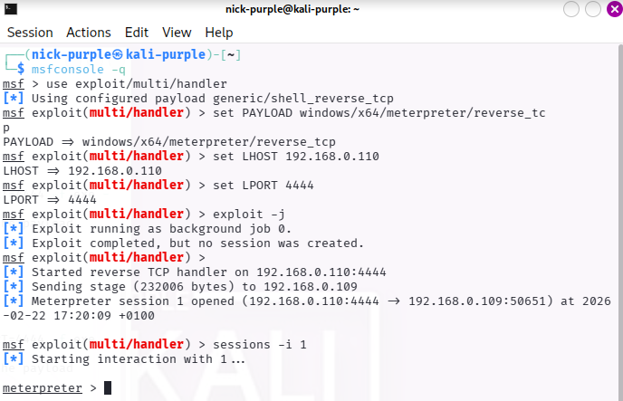
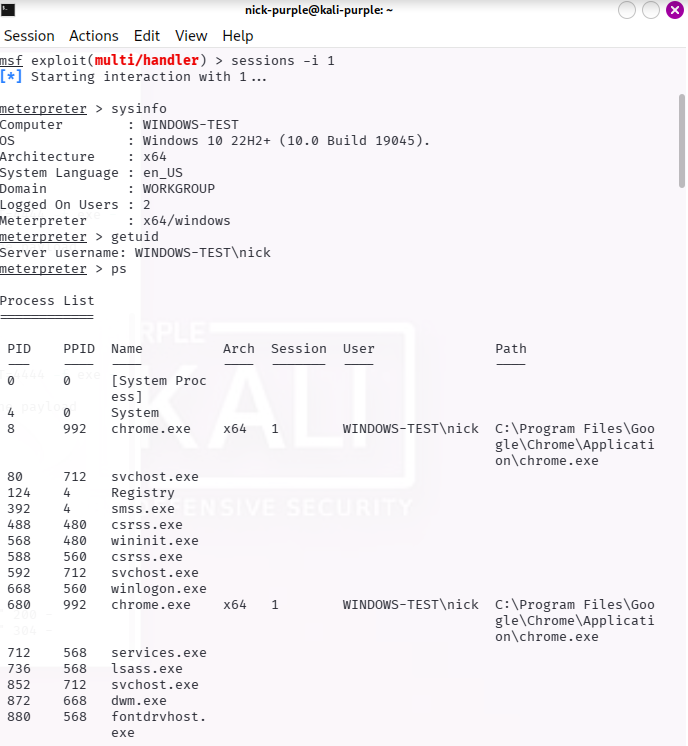
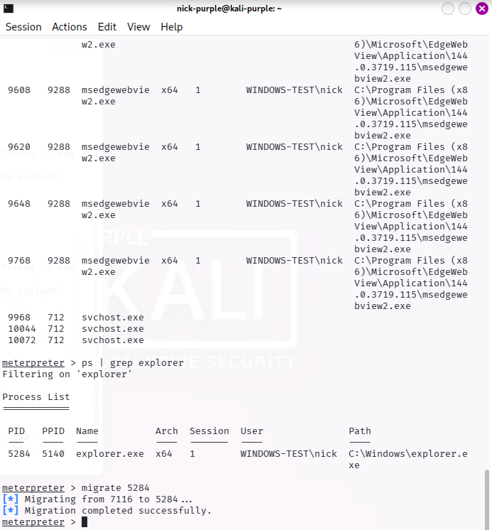
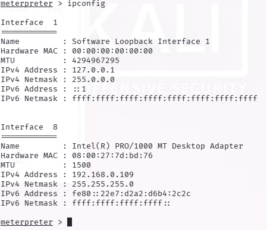
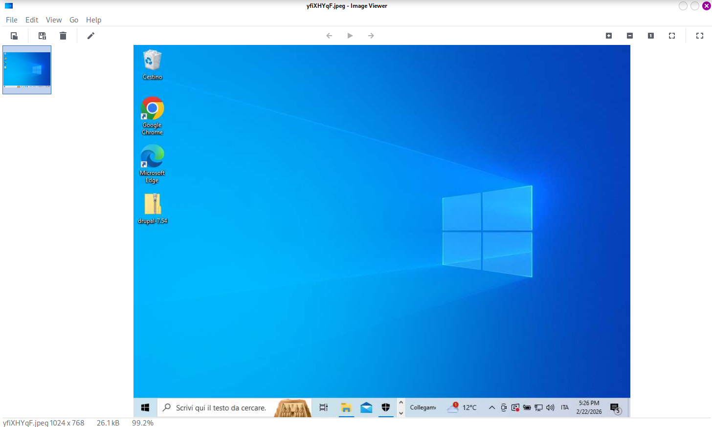
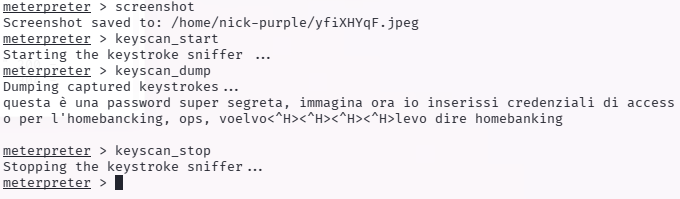
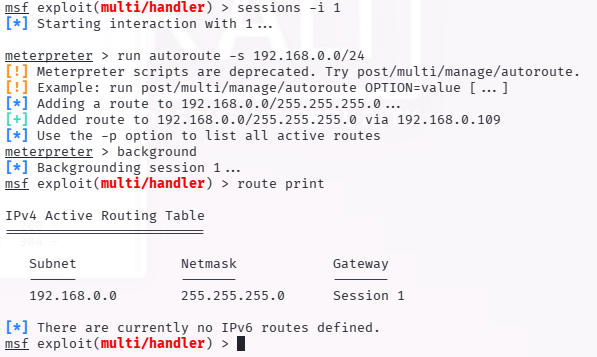
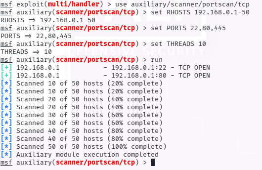
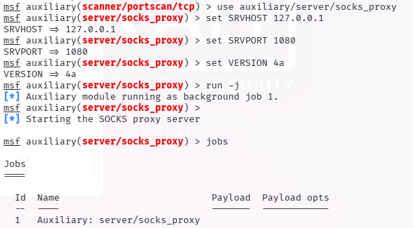

# Client-Side Attack & Network Pivoting via Metasploit

- Target Principale: Macchina Windows 10 Home (IP: 192.168.0.109)
- Target Secondario: Rete interna isolata (Subnet: 192.168.0.0/24)
- Attaccante (C2 Server): Kali Linux Purple (IP: 192.168.0.110)
- Framework Utilizzato: Metasploit Framework (MSF6)

---

## Executive Summary

Il presente documento dettaglia l'esecuzione di un attacco simulato finalizzato all'ottenimento di un Initial Access su una workstation Windows tramite tecniche di Social Engineering e alla successiva fase di esplorazione della rete interna (Network Pivoting).

L'operazione ha previsto il dispiegamento di un'infrastruttura offensiva basata su Metasploit Framework.

A fronte di blocchi preventivi da parte dei sistemi di sicurezza perimetrali e applicativi (browser reputation) e alle limitazioni imposte dai controlli di integrità del sistema operativo (UAC), si è reso necessario un continuo adattamento tattico. Sfruttando tecniche di Process Injection per garantire la sicurezza operativa (OPSEC) e meccanismi di routing avanzato, è stato possibile completare con successo la ricognizione di reti isolate aggirando le restrizioni dei privilegi locali.

---

## Fase 1: Weaponization & Delivery

La fase iniziale ha richiesto la preparazione del vettore d'attacco (Weaponization) sulla macchina attaccante. 

Utilizzando il generatore di payload `msfvenom`, è stato forgiato un file eseguibile Windows a 64-bit contenente uno stager `meterpreter/reverse_tcp`. Il file è stato nominato `update_aziendale.exe` per simulare un aggiornamento legittimo. Essendo un binario PE (Portable Executable) grezzo, privo di offuscamento (encoder) e senza firma digitale, il suo livello di entropia lo ha reso immediatamente sospetto ai filtri di sicurezza.

Durante il tentativo di scaricare il payload tramite un server HTTP locale, i sistemi di sicurezza integrati nel browser (Google Safe Browsing / Microsoft SmartScreen) hanno intercettato la minaccia, bloccando preventivamente il download e dimostrando l'efficacia dei controlli di Web Reputation.

Per procedere con l'analisi della Post-Exploitation, la limitazione tecnica è stata aggirata trasferendo fisicamente il file sul disco della vittima, simulando un bypass dei controlli perimetrali.

---

## Fase 2: Initial Access & OPSEC

Sulla macchina attaccante è stato configurato un Listener multiplo (`exploit/multi/handler`) in ascolto sulla porta TCP 4444. 

A seguito dell'esecuzione manuale del file `.exe` da parte della vittima, il payload ha stabilito un canale di comunicazione retroattivo (Reverse Shell) direttamente nella memoria RAM, istanziando con successo la `Session 1` di Meterpreter. L'Initial Access è stato pertanto formalmente acquisito.

Per garantire la Sicurezza Operativa (OPSEC) ed evitare che la chiusura dell'eseguibile anomalo da parte dell'utente recidesse la connessione, è stata applicata immediatamente una tecnica di Process Injection. Il processo malevolo è stato migrato (tramite il comando `migrate`) dalla memoria del dropper iniziale a quella del processo di sistema legittimo `explorer.exe` (PID 5284), rendendo l'impianto invisibile alle verifiche superficiali.

---

## Fase 3: Post-Exploitation e il Muro dei Privilegi

### Primi passi e interazione con l'Agent

È stato stabilito il controllo interattivo della sessione. Per verificare l'identità del contesto compromesso, sono stati inviati i comandi di base `sysinfo` e `getuid`, confermando l'accesso all'architettura target come utente standard `WINDOWS-TEST\nick`.

### Il fallimento dell'escalation (Troubleshooting)

L'obiettivo successivo è consistito nel tentativo di ottenere privilegi di sistema assoluti (`NT AUTHORITY\SYSTEM`). Sebbene l'utente compromesso appartenesse al gruppo degli Amministratori Locali, l'automazione del modulo `getsystem` (basato su Named Pipe Impersonation) ha restituito un errore bloccante (Errore 1346). 

Parallelamente, il tentativo di estrarre le password salvate in memoria tramite il comando `hashdump` ha generato un errore di accesso (Errore 1168).

Questi fallimenti documentano in modo empirico l'intervento del controllo UAC (User Account Control). L'Agent in esecuzione è stato istanziato in un contesto di "Medium Integrity"; conseguentemente, il sistema operativo ha rimosso i privilegi critici di debugging e impersonificazione dal token del processo, proteggendo con successo gli hash SAM.

---

## Analisi dell'Intelligence Raccolta

La ricognizione della rete locale tramite il comando `ipconfig` eseguito all'interno della shell di Meterpreter ha prodotto un quadro vitale per pianificare il movimento laterale.

- Informazioni sull'Host:
    - OS: Microsoft Windows 10 Home (10.0.19045)
    - Architettura: x64
    - Processo Ospitante: `explorer.exe` (PID 5284)

- Enumerazione Rete:
    - Indirizzo IP Attaccante (Bridge): `192.168.0.110`
    - Indirizzo IP Vittima (Bridge): `192.168.0.109`
    - Subnet Identificata: `192.168.0.0/24`. L'identificazione di questa rete ha fornito le coordinate per trasformare la macchina compromessa in un nodo di transito.

---

## Conclusioni e Prossimi Passi

Il framework Metasploit ha dimostrato la sua flessibilità nel gestire l'infezione in tempo reale e nell'eseguire il routing del traffico di rete. L'esperienza diretta in questo scenario conferma che le difese moderne (UAC e SmartScreen) sono efficaci nel mitigare payload basilari, ma risultano aggirabili se l'attaccante sfrutta tecniche di evasione avanzate e si accontenta dei privilegi dell'utente per eseguire spionaggio e movimenti laterali.

Vettori di Attacco Futuri Raccomandati:

Essendo il processo attuale bloccato a un'integrità media, i prossimi step logici dell'operazione prevedono:

- UAC Bypass: Sfruttamento di vulnerabilità logiche (es. manipolazione di chiavi di registro legate a `fodhelper.exe`) per avviare una seconda sessione Meterpreter in "High Integrity".
- Credential Dumping: Una volta ottenuta l'alta integrità, esecuzione di `hashdump` o iniezione di Mimikatz per estrarre gli hash NTLM, utili per attacchi Pass-The-Hash.
- Exploitation Interna: Utilizzo del tunnel SOCKS appena configurato per attaccare i servizi HTTP e SSH esposti sull'host interno identificato al `192.168.0.1`.

---

## Ampliamento: Test sui 6 Pillar della Post-Exploitation

Per valutare a fondo il potenziale di danno derivante da un accesso a integrità media, si è proceduto con il test metodologico dei sei pillar operativi della Post-Exploitation, sfruttando le capacità native in memoria di Meterpreter.

### 1 Situational Awareness (Discovery Base)

Si è proceduto alla mappatura iniziale interrogando le variabili di sistema e i processi in esecuzione (`sysinfo`, `ps`), stabilendo il perimetro d'azione limitato all'utente corrente.

### 2 Privilege Escalation (Test Difese)

È stato testato il livello di hardening locale. I tentativi di esecuzione di exploit di privilege escalation in memoria (Named Pipe e Token Duplication) sono stati bloccati dal sistema, dimostrando l'efficacia della segregazione dei token in Windows 10.

### 3 Credential Harvesting (Protezione SAM)

L'impossibilità di accedere all'alveo `HKLM\SAM` ha dimostrato che, senza un esplicito UAC Bypass, la sottrazione silente delle credenziali di sistema non è attuabile.

### 4 Collection (Spionaggio Visivo e Keystrokes)

Nonostante i privilegi limitati, è stato possibile compromettere totalmente la confidenzialità dei dati dell'utente. Si è proceduto all'acquisizione silente del desktop tramite la funzione `screenshot`. 

Successivamente, è stato iniettato un keylogger in memoria (`keyscan_start`). L'esfiltrazione dei dati (`keyscan_dump`) ha dimostrato l'intercettazione in chiaro di testi, password digitate e correzioni (Backspace) prima che venissero crittografati dai browser.

### 5 Defense Evasion (Persistenza in Memoria)

Al posto della classica persistenza su disco tramite chiavi di registro, si è adottato un approccio Fileless per prolungare la durata della sessione eludendo gli EDR. La migrazione nel processo genitore di Windows (`explorer.exe`) ha garantito stabilità operativa per l'intera durata della sessione utente.

### 6 Lateral Movement (Pivoting e SOCKS Proxy)

È stato creato un tunnel di rete virtuale. Tramite il comando `autoroute` di Meterpreter, la macchina Windows è stata configurata come Gateway per la rete `192.168.0.0/24`. 

Passando attraverso questo tunnel, è stato eseguito un portscan silente che ha individuato un host adiacente vulnerabile. 

Infine, per garantire l'accesso di tool esterni alla rete isolata, è stato aperto un server SOCKS4a in background (`auxiliary/server/socks_proxy`), che instrada con successo tutto il traffico dalla porta 1080 del Kali Linux verso l'infrastruttura interna della vittima.

---

## Mappatura MITRE ATT&CK

Per facilitare l'ingegnerizzazione dei rilevamenti (Detection Engineering) da parte del Blue Team, le azioni condotte durante l'operazione sono state mappate secondo il framework MITRE ATT&CK:

| Tattica | Tecnica | ID MITRE | Descrizione dell'Azione |
| :--- | :--- | :--- | :--- |
| Execution | User Execution: Malicious File | `T1204.002` | Esecuzione manuale dell'eseguibile dropper `update_aziendale.exe`. |
| Defense Evasion | Process Injection | `T1055` | Iniezione in RAM del payload dalla memoria del dropper al processo di sistema `explorer.exe` (PID 5284). |
| Credential Access | OS Credential Dumping: SAM | `T1003.002` | Tentativo di estrazione hash SAM respinto dai controlli di integrità dell'UAC. |
| Collection | Input Capture: Keylogging | `T1056.001` | Registrazione interattiva dell'input da tastiera tramite injection di hook di sistema. |
| Collection | Screen Capture | `T1113` | Acquisizione di screenshot del desktop remoto senza l'ausilio di tool di terze parti. |
| Discovery | Network Service Discovery | `T1046` | Port scanning proxyato tramite l'host compromesso verso segmenti LAN interni. |
| Command and Control | Proxy: Internal Proxy | `T1090.002` | Creazione di routing dinamico e tunnel SOCKS per instradare il traffico C2. |

---

## Indicators of Compromise (IOCs) & Artifacts

Di seguito si riportano gli artefatti generati durante l'emulazione della minaccia, utili per attività di Threat Hunting e tuning degli EDR:

Network Indicators:
- IP C2 (Attaccante): `192.168.0.110` (Kali Linux)
- Porta / Protocollo: `4444 / TCP` (Reverse TCP) e `1080 / TCP` (SOCKS Proxy Locale).
- Comportamento Rete: Connessione TCP costantemente aperta e persistente (Stateful) originata dall'host compromesso; traffico di scansione (SYN) anomalo originato non da dispositivi di rete ma da una workstation utente verso host interni.

Host/Endpoint Indicators:
- Artefatti su Disco: Eseguibile PE iniziale non firmato e ad alta entropia (nome variabile, nel test: `update_aziendale.exe`).
- Comportamenti Anomali (Process Tree): Presenza di thread anomali o socket di rete in ascolto/connessi all'interno dello spazio di memoria del processo di sistema `explorer.exe` (sintomo evidente di Process Injection).

---

## Remediation & Mitigation Strategy

Sulla base delle vulnerabilità logiche e operative sfruttate in questa simulazione, si raccomandano le seguenti azioni di mitigazione (Remediation Plan):

1.  Endpoint Protection & Browser Security: Mantenere attivi e aggiornati i filtri basati sulla reputazione (SmartScreen) e le policy EDR, che si sono rivelati in grado di identificare e bloccare binari generati da framework noti prima della loro esecuzione sul disco.

2.  Gestione Privilegi & UAC Hardening: Implementare configurazioni UAC stringenti impostando il livello su "Always Notify" per ostacolare le tecniche di bypass silente ("fileless bypass"). Implementare il Principle of Least Privilege rimuovendo l'utente standard dal gruppo Amministratori.

3.  Network Segmentation & Zero Trust: Per neutralizzare le tecniche di Lateral Movement e Pivoting documentate, si raccomanda di applicare policy restrittive a livello di host-based firewall, impedendo le comunicazioni peer-to-peer (come SSH, RDP o SMB) tra le workstation della medesima subnet, permettendole solo da nodi amministrativi autorizzati (Jump Server).