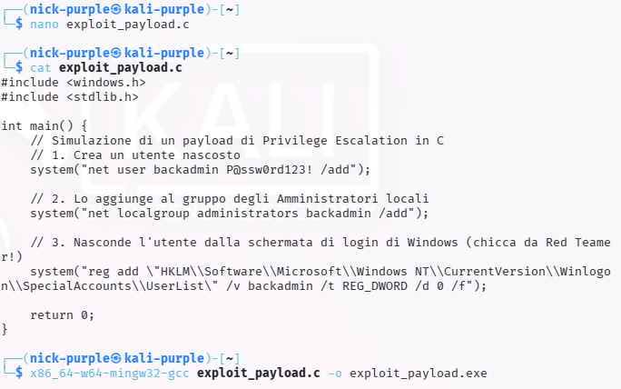
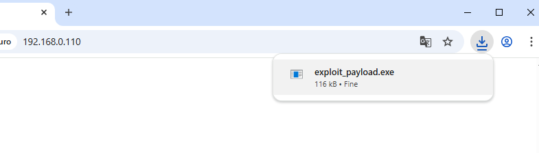
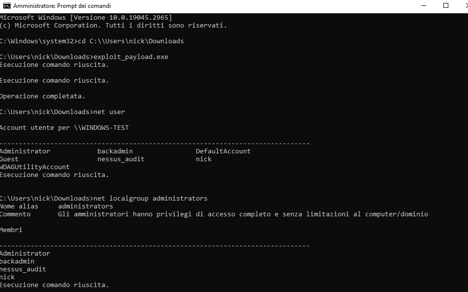
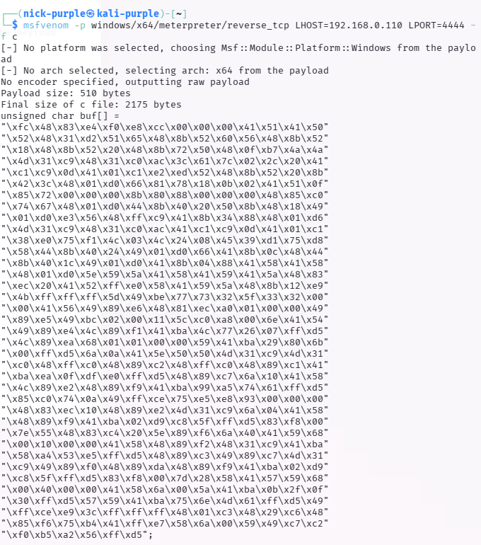
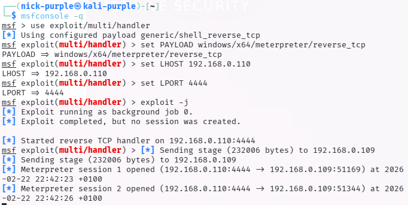

> **English** | [Italiano](README.md)

# Weaponization: Cross-Compilation & Custom Exploit Payloads

> - **Phase:** System Exploitation - Weaponization & Custom Payload Development
> - **Visibility:** High - the compiled binary is written to disk (static artifact detectable by AV/EDR); RWX memory allocation via VirtualAlloc is a high-priority behavioral indicator for EDR
> - **Prerequisites:** Shell access on the target machine (e.g., from Initial Access with Empire/Metasploit); MinGW-w64 toolchain installed on Kali for cross-compilation; shellcode payload generated with msfvenom or custom
> - **Output:** EXPLOIT-005 (custom cross-compiled payload execution on Windows, severity High); EXPLOIT-006 (in-memory shellcode execution via VirtualAlloc/CreateThread, severity Critical); functional Windows binary compiled from Kali

- Target: Windows 10 Home Machine (IP: 192.168.0.109)
- Attacker (Build Environment): Kali Linux Purple (IP: 192.168.0.110)
- Toolchain Used: GCC, MinGW-w64 (x86_64-w64-mingw32-gcc)
- Objective: Payload Customization, Cross-Compilation and Local Privilege Escalation Simulation.

---

## Executive Summary

This document illustrates the tactical adaptation and customization of a C language payload, commonly integrated within public exploits (e.g., from Exploit-DB) for obtaining persistence and privilege escalation on Microsoft Windows systems.

The operation demonstrates the ability to operate in heterogeneous environments: given the natural absence of native compilers (C/C++) on production Windows systems, the Cross-Compilation technique was adopted. The attack environment (Linux) was equipped to forge PE (Portable Executable) binaries compatible with the target architecture. The payload implemented Account Manipulation and Defense Evasion techniques to guarantee "silent" administrative access.

---

## Phase 1: Weaponization & Cross-Compilation Environment

The development phase was conducted entirely on the attacker's Linux infrastructure.

The source code (`exploit_payload.c`) was written to interface with native Windows libraries (`windows.h`) and execute system calls (`system()`) aimed at creating a persistent backdoor at the operating system level.

The payload was engineered to perform three sequential actions:

1.  User Creation: Generation of a local account named `backadmin`.

2.  Privilege Escalation: Insertion of the user into the `Administrators` group.

3.  Defense Evasion (OPSEC): Modification of the `HKLM\Software\Microsoft\Windows NT\CurrentVersion\Winlogon\SpecialAccounts\UserList` registry hive to visually hide the account from the operating system's logon screen (LogonUI).

To generate the executable, the `mingw-w64` toolchain was used. The command `x86_64-w64-mingw32-gcc exploit_payload.c -o exploit_payload.exe` successfully converted the source into a 64-bit Windows binary.

**Finding ID:** `EXPLOIT-005` | **Severity:** `High`



---

## Phase 2: Delivery & Execution

The `exploit_payload.exe` file was distributed via a local HTTP server instantiated on the attacker environment and successfully downloaded from the victim host.



To simulate the operational conditions in which a public exploit (e.g., vulnerability in drivers or SCM services) manages to divert the execution flow guaranteeing an elevated privilege context, the payload was executed from an Administrator Command Prompt.

Execution was completely silent, returning control to the prompt in fractions of a second without producing graphical output, typical behavior of malware drops.



---

## Phase 3: Post-Exploitation & Validation

To certify the successful compromise and the correct functioning of the C code compiled in a cross-environment, manual enumeration of local accounts was performed (Living off the Land).

By querying the system via the `net.exe` utility, the output confirmed the creation of the unauthorized `backadmin` account.
Subsequently, the `net localgroup administrators` command validated `backadmin`'s membership in the local administrative group, effectively certifying the acquisition of a privileged and persistent access method.


---

---

## Reference Tools

| Tool | Type | Technique/Access | Primary Use Case |
| :--- | :--- | :--- | :--- |
| `gcc` / `MinGW-w64` | Cross-compiler | CLI | Windows EXE/DLL binary compilation from Linux systems |
| `msfvenom` | Payload generator | CLI | Shellcode generation in C, Python, raw format for code embedding |
| `msfconsole` | Handler listener | CLI | Connection reception from payloads generated with msfvenom |
| `strip` | Binary tool | CLI | Debug symbol removal from binaries to reduce analysis surface |
| `wine` | Windows emulator | CLI | Windows executable testing on Linux before target deployment |
| `Donut` | Shellcode injector | CLI | Conversion of .NET assembly, EXE, DLL to in-memory shellcode |
| `pe-sieve` | Malware scanner | CLI | Windows process scanning to detect memory injection (Blue Team) |
| `x64dbg` | Debugger | GUI | Dynamic Windows binary analysis, shellcode debugging (Blue Team) |

---

## Real-World Scenario: Post-Exploitation Projection

> This section describes how EXPLOIT-005 and EXPLOIT-006 would fit into a real engagement.

### Attacker Perspective (Red Team)

**Starting point:** ability to compile and transfer a custom binary to the target; confirmed in-memory shellcode execution.

**Projected Kill Chain:**
```
EXPLOIT-006: in-memory shellcode (VirtualAlloc/CreateThread) -> active shell
        |
        v
Process migration -> inject into legitimate process (explorer.exe, svchost.exe)
        |
        v
EXPLOIT-005: persistent payload -> write Run key or Scheduled Task
        |
        v
EDR evasion: payload variants with encoder / obfuscation to bypass static signature
        |
        v
Lateral movement: deploy same payload to other hosts via SMB (PsExec / Impacket)
        |
        v
Data collection + exfiltration -> ransomware deployment
```

**Potential impact:** the in-memory execution technique (EXPLOIT-006) is particularly dangerous because it bypasses static signature-based AV solutions. Fileless payloads leave no disk traces after execution, making forensic recovery much more difficult.

**Typical monetization vectors:**
- Ransomware-as-a-Service: the custom payload is used as a dropper for the ransomware
- Credential theft: shellcode that injects into LSASS for NTLM hash dumping
- Cryptominer: silent XMRig deployment on hosts with high available CPU

### Defender Perspective (Blue Team)

**Detection:** memory allocation with PAGE_EXECUTE_READWRITE (0x40) protection via VirtualAlloc is a primary behavioral indicator for EDR (Sysmon Event ID 8 - CreateRemoteThread, Event ID 10 - ProcessAccess).

**Indicators of Compromise (IOC):**
- Process with RWX memory allocation (VirtualAlloc flags 0x3000 + 0x40)
- Unknown binary signed with absent or invalid certificate
- Cross-process injection: thread created by non-logical parent process
- reverse_tcp connection from non-browser/system process

**Containment:** kill the malicious process; isolate the host from the network; analyze memory dump with Volatility to identify injected shellcode.

**Structural hardening:**
- Enable Exploit Guard (EMET) with Control Flow Guard (CFG) protection
- Deploy EDR with behavioral detection (not just signature) - e.g., Microsoft Defender for Endpoint P2
- Implement Application Whitelisting (AppLocker/WDAC) to block unsigned binaries
- Enable Process Protection on critical processes (LSASS, system services)

---

## MITRE ATT&CK Mapping

| Tactic | Technique | MITRE ID | Action Description |
| :--- | :--- | :--- | :--- |
| Persistence | Create Account: Local Account | `T1136.001` | Creation of the `backadmin` backdoor account to guarantee future system access. |
| Privilege Escalation | Account Manipulation: Local Groups | `T1098` | Insertion of the fraudulent account into the local `Administrators` group. |
| Defense Evasion | Hide Artifacts: Hidden Window/Registry | `T1564` | Alteration of the `Winlogon\SpecialAccounts` registry keys to inhibit user display on the access UI. |
| Execution | Command and Scripting Interpreter | `T1059.003` | Leveraging the underlying `cmd.exe` interpreter (through `system()` calls in the C code) to orchestrate native binaries (`net.exe`, `reg.exe`). |

---

## Indicators of Compromise (IoCs) & Blue Team Artifacts

- File System Anomaly: Presence of an unsigned binary (`exploit_payload.exe`) containing cleartext strings related to Windows network utilities.
- Account Anomaly: Creation of a new local account (`backadmin`) outside normal IAM provisioning flows.
- Registry Alteration: Presence and modification of the `HKLM\Software\Microsoft\Windows NT\CurrentVersion\Winlogon\SpecialAccounts\UserList\backadmin` key set to DWORD `0`.
- Process Execution: Log Events (Event ID 4688) indicating chain execution of `net user`, `net localgroup` and `reg add` invoked as child processes of the malicious executable.

---

## Remediation Strategy & Mitigation

1. Security Event Monitoring: Enable advanced auditing (Audit Account Management) on Windows. Specifically monitor Event IDs 4720 (A user account was created) and 4732 (A member was added to a security-enabled local group). Any generation of these events outside maintenance windows must trigger an alert in the SIEM.

2. EDR Behavioral Analysis: Implement policies in Endpoint Detection and Response to flag unknown or unsigned applications (untrusted binaries) that attempt to instantiate interactive shells (`cmd.exe`) or that call administration utilities in rapid succession (`net.exe`, `net1.exe`, `reg.exe`).

3. Registry Hardening: Implement Attack Surface Reduction (ASR) rules or File Integrity Monitoring (FIM) monitoring to prevent or alert on modifications to the `SpecialAccounts\UserList` registry key, a technique historically abused by threat actors to maintain silent persistence.

---

## Advanced Extension: In-Memory Shellcode Execution (Defense Evasion)

**Finding ID:** `EXPLOIT-006` | **Severity:** `Critical`

To further elevate the attack sophistication level and mitigate the risk of detection by EDR (Endpoint Detection and Response) solutions based on behavioral analysis, noisy system calls (e.g., `system()`) were abandoned in favor of direct in-memory execution (In-Memory Execution).

### 1. Shellcode Generation

Using the `msfvenom` framework, the `windows/x64/meterpreter/reverse_tcp` payload was generated not in executable format, but exported as pure Shellcode (array of hexadecimal bytes in C format).



### 2. Custom Dropper Development (Memory Allocation)

A new C source (`shellcode_runner.c`) was engineered specifically to load the payload directly into RAM, avoiding the use of the file system for malicious code (Fileless-like approach). The code leverages low-level Windows APIs:

- `VirtualAlloc`: To reserve and allocate a block of dynamic memory.
- `RtlMoveMemory`: To copy the raw shellcode bytes into the allocated area.
- `VirtualProtect`: To modify the memory page protection flags to `PAGE_EXECUTE_READ`, making it actively executable by the processor.
- `CreateThread`: To generate a new execution thread pointing directly to the memory address containing the payload.

### 3. Execution and Bypass

The source was compiled via `mingw-w64`. Once executed on the target host, the executable allocated memory and executed the shellcode in a completely silent manner. The attacker's Listener successfully intercepted the Meterpreter callback, confirming the successful bypass of static controls and stable execution in RAM.



### MITRE ATT&CK Mapping (Update)

| Tactic | Technique | MITRE ID | Action Description |
| :--- | :--- | :--- | :--- |
| Defense Evasion | Process Injection: Direct Execution | `T1055` | Execution of arbitrary code injected and dynamically allocated in the calling process's memory space. |

### Advanced Mitigation (Memory Scanning)

To counter threats of this type, Blue Teams cannot rely exclusively on static file analysis. It is imperative to use EDR solutions equipped with dynamic Memory Scanning capabilities and API Hooking at the Userland level (through defensive DLL injection) or at the Kernel level (through drivers). These solutions must monitor anomalies in `VirtualAlloc` calls and intercept the allocation of memory pages with `PAGE_EXECUTE_READWRITE` flags, often indicative of unpacking or code injection.

---

> **Note:** All documented activities were conducted in a virtualized lab environment. The described payloads and binaries were compiled and executed exclusively on virtual machines owned by the author. No technique was applied to real or third-party systems without explicit authorization.
