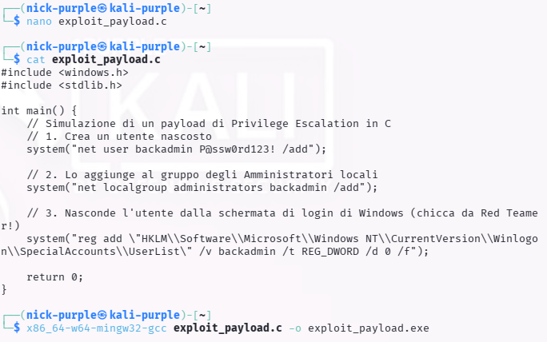
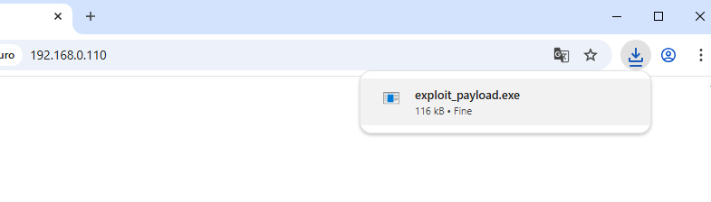
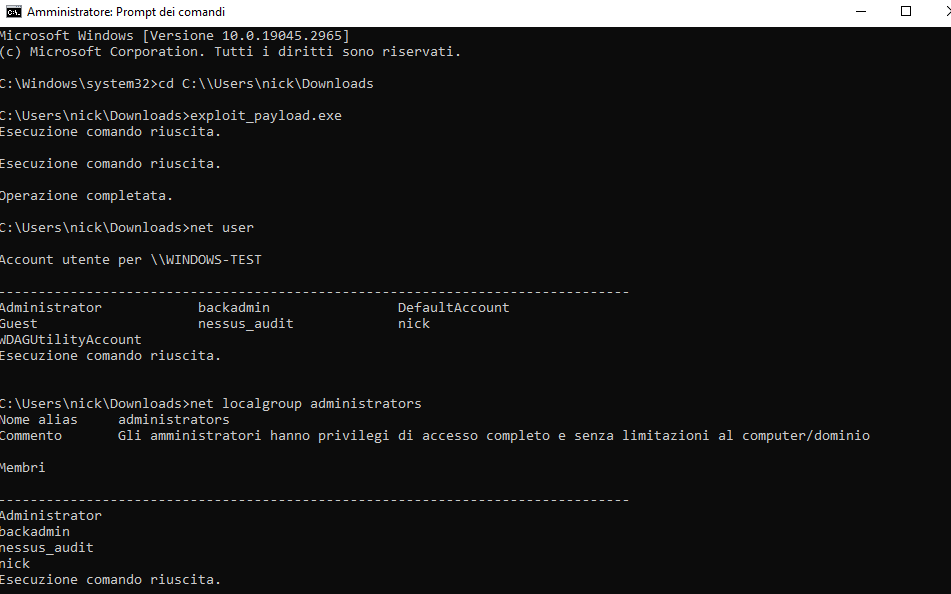
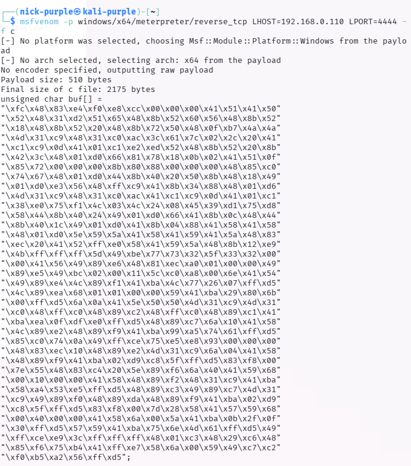

# Weaponization: Cross-Compilation & Custom Exploit Payloads

- Target: Macchina Windows 10 Home (IP: 192.168.0.109)
- Attaccante (Build Environment): Kali Linux Purple (IP: 192.168.0.110)
- Toolchain Utilizzata: GCC, MinGW-w64 (x86_64-w64-mingw32-gcc)
- Obiettivo: Simulazione di Customizzazione Payload, Cross-Compilation e Local Privilege Escalation.

---

## Executive Summary

Il presente documento illustra l'adattamento tattico e la customizzazione di un payload in linguaggio C, comunemente integrato all'interno di exploit pubblici (es. da Exploit-DB) per l'ottenimento di persistenza ed escalation dei privilegi su sistemi Microsoft Windows.

L'operazione dimostra la capacità di operare in ambienti eterogenei: a fronte della naturale assenza di compilatori nativi (C/C++) sui sistemi Windows di produzione, si è adottata la tecnica della Cross-Compilation. L'ambiente di attacco (Linux) è stato equipaggiato per forgiare binari PE (Portable Executable) compatibili con l'architettura bersaglio. Il payload ha implementato tecniche di Account Manipulation e Defense Evasion per garantire un accesso amministrativo "silente".

---

## Fase 1: Weaponization & Cross-Compilation Environment

La fase di sviluppo è stata condotta integralmente sull'infrastruttura Linux dell'attaccante.

Il codice sorgente (`exploit_payload.c`) è stato redatto per interfacciarsi con le librerie native di Windows (`windows.h`) ed eseguire chiamate di sistema (`system()`) mirate alla creazione di una backdoor persistente a livello di sistema operativo.

Il payload è stato ingegnerizzato per eseguire tre azioni sequenziali:

1.  Creazione Utente: Generazione di un account locale denominato `backadmin`.

2.  Privilege Escalation: Inserimento dell'utente nel gruppo `Administrators`.

3.  Defense Evasion (OPSEC): Modifica dell'hive di registro `HKLM\Software\Microsoft\Windows NT\CurrentVersion\Winlogon\SpecialAccounts\UserList` per nascondere visivamente l'account dalla schermata di logon (LogonUI) del sistema operativo.

Per generare l'eseguibile, è stata utilizzata la toolchain `mingw-w64`. Il comando `x86_64-w64-mingw32-gcc exploit_payload.c -o exploit_payload.exe` ha convertito con successo il sorgente in un binario a 64-bit per Windows.

---

## Fase 2: Delivery & Execution

Il file `exploit_payload.exe` è stato distribuito tramite un server HTTP locale istanziato sull'ambiente attaccante e scaricato con successo dall'host vittima.

Al fine di simulare le condizioni operative in cui un exploit pubblico (es. vulnerabilità in driver o servizi SCM) riesce a deviare il flusso di esecuzione garantendo un contesto a privilegi elevati, il payload è stato eseguito da un Prompt dei Comandi con privilegi di Amministratore.

L'esecuzione è risultata completamente silente, ritornando il controllo al prompt in frazioni di secondo senza emettere output grafici, comportamento tipico dei drop di malware.

---

## Fase 3: Post-Exploitation & Validation

Per certificare l'avvenuta compromissione e il corretto funzionamento del codice C compilato in cross-environment, si è proceduto all'enumerazione manuale degli account locali (Living off the Land).

Interrogando il sistema tramite l'utility `net.exe`, l'output ha confermato la creazione dell'account non autorizzato `backadmin`. 
Successivamente, il comando `net localgroup administrators` ha validato l'appartenenza di `backadmin` al gruppo amministrativo locale, certificando di fatto l'acquisizione di un metodo di accesso privilegiato e persistente.

---

## Mappatura MITRE ATT&CK®

| Tattica | Tecnica | ID MITRE | Descrizione dell'Azione |
| :--- | :--- | :--- | :--- |
| Persistence | Create Account: Local Account | `T1136.001` | Creazione dell'account backdoor `backadmin` per garantire accesso futuro al sistema. |
| Privilege Escalation| Account Manipulation: Local Groups | `T1098` | Inserimento dell'account fraudolento nel gruppo locale `Administrators`. |
| Defense Evasion | Hide Artifacts: Hidden Window/Registry | `T1564` | Alterazione delle chiavi di registro `Winlogon\SpecialAccounts` per inibire la visualizzazione dell'utente sulla UI di accesso. |
| Execution | Command and Scripting Interpreter | `T1059.003` | Sfruttamento dell'interprete `cmd.exe` sottostante (tramite le chiamate `system()` nel codice C) per orchestrare i binari nativi (`net.exe`, `reg.exe`). |

---

## Indicators of Compromise (IoCs) & Blue Team Artifacts

- File System Anomaly: Presenza di un binario non firmato (`exploit_payload.exe`) contenente stringhe in chiaro riconducibili alle utility di rete di Windows.
- Account Anomaly: Creazione di un nuovo account locale (`backadmin`) al di fuori dei normali flussi di provisioning IAM.
- Registry Alteration: Presenza e modifica della chiave `HKLM\Software\Microsoft\Windows NT\CurrentVersion\Winlogon\SpecialAccounts\UserList\backadmin` impostata a DWORD `0`.
- Process Execution: Eventi di Log (Event ID 4688) indicanti l'esecuzione a catena di `net user`, `net localgroup` e `reg add` invocati come processi figli dell'eseguibile malevolo.

---

## Remediation Strategy & Mitigation

1. Monitoraggio Eventi di Sicurezza: Abilitare l'auditing avanzato (Audit Account Management) su Windows. Monitorare specificamente gli Event ID 4720 (A user account was created) e 4732 (A member was added to a security-enabled local group). Qualsiasi generazione di questi eventi al di fuori delle finestre di manutenzione deve innescare un allarme nel SIEM.

2. EDR Behavioural Analysis: Implementare policy negli Endpoint Detection and Response per segnalare applicazioni non note o non firmate (untrusted binaries) che tentano di istanziare shell interattive (`cmd.exe`) o che richiamano in rapida successione le utility di amministrazione (`net.exe`, `net1.exe`, `reg.exe`).

3. Hardening del Registro: Implementare regole di Attack Surface Reduction (ASR) o monitoraggi File Integrity Monitoring (FIM) per impedire o allertare sulle modifiche alla chiave di registro `SpecialAccounts\UserList`, tecnica storicamente abusata dai threat actor per mantenere persistenza silente.

---

## Ampliamento Avanzato: In-Memory Shellcode Execution (Defense Evasion)

Per elevare ulteriormente il livello di sofisticazione dell'attacco e mitigare il rischio di rilevamento da parte di soluzioni EDR (Endpoint Detection and Response) basate sull'analisi comportamentale, si è proceduto ad abbandonare le chiamate di sistema rumorose (es. `system()`) in favore dell'esecuzione diretta in memoria (In-Memory Execution).

### 1. Shellcode Generation

Utilizzando il framework `msfvenom`, è stato generato il payload `windows/x64/meterpreter/reverse_tcp` non in formato eseguibile, ma esportato come Shellcode puro (array di byte esadecimali in formato C).

### 2. Sviluppo del Custom Dropper (Memory Allocation)

È stato ingegnerizzato un nuovo sorgente C (`shellcode_runner.c`) progettato specificamente per caricare il payload direttamente nella RAM, evitando l'uso del file system per il codice malevolo (approccio Fileless-like). Il codice sfrutta le API di Windows a basso livello:

- `VirtualAlloc`: Per riservare e allocare un blocco di memoria dinamica.
- `RtlMoveMemory`: Per copiare i byte grezzi dello shellcode nell'area allocata.
- `VirtualProtect`: Per modificare i flag di protezione della pagina di memoria in `PAGE_EXECUTE_READ`, rendendola attivamente eseguibile dal processore.
- `CreateThread`: Per generare un nuovo thread di esecuzione che punta direttamente all'indirizzo di memoria contenente il payload.

### 3. Esecuzione e Bypass

Il sorgente è stato compilato tramite `mingw-w64`. Una volta eseguito sull'host target, l'eseguibile ha allocato la memoria ed eseguito lo shellcode in modo totalmente silente. Il Listener dell'attaccante ha intercettato con successo la callback di Meterpreter, confermando l'avvenuto bypass dei controlli statici e l'esecuzione stabile in RAM.

### Mappatura MITRE ATT&CK® (Aggiornamento)

| Tattica | Tecnica | ID MITRE | Descrizione dell'Azione |
| :--- | :--- | :--- | :--- |
| Defense Evasion | Process Injection: Direct Execution | `T1055` | Esecuzione di codice arbitrario iniettato e allocato dinamicamente nello spazio di memoria del processo chiamante. |

### Mitigazione Avanzata (Memory Scanning)

Per contrastare minacce di questo tipo, i Blue Team non possono affidarsi esclusivamente all'analisi statica dei file. È imperativo l'utilizzo di soluzioni EDR dotate di capacità di Memory Scanning dinamico e di API Hooking a livello di Userland (tramite DLL iniection difensiva) o a livello Kernel (tramite driver). Queste soluzioni devono monitorare anomalie nelle chiamate a `VirtualAlloc` e intercettare l'allocazione di pagine di memoria con flag `PAGE_EXECUTE_READWRITE`, spesso indicative di unpacking o iniezione di codice.