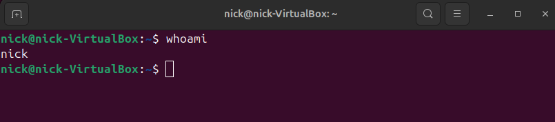
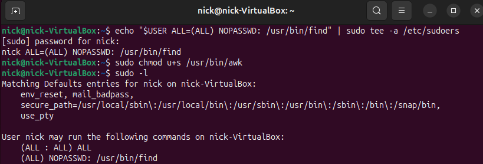
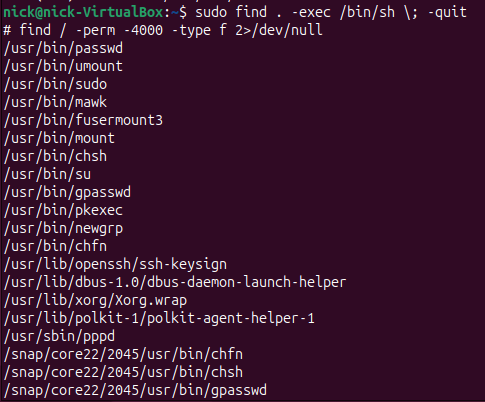
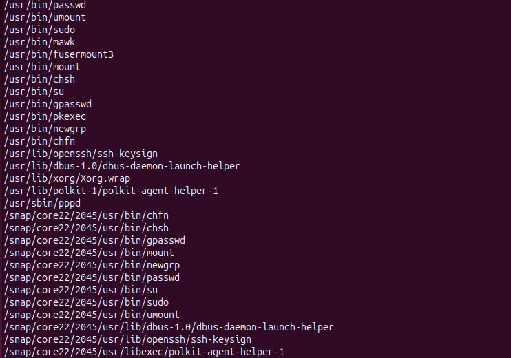
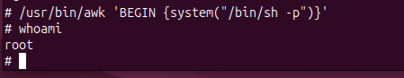

# Local Privilege Escalation (PrivEsc): Living off the Land via GTFOBins

- Ambiente Operativo: Ubuntu Linux (Target VM)
- Vettore di Accesso Iniziale: Accesso non privilegiato (Utente standard `nick`)
- Toolchain Utilizzata: Terminale nativo (sh/bash), GTFOBins (Metodologia)
- Obiettivo: Dimostrare l'identificazione e lo sfruttamento di misconfiguration sui permessi di sistema (Sudo e SUID) per ottenere privilegi di `root`, con analisi dei rischi post-exploitation e relative contromisure.

---

## Executive Summary

Il presente report documenta un'attività di Local Privilege Escalation (LPE) eseguita simulando un contesto in cui un attaccante ha già ottenuto un accesso base al sistema (Initial Access). L'assessment si è concentrato sull'abuso di binari legittimi preinstallati nel sistema operativo (tecnica nota come Living off the Land - LotL) le cui configurazioni o permessi sono stati indeboliti da errori amministrativi. 

Nello specifico, sono state identificate e sfruttate con successo due vulnerabilità critiche: un'errata configurazione del file `/etc/sudoers` associata al binario `find` e un'assegnazione anomala del bit SUID al binario `awk`. Entrambe le criticità hanno permesso un'immediata escalation ai massimi privilegi (`root`), evidenziando la necessità di applicare rigorosamente il Principio del Minimo Privilegio.

---

## Fase 1: Enumerazione e Sfruttamento Sudo (Vulnerabilità `find`)

La prima fase dell'assessment ha previsto la mappatura dei privilegi amministrativi delegati all'utente corrente.

Eseguendo il comando `sudo -l`, è emerso che l'utente standard aveva la facoltà di eseguire il binario `/usr/bin/find` come `root` senza la richiesta di alcuna password.

I threat actor utilizzano regolarmente repository come GTFOBins per identificare "funzioni nascoste" nei binari nativi. Poiché `find` possiede il flag `-exec` (progettato per eseguire comandi sui file trovati), è stato possibile abusarne per forzare la generazione di una shell interattiva con privilegi elevati.

Comando di Exploitation: `sudo find . -exec /bin/sh \; -quit`

Il comando ha bypassato i controlli di sicurezza, garantendo istantaneamente una shell di root.

---

## Fase 2: Enumerazione e Sfruttamento SUID (Vulnerabilità `awk`)

In un secondo scenario, indipendente dai permessi Sudo, si è proceduto alla ricerca di file system misconfiguration, specificamente binari con il bit SUID (Set-User-ID) anomalo.

La query `find / -perm -4000 -type f 2>/dev/null` ha restituito la lista dei file eseguibili come proprietario. Tra questi, figurava inaspettatamente `/usr/bin/awk`.

Consultando la metodologia GTFOBins, si evince che `awk` può interfacciarsi con l'OS sottostante tramite la direttiva `system()`. Sfruttando il parametro `-p` (privileged) all'interno della chiamata sh, l'eseguibile non droppa i privilegi ereditati dal SUID, restituendo all'attaccante il pieno controllo.

Comando di Exploitation: `/usr/bin/awk 'BEGIN {system("/bin/sh -p")}'`

L'esecuzione ha confermato l'acquisizione dell'identità `root`, come validato dal comando `whoami`.

---

## Post-Exploitation: Rischi e Impatto Aziendale

Ottenere l'accesso `root` significa eludere completamente i meccanismi difensivi dell'Operating System. Se questa vulnerabilità fosse sfruttata da un Threat Actor reale, l'impatto sul business includerebbe:

1. Data Exfiltration: L'attaccante può aggirare i permessi di lettura per estrarre dati sensibili (es. dump di database tramite `su - postgres`, compressione dei file web con `tar`) e inviarli a server Command & Control (C2) mascherando il traffico tramite tunnel DNS o HTTPS.

2. Deploy di Ransomware (es. LockBit/BlackCat per Linux): Accesso illimitato in scrittura permette la cifratura rapida dei dischi, distruggendo copie di shadow locali e bloccando l'operatività (Denial of Service permanente).

3. Persistenza & Backdooring: Un attaccante può mantenere l'accesso creando utenze "fantasma" (ID 0), inserendo la propria chiave in `/root/.ssh/authorized_keys`, configurando shell di reverse connection nei `cronjob`, o caricando Rootkit nel Kernel (LKM) per rendersi invisibile.

4. Defense Evasion: Manipolazione diretta e azzeramento dei file di log (`/var/log/auth.log`, `bash_history`) e falsificazione dei timestamp dei file (`touch -t`) per ostacolare l'analisi forense.

5. Lateral Movement (Pivoting): Il server compromesso viene trasformato in un router (abilitando l'IP Forwarding o usando tool di tunneling) per attaccare dall'interno altri segmenti di rete aziendali non esposti su internet (Intranet, Active Directory).

---

## Strategie di Prevenzione (Hardening) e Incident Response

Per neutralizzare le vulnerabilità LotL evidenziate e reagire a un'eventuale compromissione post-escalation, si raccomandano le seguenti contromisure:

### 1 Prevenzione e Hardening (Proattiva)

- Gestione Sudo: Evitare la direttiva `NOPASSWD` per binari interattivi o che permettono l'esecuzione di shell esterne (`find`, `vim`, `awk`, `less`, `tar`). Se un utente necessita di leggere log, limitare il path esatto e disabilitare gli escape comandi nel sudoers (es. usando flag restrittivi o script wrapper sicuri).

- Gestione SUID: Eseguire periodicamente la mappatura dei binari SUID (`find / -perm -4000`). Rimuovere immediatamente il bit SUID da binari non standard tramite il comando `chmod u-s /percorso/eseguibile`.

- EDR / Auditd: Implementare policy per il demone `auditd` capaci di tracciare processi spawnati da binari sospetti (es. `/bin/sh` invocato come figlio di `/usr/bin/find`).

### 2 Risoluzione e Incident Response (Reattiva - ad attacco in corso/avvenuto)

Se si rileva attività di PrivEsc o compromissione root, il Blue Team deve eseguire il seguente playbook:

- Isolamento (Containment): Disconnettere immediatamente il server dalla rete aziendale (o metterlo in una VLAN di quarantena) per bloccare eventuale esfiltrazione dati e impedire il Pivoting verso altri server. Non spegnere la macchina per preservare la memoria RAM.

- Analisi della Persistenza: Controllare le modifiche recenti a `/etc/passwd` (utenti non autorizzati con ID 0), verificare anomalie nei cronjob (`crontab -l`), e ispezionare chiavi SSH anomale in `/root/.ssh/authorized_keys`.

- Memoria e Forensics: Effettuare un dump della memoria RAM e analizzarlo (es. con Volatility) per identificare processi nascosti, malware memory-resident (Ransomware in esecuzione) o rootkit a livello kernel.

- Eradicazione e Ripristino: In caso di accesso root confermato, il sistema è da considerarsi non più attendibile (Zero Trust). Prelevare le evidenze forensi dai log (se ancora intatti o inviati a un SIEM centralizzato in tempo reale), procedere al wipe completo della macchina e ripristinare il servizio da backup immutabili offline certificati prima della data dell'incidente.

---

## Mappatura MITRE ATT&CK

| Tattica | Tecnica | ID MITRE | Descrizione dell'Azione |
| :--- | :--- | :--- | :--- |
| Privilege Escalation | Abuse Elevation Control Mechanism: Sudo and Sudo Caching | `T1548.003` | Bypass dei controlli sfruttando direttive `NOPASSWD` e flag di esecuzione nativi (`-exec` in `find`). |
| Privilege Escalation | Abuse Elevation Control Mechanism: Setuid and Setgid | `T1548.001` | Sfruttamento di un file system artifact (bit SUID su `awk`) per eseguire codice a livello di owner del file. |
| Execution | Command and Scripting Interpreter: Unix Shell | `T1059.004` | Utilizzo di `/bin/sh` per orchestrare l'escalation e interagire con il sistema operativo a basso livello. |