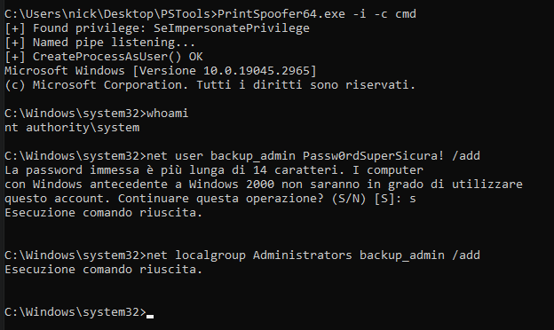
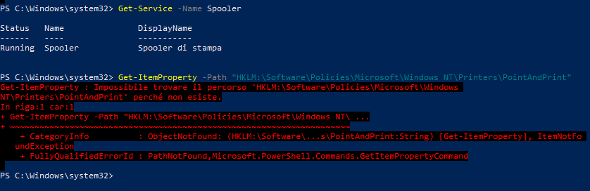

# Windows Privilege Escalation & Persistence: Access Token Abuse (PrintSpoofer)

- Ambiente Operativo: Windows 10 22H2 (Target VM)
- Vettore di Accesso Iniziale (Simulato): Compromissione di un servizio applicativo (es. Server Web IIS o SQL Server) con permessi limitati.
- Toolchain Utilizzata: Prompt dei Comandi (cmd.exe), PrintSpoofer64, Gestione Account di Rete (net.exe)
- Obiettivo:
  
  1. Identificare e sfruttare l'abuso del `SeImpersonatePrivilege` per elevare i privilegi all'autorità `NT AUTHORITY\SYSTEM` (PrintSpoofer).
  
  2. Stabilire persistenza tramite creazione di account Backdoor.
  
  3. Condurre un Vulnerability Assessment architetturale sulla superficie di attacco esposta dal servizio Spooler di Stampa (PrintNightmare - CVE-2021-34527).

---

## Executive Summary

Il presente assessment documenta una criticità di Privilege Escalation locale (LPE) basata sull'abuso dei privilegi delegati agli account di servizio in ambienti Microsoft Windows. Sfruttando il privilegio `SeImpersonatePrivilege` tramite il tool LotL (Living off the Land) PrintSpoofer, è stato possibile intercettare il Token di accesso del kernel e iniettarlo in un nuovo processo interattivo, garantendo il controllo totale dell'Endpoint.

Per dimostrare la criticità di questo vettore, l'assessment si è spinto nella fase di Post-Exploitation. Operando nel contesto di sicurezza massimo (`SYSTEM`), è stata creata una backdoor persistente a livello di sistema operativo, dimostrando come un attaccante possa garantirsi un accesso a vita alla macchina scavalcando in modo silente le difese locali.

---

## Fase 1: Enumerazione dei Privilegi (Token Hunting)

La fase di Post-Exploitation su Windows richiede l'analisi dei diritti nativi assegnati all'utente corrente dal Local Security Authority (LSA). Durante la ricognizione iniziale, l'esecuzione del comando `whoami /priv` ha rivelato la presenza di un vettore critico:

`SeImpersonatePrivilege   Rappresenta un client dopo l'autenticazione   Abilitato`

Questo privilegio, nativamente concesso ai servizi web per impersonare i client autenticati, costituisce l'anello debole architetturale: se un attaccante riesce a forzare un servizio di alto livello a comunicare con il suo processo, può "rubarne" l'identità.

---

## Fase 2: Sfruttamento tramite PrintSpoofer (Named Pipe Impersonation)

Per capitalizzare il `SeImpersonatePrivilege`, è stato impiegato PrintSpoofer64.exe. L'exploit istanzia una Named Pipe locale e sfrutta un'anomalia nel servizio nativo Spooler di Stampa per forzare l'OS (che opera come `SYSTEM`) a connettersi ad essa.

Al momento della connessione, PrintSpoofer cattura il "System Token" e utilizza l'API `CreateProcessAsUser()` per generare una shell di comandi `cmd.exe` con poteri assoluti.

Come evidenziato dai log operativi, l'exploit riconosce il privilegio (`[+] Found privilege: SeImpersonatePrivilege`) e droppa una shell che attesta l'acquisizione dell'identità suprema (`nt authority\system`).

---

## Fase 3: Post-Exploitation e Impatto Reale (Persistenza via Backdoor)

L'ottenimento dei privilegi `SYSTEM` non è quasi mai l'obiettivo finale di un Threat Actor, ma un mezzo per garantirsi il dominio incontrastato della macchina. Una delle manovre più critiche in questa fase è la Persistenza. 

Se l'azienda vittima dovesse riavviare il server, patchare il servizio o disattivare lo Spooler di Stampa, l'attaccante perderebbe istantaneamente l'accesso tramite l'exploit. Per evitare questo, operando da `SYSTEM`, le restrizioni del Security Account Manager (SAM) vengono annullate.

Come dimostrato dal Proof of Concept, sono stati impartiti due comandi diretti al sistema:

1. Creazione dell'utente ombra: `net user backup_admin Passw0rdSuperSicura! /add`

   Questo comando istanzia un nuovo utente locale nascosto alle normali verifiche applicative. Il sistema ha risposto con "Esecuzione comando riuscita".

2. Assegnazione dei privilegi massimi: `net localgroup Administrators backup_admin /add`

   L'utente ombra è stato inserito di forza nel gruppo degli Amministratori locali.



Impatto di Sicurezza: Da questo momento in poi, l'attaccante potrà collegarsi via RDP (Remote Desktop), SMB o WinRM al server utilizzando le credenziali `backup_admin` / `Passw0rdSuperSicura!`, operando alla luce del sole e rendendo totalmente ininfluente la chiusura della falla originaria.

---

## Fase 4: Auditing e Patch Validation (PrintNightmare - CVE-2021-34527)

L'assessment ha valutato l'esposizione del sistema alla CVE-2021-34527, che permette l'esecuzione remota di codice caricando driver di stampa malevoli tramite il servizio nativo Spooler (`spoolsv.exe`).

Il tentativo di recupero di PoC pubblici in memoria via PowerShell (`Invoke-Nightmare`) ha riscontrato policy di takedown (`404 Not Found`), uno scenario OPSEC comune. Si è proceduto pertanto con un Auditing strutturato del sistema:

1. Verifica dello stato del servizio:

```powershell
PS C:\> Get-Service -Name Spooler
Status   Name      DisplayName
------   ----      -----------
Running  Spooler   Spooler di stampa
```

Esito: Il demone bersaglio risulta regolarmente attivo ed in esecuzione.

2. Verifica delle policy di mitigazione Point and Print:

```PowerShell
PS C:\> Get-ItemProperty -Path "HKLM:\Software\Policies\Microsoft\Windows NT\Printers\PointAndPrint"
Get-ItemProperty : Impossibile trovare il percorso...
```

Esito: L'assenza della chiave indica che non sono state implementate restrizioni esplicite via GPO. La macchina resiste all'exploitation esclusivamente grazie alle patch cumulative integrate in Windows 10 22H2.



---

## Blue Team: Rilevamento e Contromisure (Detection Engineering)

1. Hardening Architetturale & Mitigation

- Disabilitazione Spooler (Priorità Alta): Come evidenziato nell'Auditing, il servizio Print Spooler (`spoolsv.exe`) è abilitato in modo predefinito. Su server applicativi (DC, IIS, SQL) deve essere tassativamente disabilitato tramite Services.msc o GPO (`Set-Service -Name Spooler -StartupType Disabled`), mitigando sia PrintNightmare che i vettori RPC usati da PrintSpoofer.
- Segregazione Token: Rimuovere il `SeImpersonatePrivilege` dagli account di servizio applicativi che non necessitano dell'impersonation.

2. Detection (Monitoraggio SOC/SIEM)

- Monitoraggio SAM (EID 4720 e 4732): Inviare alert critici per la creazione improvvisa di account locali e il loro inserimento nel gruppo Administrators (Fase di persistenza).
- Named Pipe Anomale: Monitoraggio di interazioni impreviste sulle named pipe (Sysmon Event ID 17 e 18), specialmente se le connessioni in entrata provengono dallo Spooler.

---

## Mappatura MITRE ATT&CK

| Tattica | Tecnica | ID MITRE | Descrizione dell'Azione |
| :--- | :--- | :--- | :--- |
| Privilege Escalation | Access Token Manipulation: Token Impersonation/Theft | `T1134.001` | Abuso del `SeImpersonatePrivilege` per duplicare un Access Token a livello `SYSTEM`. |
| Persistence | Create Account: Local Account | `T1136.001` | Creazione di un account locale (`backup_admin`) per mantenere l'accesso al sistema. |
| Persistence / Privilege Escalation | Valid Accounts: Local Accounts | `T1078.003` | Inserimento dell'account illecito nel Local Administrators Group per garantire privilegi massimi continui. |
| Execution | Command and Scripting Interpreter: Windows Command Shell | `T1059.003` | Iniezione del token rubato in una shell e utilizzo di `net.exe` per la manipolazione del SAM. |
| Execution | Command and Scripting Interpreter: PowerShell | `T1059.001` | Utilizzo di PowerShell per condurre l'auditing dei servizi e dei registri OS per PrintNightmare. |
|Discovery | System Service Discovery | `T1007` | Enumerazione dello stato operativo dello Spooler di stampa tramite moduli nativi. |