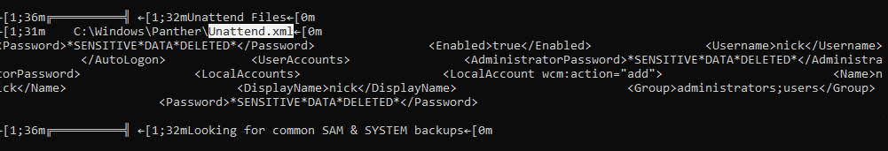
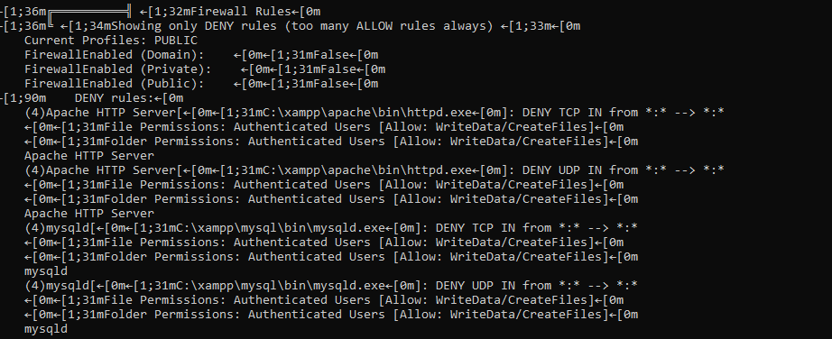

# Automated Post-Exploitation & Privilege Escalation: WinPEAS (Windows Local Enumeration)

- Ambiente Operativo: Windows 10 22H2 (Target VM)
- Vettore di Accesso Iniziale: Accesso non privilegiato tramite shell (Utente `nick`)
- Toolchain Utilizzata: WinPEASx64.exe (Windows Privilege Escalation Awesome Scripts)
- Obiettivo: Eseguire un'enumerazione locale massiva e silente per identificare misconfiguration di sistema, permessi deboli su file/cartelle e credenziali in chiaro dimenticate (Credential Hunting) al fine di scalare i privilegi a `NT AUTHORITY\SYSTEM`.

---

## Executive Summary

Il presente documento illustra i risultati di un'operazione di enumerazione automatizzata post-compromissione in ambiente Windows tramite l'impiego del tool WinPEAS. A differenza degli exploit a livello kernel (es. vulnerabilità dello spooler o driver), questo assessment si è concentrato sull'identificazione di falle logiche, errori di configurazione (Misconfigurations) e negligenze operative (OPSEC failures).

L'auditing ha rivelato due criticità di livello Alto/Critico: l'esposizione di credenziali amministrative all'interno di file di deployment di sistema (Sysprep/Unattend) e una gravissima configurazione errata dei permessi (Weak ACLs) sui binari di una suite software di terze parti (XAMPP), garantendo due percorsi distinti e garantiti per la compromissione totale dell'infrastruttura.

---

## Fase 1: Enumerazione Massiva (Execution)

Per condurre l'analisi, le difese in tempo reale (AMSI/Defender) sono state temporaneamente evase, permettendo l'esecuzione del binario `winPEASx64.exe` direttamente dal prompt dei comandi dell'utente compromesso. 

Il tool ha analizzato le policy di sicurezza, i token utente, i servizi di rete, i registri di sistema (HKLM/HKCU) e ha effettuato un parsing alla ricerca di keyword sensibili (password, pass, creds) all'interno dell'intero file system.

```cmd
C:\Users\nick\Desktop>winPEASx64.exe
Creating Dynamic lists, this could take a while, please wait...
- Loading sensitive_files yaml definitions file...
- Creating current user groups list...
```

---

## Fase 2: Triage delle Vulnerabilità (Risultati WinPEAS)

Dalla mole di dati generata, l'analista ha isolato e validato due vettori critici evidenziati dal sistema di alerting cromatico del tool (Rosso).
Vettore 1: Credential Hunting (Unattended Installation Files)

Durante l'installazione massiva di macchine Windows negli ambienti aziendali, gli amministratori utilizzano tool come Sysprep, che leggono configurazioni da file XML (`unattend.xml` o `autounattend.xml`). Al termine del deployment, questi file dovrebbero essere distrutti.
WinPEAS ha individuato un residuo operativo nella cartella di sistema `Panther`:

```Plaintext
╔══════════╣ Unattend Files
╚ https://book.hacktricks.wiki/en/windows-hardening/windows-local-privilege-escalation/index.html#files-and-registry-credentials
    C:\Windows\Panther\Unattend.xml
        <Password>*SENSITIVE*DATA*DELETED*</Password>
        <Enabled>true</Enabled>
        <Username>nick</Username>
    </AutoLogon>
    <UserAccounts>
        <AdministratorPassword>*SENSITIVE*DATA*DELETED*</AdministratorPassword>
```

Artifact 1: Estratto dell'output di WinPEAS che rileva la presenza di un file Unattend.xml popolato.



Impatto: Leggendo fisicamente questo file, un attaccante è in grado di recuperare le password (spesso codificate in semplice Base64, facilmente decodificabile) degli account utente e dell'Amministratore Locale, ottenendo privilegi massimi senza dover eseguire alcun codice malevolo.

Vettore 2: Weak Service Binaries Permissions (XAMPP)

L'analisi delle ACL (Access Control List) sulle cartelle non standard ha rivelato un problema architetturale legato alla suite software XAMPP (Apache, MySQL, Tomcat).

```Plaintext
╔══════════╣ Searching executable files in non-default folders with write permissions
    File Permissions "C:\xampp\mysql\bin\mysqld.exe": Authenticated Users [Allow: WriteData/CreateFiles]
    File Permissions "C:\xampp\apache\bin\httpd.exe": Authenticated Users [Allow: WriteData/CreateFiles]
    File Permissions "C:\xampp\tomcat\bin\tomcat7.exe": Authenticated Users [Allow: WriteData/CreateFiles]
```

Artifact 2: Evidenza dei permessi deboli sugli eseguibili critici dei servizi di terze parti.



Impatto (Service Binary Hijacking): Come documentato, il gruppo `Authenticated Users` (che include qualsiasi utente che abbia fatto login, persino il meno privilegiato) possiede permessi di `WriteData/CreateFiles` su eseguibili critici.

Un attaccante può semplicemente rinominare `mysqld.exe` in `mysqld.bak`, generare un malware (Reverse Shell) tramite MSFvenom, nominarlo `mysqld.exe` e attendere. Al riavvio del server o del servizio, Windows eseguirà il malware come `NT AUTHORITY\SYSTEM`.

---

## Blue Team: Rilevamento e Contromisure (Detection Engineering)

La presenza di strumenti di enumerazione massiva e le relative misconfiguration identificate richiedono interventi immediati:

1. Hardening & Remediation (Priorità Alta)

- Pulizia Sysprep (Credential Management): Verificare ed eliminare i file di configurazione di installazione residui dalle directory `C:\Windows\Panther\`, `C:\Windows\System32\sysprep\` e `C:\unattend.xml`. Le password amministrative locali devono essere gestite centralmente, preferibilmente tramite implementazione di Microsoft LAPS (Local Administrator Password Solution), la cui assenza è stata evidenziata dal tool.
- Bonifica ACL su Third-Party Software: L'installazione di software fuori dalla directory `C:\Program Files\` (che è protetta nativamente da Windows) spesso eredita permessi errati dalla root `C:\`. È imperativo correggere le proprietà della cartella `C:\xampp\`, rimuovendo il permesso di "Controllo Completo" e "Scrittura" per il gruppo Users e Authenticated Users.

2. Detection (SOC & SIEM)

- Monitoraggio Esecuzione WinPEAS: WinPEAS e script affini (.bat, .ps1) producono pattern di esecuzione rumorosi. Implementare regole YARA/Sigma e alert EDR per rilevare:

    - L'avvio di un elevato numero di query WMI (`wmic.exe`, `gwmi`) e comandi `reg query` in un lasso di tempo ristretto (< 3 secondi).
    - Lettura anomala di directory critiche (es. accesso non autorizzato a `C:\Windows\Panther\Unattend.xml` da processi non di sistema).

---

## Mappatura MITRE ATT&CK

| Tattica | Tecnica | ID MITRE | Descrizione dell'Azione |
|---------|---------|----------|-------------------------|
| Discovery | System Information Discovery | `T1082` | Uso di WinPEAS per enumerare massivamente stato del SO, patch, e configurazioni locali. |
| Credential Access | Unsecured Credentials: Credentials in Files | `T1552.001` | Identificazione e parsing di file Unattend.xml contenenti password di AutoLogon e Admin. |
| Privilege Escalation | Hijack Execution Flow: Executable Installer/Service | `T1574` | Identificazione della possibilità di sostituire eseguibili legittimi (es. XAMPP) a causa di permessi deboli (Weak ACL). |
| Discovery | File and Directory Discovery | `T1083` | Ricerca di file eseguibili con permessi di scrittura e scansione delle history dei browser/console. |