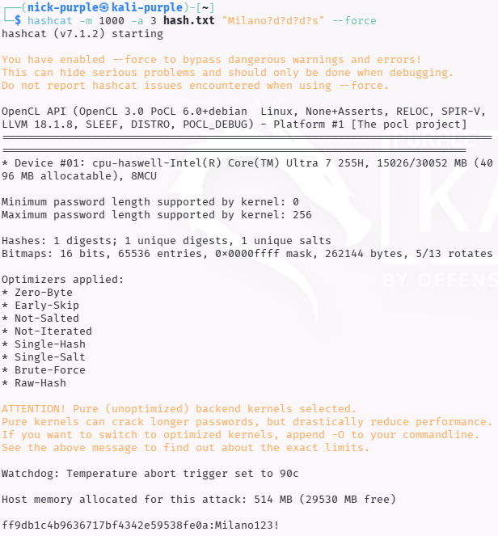
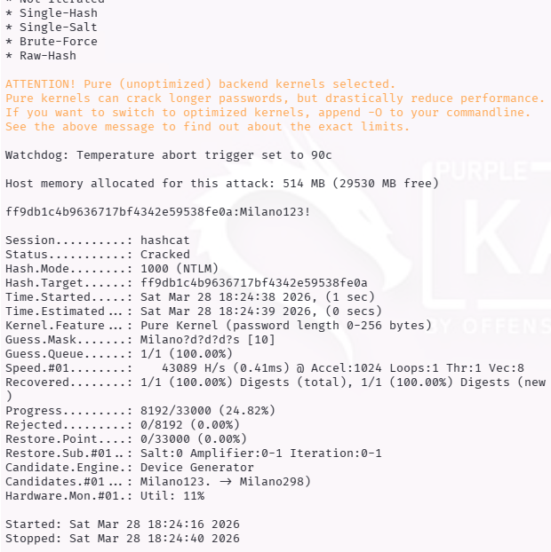
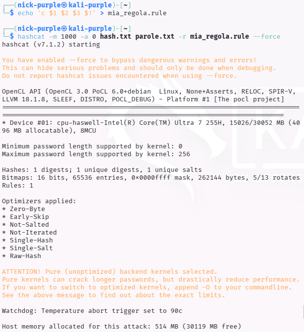
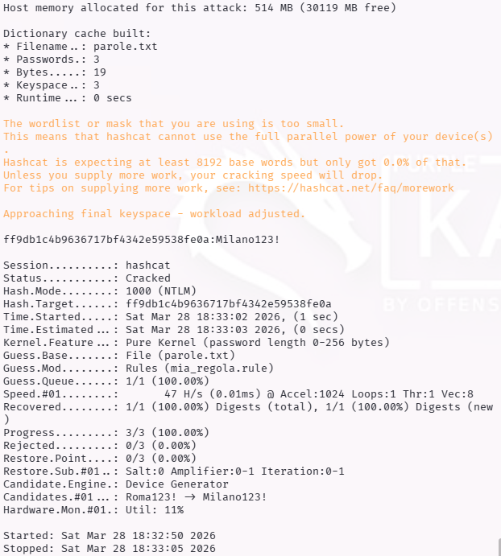

# Password Cracking Avanzato con Hashcat: Mask Attack & Rule-based Attack

> - **Fase:** System Exploitation - Password Cracking - GPU-Accelerated Offline Cracking
> - **Visibilita:** Zero - operazione completamente offline su hash estratti; nessun traffico di rete generato, nessuna interazione con il target
> - **Prerequisiti:** Hash NTLM estratto dal target (via Mimikatz, SAM dump, secretsdump.py o altra tecnica di credential dumping); Hashcat installato con driver GPU compatibile; wordlist contestuali e/o conoscenza della policy password aziendale per costruzione maschere
> - **Output:** EXPLOIT-022 (NTLM cracking via Mask Attack - severity Alto); EXPLOIT-023 (NTLM cracking via Rule-based Attack con regola custom - severity Alto)

- **Ambiente Operativo:** Kali Linux Purple (Attaccante), Windows Virtual Machine (Vittima)
- **Target:** NTLM Hash (Windows SAM/Active Directory)
- **Framework:** Hashcat (v7.1.2)
- **Tecniche Documentate:** Mask Attacks (`-a 3`), Custom Rule-based Attacks (`-a 0 -r`)

---

## Executive Summary

La decrittazione delle credenziali (Password Cracking) è una fase critica del Penetration Testing che non si basa più sulla forza bruta pura, ma sullo sfruttamento della prevedibilità umana e delle debolezze nelle policy di sicurezza ("Complexity Requirements").

In questo modulo è documentato l'utilizzo avanzato di **Hashcat**, lo standard industriale per il recupero delle credenziali ad altissime prestazioni. L'analisi si concentra su due metodologie chirurgiche per abbattere drasticamente lo spazio di ricerca (keyspace reduction): i **Mask Attacks** e i **Rule-based Attacks**. Entrambe le tecniche sono state testate con successo contro un hash NTLM, l'algoritmo di hashing primario negli ambienti Microsoft Windows.

È stato simulato uno scenario reale in cui l'analista ottiene l'hash dell'utente Amministratore (password `Milano123!`) e utilizza l'intelligenza contestuale per accelerarne la compromissione.

---

## Metodologia 1: Mask Attack (L'attacco mirato)

**ID Finding:** `EXPLOIT-022` | **Severity:** `Alto`

Un attacco a maschera viene impiegato quando la struttura della password bersaglio è nota o altamente probabile (es. attraverso OSINT o analisi delle policy aziendali), ma i caratteri specifici sono ignoti. Invece di testare iterativamente l'intero spazio di ricerca, la maschera costringe Hashcat a calcolare solo le combinazioni che rispettano un formato predefinito.

**Scenario PoC:** L'Information Gathering indica che l'amministratore usa una password basata sulla città "Milano" seguita da 3 numeri e un simbolo speciale.

### PoC - Fase 1: Lancio dell'Attacco
È stato configurato l'attacco (`-a 3`) per l'hash NTLM target (`ff9db1c4b9636717bf4342e59538fe0a`) utilizzando i placeholder di Hashcat:
* `?d` = Digit (Numeri 0-9)
* `?s` = Special (Simboli)

Comando: `hashcat -m 1000 -a 3 hash.txt "Milano?d?d?d?s" --force`



### PoC - Fase 2: Successo del Cracking
Dato lo spazio di ricerca drasticamente ridotto dalla maschera, il cracking avviene quasi istantaneamente.



---

## Metodologia 2: Custom Rule-based Attack (La mutazione dinamica)

**ID Finding:** `EXPLOIT-023` | **Severity:** `Alto`

Un attacco a regole viene utilizzato quando si dispone di liste di parole contestuali (es. nomi dell'azienda, squadre sportive locali, anni correnti) e si desidera scalarle per soddisfare i requisiti minimi di complessità. Le regole sono un linguaggio di scripting interpretato da Hashcat che applica mutazioni logiche (es. capitalizzazione, prefissi, suffissi) on-the-fly durante l'iterazione della wordlist.

**Scenario PoC (Information Disclosure):** Si sospetta che l'utente usi la propria città preferita. Si dispone di una wordlist minimale (`roma\nnapoli\nmilano`) tutta minuscola. L'obiettivo è istruire Hashcat affinché muti queste parole base per indovinare la password reale (`Milano123!`).

### PoC - Fase 1: Identificazione Problema e Soluzione Custom
Durante il tentativo di utilizzo di una regola di sistema (`best64.rule`), è stato riscontrato un errore di percorso file non trovato (Figura 3). L'analista ha proceduto alla creazione di un file di regole personalizzato (`mia_regola.rule`) per ottenere la mutazione desiderata.

**Sintassi della Regola Custom:**
`echo 'c $1 $2 $3 $!' > mia_regola.rule`
* `c` = Capitalize (Metti la prima lettera maiuscola)
* `$1 $2 $3 $!` = Append (Aggiungi alla fine i caratteri 1, 2, 3, !)



### PoC - Fase 2: Successo del Cracking con Regola Custom
Hashcat ingerisce la wordlist (`parole.txt`), applica la mutazione definita a ogni parola e calcola l'hash. La parola `milano` viene trasformata in `Milano123!`, causando la collisione dell'hash.



---

## Impatto e Remediation (Blue Team)

L'efficacia schiacciante di questi attacchi, anche su hardware limitato (CPU di una VM), evidenzia l'inadeguatezza delle tradizionali policy di sicurezza basate sulla complessità ("Complexity Requirements").

Per difendere efficacemente gli ambienti Windows/Active Directory, è necessario implementare le seguenti contromisure:

1. **Abbandono della Complessità a favore della Lunghezza (Passphrase):** Imporre policy che favoriscano passphrase lunghe (L > 15-20 caratteri) ma facili da ricordare (es. *IlMioCaneAbbaiaForteAlPostino*). La lunghezza aumenta lo spazio di ricerca in modo esponenziale, rendendo matematicamente impraticabili gli attacchi a maschera e a regola.
2. **Disabilitazione dei Protocolli Legacy:** Disabilitare l'hashing LM e NTLMv1/v2 a favore dell'uso esclusivo di Kerberos per l'autenticazione.
3. **MFA (Multi-Factor Authentication):** L'implementazione dell'MFA rende il cracking dell'hash insufficiente per l'accesso remoto iniziale.

---

## Esperienza di Laboratorio

L'ambiente di test e stato configurato con una VM Kali Linux Purple come macchina attaccante e un hash NTLM estratto manualmente da una VM Windows (password target: `Milano123!`). La scelta di NTLM come formato hash e dettata dalla sua diffusione ubiquitaria negli ambienti Active Directory, dove ogni account di dominio possiede un hash NTLM derivato dalla propria password.

Il primo approccio tentato e stato il Mask Attack (EXPLOIT-022). La costruzione della maschera `Milano?d?d?d?s` ha richiesto un ragionamento di intelligence contestuale: in un engagement reale, l'analista avrebbe ricavato il pattern "citta + numeri + simbolo" dall'analisi delle policy aziendali o da precedenti password compromesse. Il cracking si e concluso in pochi millisecondi, dimostrando che la conoscenza parziale della struttura abbatte lo spazio di ricerca da miliardi di combinazioni a poche migliaia.

Per il Rule-based Attack (EXPLOIT-023), il tentativo iniziale ha utilizzato la regola di sistema `best64.rule`, ma Hashcat ha restituito un errore di percorso (`No such file or directory`). Questo problema - comune nelle installazioni Kali dove il path delle regole varia tra versioni - ha richiesto la creazione di una regola personalizzata (`mia_regola.rule`). La regola `c $1 $2 $3 $!` e stata costruita ragionando sulle mutazioni piu probabili applicate dagli utenti per soddisfare i requisiti di complessita: capitalizzazione iniziale + suffisso numerico + simbolo obbligatorio. Questa logica riflette fedelmente il comportamento documentato nel report di Hive Systems e nei dataset di breach analizzati da NIST.

Il dato piu significativo dell'esercizio e la velocita di compromissione: in entrambi i casi il cracking e avvenuto quasi istantaneamente, persino su hardware limitato (CPU di una VM senza accelerazione GPU). In un engagement reale con GPU dedicata (es. NVIDIA RTX 4090), lo stesso attacco coprirebbe keyspace ordini di grandezza superiori.

---

## Analisi Teorica: Perche le Policy di Complessita Falliscono

L'algoritmo NTLM (MD4 senza salt) e l'anello debole della catena di autenticazione Windows. La mancanza di salting significa che hash identici corrispondono a password identiche su qualsiasi macchina del dominio, abilitando attacchi rainbow table e pre-computation. La velocita di calcolo di MD4 su GPU moderne (decine di miliardi di hash/secondo su una singola RTX 4090) rende il brute-force completo praticabile per password fino a 8-9 caratteri.

La vera lezione di questo laboratorio non e tecnica ma organizzativa: le policy di complessita tradizionali ("minimo 8 caratteri, una maiuscola, un numero, un simbolo") generano pattern prevedibili. Gli utenti rispondono invariabilmente con il pattern `Parola123!` - capitalizzazione iniziale, numeri sequenziali, simbolo obbligatorio in coda. Questo pattern e esattamente cio che Mask Attack e Rule-based Attack sfruttano. La raccomandazione NIST SP 800-63B (2024) ha abbandonato i requisiti di complessita a favore della lunghezza minima (15+ caratteri) e del blocco delle password presenti in breach database, approccio confermato dall'analisi dei dataset di compromissione reali.

Nel contesto della kill chain, il password cracking offline si colloca dopo la fase di Credential Dumping (es. Mimikatz `sekurlsa::logonpasswords`, `secretsdump.py`, SAM extraction) e prima del Lateral Movement. La password in chiaro recuperata puo essere usata per autenticazione RDP, WinRM, o per generare ticket Kerberos tramite `getTGT.py` (Impacket), bypassando le limitazioni del Pass-the-Hash in contesti dove solo l'autenticazione con password e permessa.

---

## Scenario Reale: Proiezione Post-Exploitation

> Questa sezione descrive come EXPLOIT-022 ed EXPLOIT-023 si inserirebbero in un engagement reale su un'infrastruttura Active Directory.

### Prospettiva Attaccante (Red Team)

**Punto di partenza:** hash NTLM dell'utente Amministratore locale ottenuto tramite SAM dump, DCSync o intercettazione SMB Relay; cracking completato con successo tramite Mask o Rule-based Attack; password in chiaro disponibile.

**Passo successivo immediato:** autenticazione con le credenziali recuperate verso altri sistemi del dominio per verificare il riuso della password (credential stuffing interno).

**Kill Chain proiettata:**
```
Credential Dumping (SAM/LSASS/DCSync) -> hash NTLM
        |
        v
EXPLOIT-022/023: Hashcat cracking -> password in chiaro "Milano123!"
        |
        v
Credential Reuse: RDP/WinRM/SMB verso altri host con stessa password
        |
        v
Mimikatz su host multipli -> hash NTLM Domain Admin (se cached)
        |
        v
DCSync -> dump completo NTDS.dit -> tutti gli hash del dominio
        |
        v
Golden Ticket (Kerberos) -> persistenza a lungo termine (10 anni)
        |
        v
Ransomware deployment via GPO / esfiltrazione dati sensibili
```

**Impatto potenziale:** la password craccata di un singolo account amministratore locale, se riutilizzata su piu macchine (pattern comune in ambienti senza LAPS), consente il movimento laterale verso il Domain Controller e la compromissione totale del dominio AD.

**Vettori di monetizzazione tipici:**
- Ransomware-as-a-Service (LockBit 3.0, BlackCat/ALPHV): cifratura sistemi + richiesta riscatto 100.000-5.000.000 USD
- Double extortion: riscatto per decriptare + riscatto per non pubblicare i dati esfiltrati
- Access Broker: rivendita dell'accesso Domain Admin su forum underground (5.000-50.000 USD)
- Business Email Compromise: accesso a mailbox tramite credenziali recuperate per frodi finanziarie

### Prospettiva Difensore (Blue Team)

**Rilevamento:** il password cracking offline non genera eventi rilevabili dal SOC (operazione locale sull'host dell'attaccante). La difesa si concentra sulle fasi precedenti (credential dumping) e successive (lateral movement). Event ID 4625 (logon failed) e 4624 (logon success) con credenziali riutilizzate su host multipli in finestra temporale ristretta indicano credential stuffing post-cracking.

**Indicatori di Compromissione (IOC):**
- Event ID 4776: NTLM authentication attempts anomali in rapida successione
- Event ID 4624 con LogonType=10 (RDP) da IP interni non autorizzati
- Accesso a share amministrative (C$, ADMIN$) da account non previsti
- Pattern di login simultanei sullo stesso account da IP diversi

**Contenimento:** reset immediato della password compromessa e di tutti gli account che utilizzano la stessa password; revoca sessioni attive; isolamento degli host potenzialmente compromessi.

**Eradicazione e hardening:**
- Implementare LAPS (Local Administrator Password Solution) per password uniche per macchina
- Abilitare Credential Guard per proteggere gli hash NTLM in memoria da dump
- Adottare passphrase lunghe (15+ caratteri) al posto delle policy di complessita tradizionali
- Abilitare MFA per tutti gli accessi remoti (RDP, VPN, WinRM)
- Monitorare l'hash NTLM degli account privilegiati contro database di password compromesse (HaveIBeenPwned NT Hash API)

**Lezione difensiva:** la complessita della password non e un sostituto della lunghezza. Una password che rispetta tutti i requisiti di complessita aziendale (`Milano123!`) viene craccata in millisecondi, mentre una passphrase senza requisiti di complessita (`il-mio-gatto-dorme-sul-divano-rosso`) richiederebbe milioni di anni.

---

## Tool di riferimento

| Tool | Tipo | Tecnica/Accesso | Caso d'uso principale |
| :--- | :--- | :--- | :--- |
| `Hashcat` | Password cracking | CLI - GPU accelerated | Standard industriale per cracking offline ad alte prestazioni: supporta 350+ tipi di hash, mask/rule/hybrid attacks |
| `John the Ripper` | Password cracking | CLI - CPU bound | Alternativa CPU-based con suite `*2john` per estrazione hash da formati complessi (ZIP, PDF, SSH, KeePass) |
| `hashid` / `hash-identifier` | Hash identification | CLI | Identificazione automatica del tipo di hash prima del cracking |
| `CeWL` | Wordlist generator | CLI - Web scraping | Generazione wordlist contestuali da siti web del target per attacchi mirati |
| `Mentalist` | Rule builder | GUI | Costruzione visuale di catene di regole per password cracking |
| `kwprocessor` | Keyboard walk gen | CLI | Generazione di pattern basati su percorsi fisici della tastiera (es. `qwerty123`) |
| `Mimikatz` | Credential dumping | CLI - Windows | Estrazione hash NTLM dalla memoria (LSASS) - fornisce l'input per il cracking |
| `secretsdump.py` | Credential dumping | CLI - Impacket | Estrazione remota di hash NTLM via DCSync, SAM o NTDS.dit |

> **Tool moderno consigliato:** per identificazione automatica del tipo di hash prima del cracking, utilizzare `hashid` o `name-that-hash` (ntHash) che supportano formati moderni e restituiscono direttamente il mode number di Hashcat (`-m`). Per la generazione di wordlist contestuali, `CeWL` combinato con regole Hashcat produce risultati superiori al brute-force puro.

---

## Mappatura MITRE ATT&CK

| Tattica | Tecnica | ID MITRE | Descrizione dell'Azione |
| :--- | :--- | :--- | :--- |
| Credential Access | Brute Force: Password Cracking | `T1110.002` | Cracking offline dell'hash NTLM tramite Mask Attack con pattern strutturale noto (EXPLOIT-022) e Rule-based Attack con mutazione custom su wordlist contestuale (EXPLOIT-023). |
| Credential Access | Brute Force: Password Guessing | `T1110.001` | Contestualizzazione del pattern password tramite OSINT e analisi policy aziendale per ridurre il keyspace di attacco. |
| Resource Development | Obtain Capabilities: Tool | `T1588.002` | Impiego di Hashcat (v7.1.2) come tool di cracking ad alte prestazioni per l'elaborazione degli hash estratti. |
| Lateral Movement | Use Alternate Authentication Material: Pass the Hash | `T1550.002` | La password recuperata in chiaro abilita direttamente autenticazione verso altri host del dominio (credential reuse). |

---

> **Nota:** Tutte le attivita documentate sono state condotte in un ambiente di laboratorio virtualizzato (VirtualBox, rete NAT/Bridge isolata). L'hash NTLM utilizzato e stato generato localmente su una VM Windows di proprieta dell'autore a scopo didattico. Nessuna tecnica e stata applicata a sistemi reali o di terze parti senza autorizzazione esplicita.