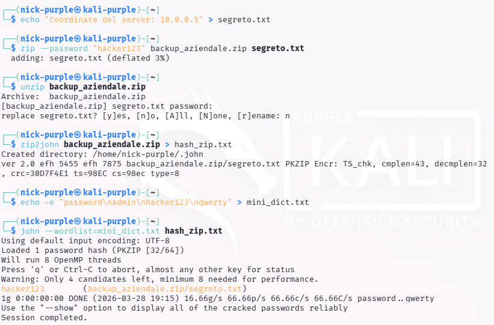
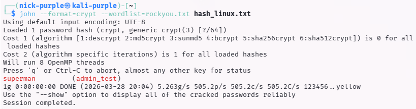

# Estrazione Credenziali e Password Recovery: John the Ripper

> - **Fase:** System Exploitation - Password Cracking - CPU-bound Offline Cracking & Hash Extraction
> - **Visibilita:** Zero - operazione completamente offline; nessun traffico di rete, nessuna interazione con il target dopo l'estrazione degli hash/file
> - **Prerequisiti:** File cifrato (ZIP/RAR/PDF) o hash di sistema Linux (`/etc/shadow`) esfiltrati dal target; John the Ripper con suite `*2john` installata; wordlist (custom o `rockyou.txt`)
> - **Output:** EXPLOIT-024 (cracking password archivio ZIP cifrato - severity Medio); EXPLOIT-025 (cracking hash Linux via unshadowing + dizionario RockYou - severity Alto)

- **Ambiente Operativo:** Kali Linux Purple
- **Target:** Archivi compressi cifrati (.zip) e Hash di sistema Linux (`/etc/shadow`)
- **Framework:** John the Ripper (JtR) / Suite `*2john`
- **Tecniche Documentate:** Hash Extraction, Unshadowing, Dictionary Attacks (Custom & RockYou)

---

## Executive Summary

Mentre Hashcat è lo standard per la forza bruta cruda su hash isolati tramite GPU, **John the Ripper (JtR)** rappresenta il framework d'elezione per l'elaborazione CPU-bound e, soprattutto, per l'**estrazione di credenziali da file complessi**.

In questo modulo viene documentato l'utilizzo pratico della suite di John the Ripper per due degli scenari più comuni durante un ingaggio di Red Teaming o un'attività di Incident Response:
1. **Data Exfiltration & Decryption:** Recupero di documenti riservati protetti da password tramite l'estrazione dell'intestazione crittografica (file ZIP).
2. **Local Privilege Escalation (Linux):** Compromissione degli account di sistema tramite fusione e decrittazione dei file `/etc/passwd` e `/etc/shadow`.

---

## Metodologia 1: Cracking di Archivi Protetti (ZIP)

**ID Finding:** `EXPLOIT-024` | **Severity:** `Medio`

Gli utenti aziendali spesso utilizzano la crittografia integrata nei formati di archiviazione (come .zip, .rar, .pdf) per proteggere dati sensibili, credendo che siano inaccessibili senza la password. Tuttavia, l'algoritmo di hashing utilizzato per derivare la chiave spesso è vulnerabile ad attacchi offline.

**Esecuzione:**
1. **Estrazione dell'Hash:** I password cracker non possono processare direttamente un file `.zip`. È stata utilizzata l'utility `zip2john` per parsare l'intestazione del file `backup_aziendale.zip` ed estrarre l'impronta crittografica in un formato standard (PKZIP).

```bash
zip2john backup_aziendale.zip > hash_zip.txt
```

2. **Dictionary Attack:** L'hash estratto è stato dato in pasto a John the Ripper combinato con un dizionario mirato, rivelando quasi istantaneamente la password in chiaro (`hacker123`).



---

## Metodologia 2: Linux Privilege Escalation (Unshadowing)

**ID Finding:** `EXPLOIT-025` | **Severity:** `Alto`

Se un attaccante ottiene una shell *low-privileged* su un server Linux e riesce, per via di una misconfiguration dei permessi (es. SUID bit errato) o di un backup esposto, a leggere il file `/etc/shadow`, può tentare di decrittare le password degli altri utenti (incluso `root`) per effettuare un'escalation dei privilegi.

**Esecuzione:**
1. **Unshadowing:** I file di sistema Linux separano le informazioni pubbliche dell'utente (`/etc/passwd`) dall'hash della password (`/etc/shadow`). L'utility `unshadow` è stata utilizzata per fondere questi due file in un singolo target (`hash_linux.txt`) comprensibile dal framework.

```bash
unshadow passwd.txt shadow.txt > hash_linux.txt
```

2. **Forzatura del Formato e Cracking:** Utilizzando la rinomata wordlist `rockyou.txt` (14+ milioni di password reali leakate), l'hash è stato elaborato. A causa dei moderni e complessi algoritmi di hashing di Kali (es. *yescrypt*), è stato necessario specificare manualmente il formato a JtR tramite il parametro `--format=crypt` per permetterne il corretto parsing e decrittazione.

```bash
john --format=crypt --wordlist=rockyou.txt hash_linux.txt
```



---

## Impatto e Remediation (Blue Team)

L'efficacia di questi attacchi dimostra falle critiche nelle policy di gestione delle informazioni e nella robustezza delle credenziali:

1. **Gestione degli Archivi:** Non affidarsi alla crittografia legacy di ZIP/PDF per documenti aziendali critici. Utilizzare soluzioni crittografiche robuste e standard aziendali (es. GPG, VeraCrypt, o Azure RMS) con passphrase forti.
2. **Protezione dei File di Sistema:** Monitorare rigorosamente i permessi dei file `/etc/passwd` e `/etc/shadow` tramite sistemi FIM (File Integrity Monitoring). Qualsiasi lettura non autorizzata o copia di backup mal riposta equivale a una compromissione potenziale dell'intero sistema.
3. **Password Policy:** La violazione di un account di sistema in pochi secondi tramite wordlist (`rockyou.txt`) dimostra la debolezza intrinseca di password predicibili ("superman"). Imporre l'uso di Passphrase lunghe e randomizzate.

---

## Esperienza di Laboratorio

L'ambiente di test ha utilizzato Kali Linux Purple come unica macchina operativa, simulando due scenari distinti di post-exploitation: il recupero di un archivio cifrato esfiltrato e la compromissione di credenziali di sistema Linux.

Per la Metodologia 1 (EXPLOIT-024), e stato creato un archivio ZIP protetto da password (`backup_aziendale.zip`) contenente file sensibili fittizi. Il passaggio chiave - e il concetto fondamentale da interiorizzare - e che i password cracker non operano mai direttamente sul file cifrato: necessitano di un hash estratto in formato standard. La utility `zip2john` ha eseguito il parsing dell'intestazione crittografica PKZIP e prodotto l'impronta in formato compatibile con JtR. Il cracking con dizionario custom ha rivelato la password (`hacker123`) quasi istantaneamente, dimostrando la debolezza intrinseca della crittografia legacy dei formati ZIP quando combinata con password predicibili.

Per la Metodologia 2 (EXPLOIT-025), l'operazione e stata piu complessa e rappresentativa di uno scenario reale di privilege escalation Linux. Il passaggio di `unshadow` per fondere `/etc/passwd` e `/etc/shadow` in un unico file target e un prerequisito non ovvio: JtR necessita di entrambe le informazioni (metadata utente + hash) in formato unificato. Il problema tecnico piu significativo incontrato e stato il formato hash: Kali Linux utilizza algoritmi moderni (yescrypt/SHA-512 con salt e iterazioni elevate), e JtR in modalita automatica non ha riconosciuto correttamente il formato. La soluzione ha richiesto la forzatura manuale del parametro `--format=crypt`, che istruisce JtR a delegare il calcolo alla libreria `crypt(3)` del sistema operativo. Questo workaround - necessario sugli algoritmi piu recenti - e un pattern ricorrente che l'analista deve conoscere.

La password dell'account `admin_test` ("superman") e stata compromessa in pochi secondi tramite la wordlist `rockyou.txt` (14+ milioni di password reali da breach). Il risultato conferma un dato statistico documentato: oltre il 70% delle password utente in ambienti non hardened sono presenti nelle prime 10.000 entry di wordlist pubbliche.

---

## Analisi Teorica: Hash Extraction come Prerequisito del Cracking

Il principio che distingue John the Ripper da Hashcat non e la potenza di calcolo (Hashcat e superiore grazie alla GPU), ma la **capacita di estrazione**. La suite `*2john` comprende decine di utility specializzate (`zip2john`, `rar2john`, `pdf2john`, `ssh2john`, `keepass2john`, `bitlocker2john`) che trasformano formati proprietari in hash standard processabili dal motore di cracking. Questa fase di pre-processing e il vero valore aggiunto di JtR nella toolchain del penetration tester.

La tecnica di `unshadow` su sistemi Linux merita un approfondimento architetturale. La separazione tra `/etc/passwd` (leggibile da tutti, contiene UID/GID/shell ma non l'hash) e `/etc/shadow` (leggibile solo da root, contiene l'hash) e una misura di sicurezza introdotta nei primi anni '90. In un ambiente correttamente configurato, un utente non privilegiato non puo leggere `/etc/shadow`. I vettori di accesso tipici sono: backup esposti, misconfiguration dei permessi (chmod errato), SUID binary che consente lettura arbitraria, o exploit kernel che eleva temporaneamente i privilegi. Il fatto che l'attaccante disponga di entrambi i file implica gia una compromissione parziale del sistema - il cracking e il passo successivo per trasformare un accesso parziale in accesso completo.

L'algoritmo yescrypt (default in Kali/Debian moderni) e deliberatamente memory-hard: richiede grandi quantita di RAM per ogni tentativo, rendendo il cracking GPU inefficiente (la GPU ha molta potenza di calcolo ma poca memoria per thread). Questa e la ragione per cui JtR (CPU-based) e spesso la scelta corretta per hash di sistema Linux moderni, invertendo il vantaggio che Hashcat detiene su formati come NTLM o MD5.

---

## Scenario Reale: Proiezione Post-Exploitation

> Questa sezione descrive come EXPLOIT-024 ed EXPLOIT-025 si inserirebbero in un engagement reale, sia dal punto di vista dell'attaccante (Red Team) che del difensore (Blue Team).

### Prospettiva Attaccante (Red Team)

**Punto di partenza:** shell low-privilege su server Linux; file `/etc/shadow` esfiltrato tramite misconfiguration o exploit locale; archivi ZIP cifrati trovati in share di rete o backup.

**Passo successivo immediato:** cracking degli hash con JtR + wordlist; utilizzo delle credenziali recuperate per escalation a root o per accesso ad altri sistemi con password riutilizzate.

**Kill Chain proiettata:**
```
Shell low-privilege (www-data / utente standard)
        |
        v
Esfiltrazione /etc/shadow (backup esposto / SUID exploit / LFI)
        |
        v
EXPLOIT-025: unshadow + john --wordlist=rockyou.txt -> password "superman"
        |
        v
su root (se password di root craccata) o su admin_test -> accesso privilegiato
        |
        v
Post-exploitation: dump chiavi SSH, token API, credenziali database
        |
        v
Pivot verso altri host interni (credential reuse via SSH/RDP)
        |
        v
Esfiltrazione dati sensibili / persistenza via cron job o SSH key injection
```

**Impatto potenziale:** la compromissione di un account di sistema Linux con password debole consente l'escalation a root (se la password dell'account privilegiato e nel dizionario) e il movimento laterale verso altri host della rete interna dove le stesse credenziali sono riutilizzate.

**Vettori di monetizzazione tipici:**
- Cryptomining: deployment di miner su server Linux compromessi (Monero)
- Ransomware: cifratura di server di produzione e database
- Data exfiltration: esfiltrazione di dati da database applicativi accessibili dal server
- Webshell persistence: installazione di backdoor in applicazioni web per accesso persistente

### Prospettiva Difensore (Blue Team)

**Rilevamento:** la lettura anomala di `/etc/shadow` da processi non autorizzati genera eventi auditd (se configurato). Il comando `unshadow` e l'esecuzione di `john` sono rilevabili tramite monitoring dei processi.

**Indicatori di Compromissione (IOC):**
- Auditd: accesso in lettura a `/etc/shadow` da UID non root (regola `-w /etc/shadow -p r`)
- Processo: esecuzione di `john`, `hashcat`, `zip2john` o varianti da utenti non autorizzati
- File system: creazione di file temporanei con pattern di hash (es. `hash_*.txt`) in directory utente
- Rete: download di wordlist di grandi dimensioni (es. `rockyou.txt`, 133 MB) da fonti esterne

**Contenimento:** reset immediato delle password degli account compromessi; revoca sessioni attive; verifica di accessi anomali da IP interni verso altri host (lateral movement).

**Eradicazione e hardening:**
- Verificare e correggere permessi su `/etc/shadow` (`chmod 640`, owner `root:shadow`)
- Implementare auditd con regole specifiche per file critici di credenziali
- Adottare algoritmi memory-hard (yescrypt, Argon2) con parametri di costo elevati
- Imporre passphrase lunghe tramite PAM (`pam_pwquality.so` con `minlen=15`)
- Monitorare i SUID binary e rimuovere quelli non necessari (`find / -perm -4000`)
- Implementare SSH key-based authentication e disabilitare il login con password per account privilegiati

**Lezione difensiva:** la sicurezza delle credenziali Linux si basa su tre livelli: robustezza della password (lunghezza), robustezza dell'algoritmo di hashing (yescrypt con costo elevato) e protezione dell'accesso al file shadow (permessi + audit). Se anche uno solo di questi livelli fallisce, la catena si spezza.

---

## Tool di riferimento

| Tool | Tipo | Tecnica/Accesso | Caso d'uso principale |
| :--- | :--- | :--- | :--- |
| `John the Ripper` | Password cracking | CLI - CPU bound | Framework di cracking con suite `*2john` per estrazione hash da formati complessi |
| `zip2john` | Hash extractor | CLI - Utility JtR | Estrazione hash crittografici da archivi ZIP protetti da password |
| `rar2john` / `pdf2john` | Hash extractor | CLI - Utility JtR | Estrazione hash da archivi RAR e documenti PDF protetti |
| `ssh2john` / `keepass2john` | Hash extractor | CLI - Utility JtR | Estrazione hash da chiavi SSH protette e database KeePass |
| `unshadow` | Credential merger | CLI - Utility JtR | Fusione di `/etc/passwd` e `/etc/shadow` in formato processabile dal cracker |
| `Hashcat` | Password cracking | CLI - GPU accelerated | Alternativa GPU per hash ad alta velocita (NTLM, MD5, SHA) dove la parallelizzazione offre vantaggio |
| `hash-identifier` / `hashid` | Hash identification | CLI | Identificazione automatica del tipo di hash estratto |
| `haiti` | Hash identification | CLI (Ruby) | Alternativa moderna a hashid con supporto per formati recenti e output mode Hashcat/JtR |

> **Tool moderno consigliato:** `haiti` (Ruby) per l'identificazione automatica del tipo di hash con output diretto dei parametri `--format` (JtR) e `-m` (Hashcat). Per l'estrazione di hash da formati moderni (Office 365, BitLocker, Apple Keychain), la versione Jumbo di John the Ripper include utility `*2john` aggiornate non presenti nella versione base.

---

## Mappatura MITRE ATT&CK

| Tattica | Tecnica | ID MITRE | Descrizione dell'Azione |
| :--- | :--- | :--- | :--- |
| Credential Access | Brute Force: Password Cracking | `T1110.002` | Cracking offline degli hash estratti tramite dictionary attack con wordlist custom e RockYou (EXPLOIT-024, EXPLOIT-025). |
| Credential Access | OS Credential Dumping: /etc/passwd and /etc/shadow | `T1003.008` | Esfiltrazione e fusione (unshadow) dei file di sistema Linux per accesso agli hash delle credenziali (EXPLOIT-025). |
| Credential Access | Unsecured Credentials: Credentials in Files | `T1552.001` | Estrazione di hash crittografici da archivi ZIP protetti da password tramite `zip2john` (EXPLOIT-024). |
| Discovery | File and Directory Discovery | `T1083` | Identificazione di archivi protetti e file di backup contenenti informazioni sensibili nel filesystem del target. |
| Privilege Escalation | Valid Accounts: Local Accounts | `T1078.003` | Utilizzo delle credenziali craccate (EXPLOIT-025) per autenticazione come utente privilegiato e escalation a root. |

---

> **Nota:** Tutte le attivita documentate sono state condotte in un ambiente di laboratorio virtualizzato (Kali Linux Purple). Gli archivi cifrati e gli hash di sistema sono stati creati localmente a scopo didattico su macchine virtuali di proprieta dell'autore. Nessuna tecnica e stata applicata a sistemi reali o di terze parti senza autorizzazione esplicita.