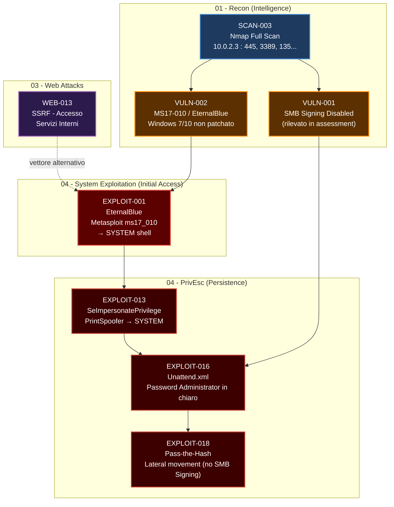

# Cybersecurity Labs


---

Benvenuto nella repository centrale per le operazioni di sicurezza offensiva (Red Team), difensiva (Blue Team) e cloud.

Questa struttura e organizzata seguendo il flusso logico di un **Penetration Test** reale e le fasi della **Cyber Kill Chain**, con l'aggiunta di moduli specifici per la difesa e le infrastrutture moderne.

I README di ogni modulo non sono semplici guide di comandi: documentano l'**esperienza reale di laboratorio** (problemi riscontrati, scelte operative, risultati concreti), la **teoria** dietro ogni tecnica e una **proiezione verso scenari reali** di attacco e difesa.

---

## Legal Disclaimer

> **ATTENZIONE:** Tutto il materiale, gli script e le metodologie contenute in questa repository sono a scopo puramente **educativo** e di **ricerca**. L'autore non si assume alcuna responsabilita per l'uso improprio di queste informazioni.
>
> *Non testare mai sistemi senza un'autorizzazione scritta esplicita.*

---

## Mappa di Navigazione

| Fase / Dominio | Cartella | Stato | Finding |
| :--- | :--- | :---: | :--- |
| **I. Intelligence** | [01-recon](#01-recon-red-team-basic) | Completo | OSINT-001..004, SCAN-001..003, DNS-001..003, INTEL-001..004 |
| **II. Assessment** | [02-vulnerability-assessment](#02-vulnerability-assessment) | Completo | VULN-001..006 |
| **III. Web Ops** | [03-web-attacks](#03-web-attacks-red-team--secure-coding) | Completo | WEB-001..015 |
| **00. Setup** | [00-setup-after-installing-kali](#00-setup-after-installing-kali) | Completo | - (hardening guide) |
| **IV. System Ops** | [04-system-exploitation](#04-system-exploitation) | Completo | EXPLOIT-001..019 |
| **V. Human Ops** | [05-social-engineering](#05-social-engineering-toolingpython) | Da fare | SE-001..? |
| **VI. Wireless** | [06-wireless-security](#06-wireless-security) | Da fare | WIFI-001..? |
| **VII. Post-Exploit** | [07-post-exploitation](#07-post-exploitation) | Da fare | POST-001..? |
| **VIII. Defense** | [08-defense-hardenings](#08-defense-hardenings-blue-team-prevention) | Da fare | DEF-001..? |
| **IX. Analysis** | [09-digital-forensics](#09-digital-forensics-blue-team-analysis) | Da fare | FOR-001..? |
| **X. Modern Infra** | [10-cloud-security](#10-cloud-security-cloudmodern) | Da fare | CLOUD-001..? |

---

## Kill Chain - Scenario di Attacco Documentato

Il diagramma seguente rappresenta il percorso di attacco completo documentato in questa repository,
dalla ricognizione iniziale alla compromissione totale del target Windows 10 (`192.168.0.109`).
Ogni nodo e collegato al finding ID corrispondente nei README di modulo.



---

## Architettura della Repository

```
cybersecurity-labs/
+-- REPORT_STANDARDS.md          <- Standard di redazione (leggere prima di lavorare)
+-- README.md                    <- Questo file
+-- EXECUTIVE_SUMMARY.md         <- Executive Summary per il management (54 finding, Top 5 critici)
+-- LAB_SETUP.md                 <- Topologia VirtualBox, IP NAT/Bridge, configurazione VM
+-- 00-setup-after-installing-kali/  <- Hardening guide: 20 step post-installazione
+-- 01-recon (Red Team Basic)/
+-- 02-vulnerability-assessment/
+-- 03-web-attacks (Red Team + Secure Coding)/
+-- 04-system-exploitation/
+-- 05-social-engineering (Tooling&Python)/
+-- 06-wireless-security/
+-- 07-post-exploitation/
+-- 08-defense-hardenings/
+-- 09-digital-forensics/
+-- 10-cloud-security/
```

---

## Struttura della Repository

### 01-recon (Red Team Basic)

**Obiettivo:** Mappare la superficie d'attacco senza lasciare tracce rilevabili.

La ricognizione e la fase piu critica e piu trascurata: piu informazioni si raccolgono prima di attaccare, minore e il rischio di essere rilevati durante le fasi successive. Questa sezione e divisa in due nature operative complementari: la **OSINT passiva** (invisibile, zero contatto col target) e la **scansione attiva** (rumorosa, rilevabile).

- **Completato:** OSINT personale su `nicholas-arcari.github.io`, Google Dorking su `nasa.gov`, network scanning su lab VirtualBox (Windows 10 `10.0.2.3`), DNS enumeration, Shodan/Censys recon
- **Finding:** 12 finding documentati (OSINT-001..004, SCAN-001..003, DNS-001..003, INTEL-001..004)
- **Contenuto:** TheHarvester, Sherlock, Nmap, Masscan, dnsrecon, Subfinder, Shodan CLI

---

### 02-vulnerability-assessment

**Obiettivo:** Rispondere a "cosa e rotto?" con dati misurabili e classificati.

Mentre la recon risponde a "cosa esiste?", il Vulnerability Assessment risponde a "cosa e vulnerabile e quanto?". Questa sezione e il ponte tra la ricognizione e l'exploitation: senza un VA strutturato, gli attacchi successivi sarebbero tentativi alla cieca. Documenta sia la metodologia automatizzata (Nessus, OpenVAS) che quella manuale (audit specifico per protocollo).

- **Completato:** Nessus credentialed scan su Windows 10, audit SMB/NetBIOS, SMTP, SNMP, SSL/TLS, analisi CVE con searchsploit e CVSS calculator, template di reporting professionale
- **Finding:** 6 finding documentati (VULN-001..006): SMB Signing, Windows EoL, NetBIOS disclosure, accesso C$ con credenziali standard, audit SMTP, SNMP
- **Contenuto:** Nessus, OpenVAS/GVM, nmap NSE, enum4linux, nbtscan, testssl.sh, searchsploit

---

### 03-web-attacks (Red Team + Secure Coding)

**Obiettivo:** Compromettere applicazioni web e API - poi correggere il codice.

Questa e la sezione piu ampia della repository, con doppia anima: **Red Team** (trovare e sfruttare le vulnerabilita) e **Secure Coding** (capire perche esistono e come eliminarle nel codice). Copre l'intera OWASP Top 10:2021 e l'OWASP API Top 10:2023. La sezione Secure Coding documenta il ciclo completo: vulnerabilita identificata, codice vulnerabile analizzato, fix implementato, verifica post-remediation.

- **Completato:** SQL Injection (manuale + sqlmap), XSS Reflected/Stored/Blind, SSTI Jinja2 RCE, Brute Force web, Session Hijacking, JWT forging, GraphQL Introspection + RCE, IDOR/BOLA, Drupal CVE-2018-7600, SAST analysis, Prepared Statements fix, htmlspecialchars() fix
- **Finding:** 15 finding documentati (WEB-001..015): da CSRF assente a RCE via GraphQL
- **Contenuto:** Burp Suite, OWASP ZAP, Gobuster, Feroxbuster, Nikto, Nuclei, sqlmap, Hydra, WPScan, JoomScan, PyJWT, DVWA, DVGA, Metasploit

---

### 00-setup-after-installing-kali

**Obiettivo:** Trasformare un'installazione Kali "bare metal" in un ambiente sicuro e operativo.

20 passaggi documentati per il hardening e la configurazione iniziale: cambio credenziali di default, firewall UFW, SSH hardening, kernel sysctl, Suricata IDS, cifratura LUKS, backup e monitoring. Prerequisito operativo prima di qualsiasi attivita offensiva o difensiva.

- **Stato:** Completo (21 README: parent + 20 step)
- **Contenuto:** UFW, sshd_config, sysctl, Suricata, GVM/OpenVAS, Logwatch, LUKS/VeraCrypt, rsync

---

### 04-system-exploitation

**Obiettivo:** Ottenere una shell (RCE) e diventare root/admin.

Dedicato all'attacco infrastrutturale puro: sfruttamento di servizi esposti, exploit di vulnerabilita note, privilege escalation locale. Il focus non e solo "eseguire Metasploit" ma comprendere la catena di compromissione: dalla shell non privilegiata al controllo totale del sistema.

- **Completato:** C2 frameworks (Empire + Metasploit), custom payload cross-compilation, exploit research (searchsploit), Linux PrivEsc (GTFOBins, LinPEAS, cronjob hijacking), Windows PrivEsc (PrintSpoofer, WinPEAS, Unattend.xml, XAMPP weak ACL), kernel audit (Sherlock, PwnKit)
- **Finding:** 19 finding documentati (EXPLOIT-001..019): da Initial Access fileless a shell SYSTEM
- **Contenuto:** PowerShell Empire 5, Metasploit, msfvenom, PrintSpoofer, WinPEAS, LinPEAS, GTFOBins, Sherlock.ps1, MinGW-w64

---

### 05-social-engineering (Tooling&Python)

**Obiettivo:** Hacking del fattore umano.

Il vettore piu efficace non e tecnico: e psicologico. Questa sezione documenta la simulazione di attacchi di phishing, la creazione di payload ingannevoli e le tecniche di ingegneria sociale, con attenzione particolare alla loro rilevabilita e contromisure.

- **Stato:** Da documentare
- **Contenuto:** GoPhish templates, script Python personalizzati, generatori payload Office/HTA

---

### 06-wireless-security

**Obiettivo:** Intercettazione e attacco su frequenze radio.

Tutto cio che "viaggia nell'aria" e potenzialmente intercettabile. Questa sezione copre WiFi, Bluetooth/BLE, SDR e RFID/NFC - protocolli spesso trascurati nei programmi di hardening aziendale.

- **Stato:** Da documentare
- **Contenuto:** Aircrack-ng, Bettercap, SDR (radiofrequenza), tool RFID/NFC

---

### 07-post-exploitation

**Obiettivo:** Mantenere l'accesso e muoversi nella rete (Lateral Movement).

Ottenere la shell iniziale e solo il primo passo. Questa sezione documenta cosa succede dopo: come mantenere l'accesso (persistence), come raccogliere credenziali (credential dumping), come espandere la presenza nella rete (pivoting) e come esfiltrare dati in modo silenzioso.

- **Stato:** Da documentare
- **Contenuto:** Mimikatz, Chisel/Ligolo (tunneling), backdoor persistenti, tecniche di exfiltration

---

### 08-defense-hardenings (Blue Team Prevention)

**Obiettivo:** Proteggere proattivamente e monitorare in tempo reale.

La controparte difensiva dei moduli precedenti. Per ogni tecnica di attacco documentata nei moduli 01-07, qui si trova la risposta difensiva: configurazione corretta, hardening, monitoring e detection. Wazuh (SIEM/XDR) e il tool centrale di questa sezione.

- **Stato:** Da documentare
- **Tool chiave:** Wazuh (SIEM/XDR), CIS Benchmarks, Honeypots

---

### 09-digital-forensics (Blue Team Analysis)

**Obiettivo:** Investigare l'incidente e ricostruire la kill chain.

Quando le difese falliscono, entra in gioco la forensics: analisi delle tracce lasciate dall'attaccante per capire cosa e successo, come e entrato, cosa ha fatto e cosa ha portato via. Wireshark (analisi traffico di rete) e il punto di partenza.

- **Stato:** Da documentare
- **Tool chiave:** Wireshark, Autopsy, Volatility

---

### 10-cloud-security (Cloud&Modern)

**Obiettivo:** Sicurezza per infrastrutture moderne: container, orchestratori e cloud provider.

Le infrastrutture moderne (Docker, Kubernetes, AWS/Azure/GCP) introducono una superficie di attacco completamente diversa dalla rete tradizionale. Questa sezione documenta sia le tecniche di attacco specifiche per il cloud che le contromisure e i tool di audit.

- **Stato:** Da documentare
- **Contenuto:** AWS/Azure/GCP enumeration, Docker security (Trivy), Kubernetes audit, IaC scanning (Terraform)

---

## Finding Registry Globale

| ID | Titolo | Severity | Modulo |
| :--- | :--- | :--- | :--- |
| [OSINT-001](<01-recon (Red Team Basic)/01-osint-passive (Open Source Intelligence)/breach-data/README.md>) | Breach data exposure | Alto | osint-passive/breach-data |
| [OSINT-002](<01-recon (Red Team Basic)/01-osint-passive (Open Source Intelligence)/email-harvesting/README.md>) | Email harvesting su dominio personale | Informativo | osint-passive/email-harvesting |
| [OSINT-003](<01-recon (Red Team Basic)/01-osint-passive (Open Source Intelligence)/google-dorks/README.md>) | Google Dorking - documenti e login esposti | Variabile | osint-passive/google-dorks |
| [OSINT-004](<01-recon (Red Team Basic)/01-osint-passive (Open Source Intelligence)/user-enumeration/README.md>) | User enumeration su social network | Basso | osint-passive/user-enumeration |
| [SCAN-001](<01-recon (Red Team Basic)/02-network-scanning-active/live-host-discovery/README.md>) | Live host discovery - subnet mapping | Informativo | network-scanning/live-host-discovery |
| [SCAN-002](<01-recon (Red Team Basic)/02-network-scanning-active/port-scanning (Nmap)/masscan/README.md>) | Port scan massivo - superficie esposta | Informativo | port-scanning/masscan |
| [SCAN-003](<01-recon (Red Team Basic)/02-network-scanning-active/port-scanning (Nmap)/nmap-scripts/README.md>) | SMB Signing not required (via nmap NSE) | Alto | port-scanning/nmap-scripts |
| [DNS-001](<01-recon (Red Team Basic)/03-dns-enumeration/dns-recon/README.md>) | Zone Transfer o subdomain disclosure | Critico/Medio | dns-enumeration/dns-recon |
| [DNS-002](<01-recon (Red Team Basic)/03-dns-enumeration/hosts-file/README.md>) | Hosts file manipulation vettore | Medio | dns-enumeration/hosts-file |
| [DNS-003](<01-recon (Red Team Basic)/03-dns-enumeration/subdomain-finding/README.md>) | Sottodomini nascosti identificati | Medio | dns-enumeration/subdomain-finding |
| [INTEL-001](<01-recon (Red Team Basic)/04-infrastructure-intel/shodan-censys/README.md>) | Servizi esposti rilevati via Shodan | Alto | infrastructure-intel/shodan-censys |
| [INTEL-002](<01-recon (Red Team Basic)/04-infrastructure-intel/shodan-censys/README.md>) | Versioni software esposte via Shodan | Medio | infrastructure-intel/shodan-censys |
| [INTEL-003](<01-recon (Red Team Basic)/04-infrastructure-intel/shodan-censys/README.md>) | Banner grabbing infrastruttura | Basso | infrastructure-intel/shodan-censys |
| [INTEL-004](<01-recon (Red Team Basic)/04-infrastructure-intel/tech-stack/README.md>) | Tech stack fingerprinting | Informativo | infrastructure-intel/tech-stack |
| [VULN-001](<02-vulnerability-assessment/01-general-scanners (Infrastructure)/nessus/README.md>) | SMB Signing not required (Nessus credentialed) | Alto | general-scanners/nessus |
| [VULN-002](<02-vulnerability-assessment/01-general-scanners (Infrastructure)/nessus/README.md>) | Windows 10 22H2 End of Life | Medio | general-scanners/nessus |
| [VULN-003](<02-vulnerability-assessment/02-protocol-specific-audit/smb-net-bios/README.md>) | NetBIOS Name/Service Disclosure | Basso | protocol-audit/smb-net-bios |
| [VULN-004](<02-vulnerability-assessment/02-protocol-specific-audit/smb-net-bios/README.md>) | Accesso C$ con credenziali standard | Alto | protocol-audit/smb-net-bios |
| [VULN-005](<02-vulnerability-assessment/02-protocol-specific-audit/smtp/README.md>) | Audit SMTP - da determinare | Medio | protocol-audit/smtp |
| [VULN-006](<02-vulnerability-assessment/02-protocol-specific-audit/snmp/README.md>) | Audit SNMP - da determinare | Medio | protocol-audit/snmp |
| [WEB-001](<03-web-attacks (Red Team + Secure Coding)/01-proxy-tools (Intercept)/owasp-zap/README.md>) | Assenza token CSRF su form di ricerca | Medio | proxy-tools/owasp-zap |
| [WEB-002](<03-web-attacks (Red Team + Secure Coding)/02-web-recon (Enumeration)/tech-profiler/README.md>) | PHP 5.6.40 EOL + X-Powered-By exposure | Alto | web-recon/tech-profiler |
| [WEB-003](<03-web-attacks (Red Team + Secure Coding)/02-web-recon (Enumeration)/dir-busting/README.md>) | CVS directory + .idea esposti | Alto | web-recon/dir-busting |
| [WEB-004](<03-web-attacks (Red Team + Secure Coding)/03-owasp (Attacks)/sql-injection (SQLi)/manual-payloads/README.md>) | SQL Injection manuale - auth bypass + dump | Critico | owasp/sql-injection/manual-payloads |
| [WEB-005](<03-web-attacks (Red Team + Secure Coding)/03-owasp (Attacks)/xss (Cross-Site Scripting)/reflected/README.md>) | XSS Reflected - parametro GET | Medio | owasp/xss/reflected |
| [WEB-006](<03-web-attacks (Red Team + Secure Coding)/03-owasp (Attacks)/xss (Cross-Site Scripting)/stored/README.md>) | XSS Stored - campo commenti | Alto | owasp/xss/stored |
| [WEB-007](<03-web-attacks (Red Team + Secure Coding)/03-owasp (Attacks)/xss (Cross-Site Scripting)/xss-hunter-payloads/README.md>) | XSS Blind/OOB - form senza output | Alto | owasp/xss/xss-hunter-payloads |
| [WEB-008](<03-web-attacks (Red Team + Secure Coding)/03-owasp (Attacks)/ssti (Server Side Template Injection)/README.md>) | SSTI Jinja2 RCE - MRO exploit chain | Critico | owasp/ssti |
| [WEB-009](<03-web-attacks (Red Team + Secure Coding)/03-owasp (Attacks)/auth-attacks/bruteforce-web/README.md>) | Brute Force web - assenza rate limiting | Alto | owasp/auth-attacks/bruteforce-web |
| [WEB-010](<03-web-attacks (Red Team + Secure Coding)/03-owasp (Attacks)/auth-attacks/session-hijacking/README.md>) | Session Hijacking - cookie non protetto | Alto | owasp/auth-attacks/session-hijacking |
| [WEB-011](<03-web-attacks (Red Team + Secure Coding)/03-owasp (Attacks)/sql-injection (SQLi)/sql-map-data/README.md>) | SQLi automatizzata sqlmap - PCI-DSS violation | Critico | owasp/sql-injection/sql-map-data |
| [WEB-012](<03-web-attacks (Red Team + Secure Coding)/05-api-security/jwt-tokens/README.md>) | JWT weak secret - token admin forged | Critico | api-security/jwt-tokens |
| [WEB-013](<03-web-attacks (Red Team + Secure Coding)/05-api-security/graphql/README.md>) | GraphQL Introspection + Command Injection RCE | Critico | api-security/graphql |
| [WEB-014](<03-web-attacks (Red Team + Secure Coding)/05-api-security/postman/README.md>) | IDOR/BOLA - dati finanziari altrui | Critico | api-security/postman |
| [WEB-015](<03-web-attacks (Red Team + Secure Coding)/04-cms-specific/drupal/README.md>) | Drupal CVE-2018-7600 Drupalgeddon2 RCE | Critico | cms-specific/drupal |
| [EXPLOIT-001](<04-system-exploitation/01-frameworks/empire/README.md>) | Initial Access fileless via Empire Agent (stager .bat in-memory) | Alto | frameworks/empire |
| [EXPLOIT-002](<04-system-exploitation/01-frameworks/empire/README.md>) | Persistenza via Registry Run Key HKCU | Alto | frameworks/empire |
| [EXPLOIT-003](<04-system-exploitation/01-frameworks/metasploit/README.md>) | Initial Access via msfvenom reverse_tcp + Process Injection explorer.exe | Alto | frameworks/metasploit |
| [EXPLOIT-004](<04-system-exploitation/01-frameworks/metasploit/README.md>) | Network Pivoting via SOCKS proxy interno | Alto | frameworks/metasploit |
| [EXPLOIT-005](<04-system-exploitation/02-exploit-database/compiled-exploits/README.md>) | Payload C cross-compilato con backdoor persistente (backadmin) | Alto | exploit-database/compiled-exploits |
| [EXPLOIT-006](<04-system-exploitation/02-exploit-database/compiled-exploits/README.md>) | In-memory shellcode execution via VirtualAlloc/CreateThread | Critico | exploit-database/compiled-exploits |
| [EXPLOIT-007](<04-system-exploitation/02-exploit-database/searchsploit/README.md>) | Exploit research e correlazione Nmap/Searchsploit (metodologia) | Informativo | exploit-database/searchsploit |
| [EXPLOIT-008](<04-system-exploitation/03-privilege-escalation (PrivEsc)/linux-priv-esc/gtfo-bins-notes/README.md>) | sudo NOPASSWD su `find` - escalation root immediata | Alto | linux-priv-esc/gtfo-bins |
| [EXPLOIT-009](<04-system-exploitation/03-privilege-escalation (PrivEsc)/linux-priv-esc/gtfo-bins-notes/README.md>) | SUID bit su `awk` - esecuzione arbitraria come root | Alto | linux-priv-esc/gtfo-bins |
| [EXPLOIT-010](<04-system-exploitation/03-privilege-escalation (PrivEsc)/linux-priv-esc/linpeas/README.md>) | Credential disclosure in file di log/config (LinPEAS) | Alto | linux-priv-esc/linpeas |
| [EXPLOIT-011](<04-system-exploitation/03-privilege-escalation (PrivEsc)/linux-priv-esc/linpeas/README.md>) | Cronjob hijacking: script root scrivibile -> reverse shell | Alto | linux-priv-esc/linpeas |
| [EXPLOIT-012](<04-system-exploitation/03-privilege-escalation (PrivEsc)/linux-priv-esc/linpeas/README.md>) | CVE-2021-4034 PwnKit audit - sistema aggiornato | Informativo | linux-priv-esc/linpeas |
| [EXPLOIT-013](<04-system-exploitation/03-privilege-escalation (PrivEsc)/windows-priv-esc/juicypotato-printnightmare/README.md>) | SeImpersonatePrivilege abuse via PrintSpoofer -> NT AUTHORITY\SYSTEM | Critico | windows-priv-esc/juicypotato |
| [EXPLOIT-014](<04-system-exploitation/03-privilege-escalation (PrivEsc)/windows-priv-esc/juicypotato-printnightmare/README.md>) | CVE-2021-34527 PrintNightmare audit - sistema patchato | Informativo | windows-priv-esc/juicypotato |
| [EXPLOIT-015](<04-system-exploitation/03-privilege-escalation (PrivEsc)/windows-priv-esc/sherlock/README.md>) | Kernel patch audit (Sherlock) - MS10-015..MS16-032 non presenti | Informativo | windows-priv-esc/sherlock |
| [EXPLOIT-016](<04-system-exploitation/03-privilege-escalation (PrivEsc)/windows-priv-esc/winpeas/README.md>) | Credential disclosure in Unattend.xml - password Administrator | Critico | windows-priv-esc/winpeas |
| [EXPLOIT-017](<04-system-exploitation/03-privilege-escalation (PrivEsc)/windows-priv-esc/winpeas/README.md>) | XAMPP weak ACL: Authenticated Users WriteData su binari servizio | Critico | windows-priv-esc/winpeas |
| [EXPLOIT-018](<04-system-exploitation/03-privilege-escalation (PrivEsc)/windows-priv-esc/winpeas/README.md>) | LocalAccountTokenFilterPolicy=1 - lateral movement via PtH | Medio | windows-priv-esc/winpeas |
| [EXPLOIT-019](<04-system-exploitation/03-privilege-escalation (PrivEsc)/windows-priv-esc/winpeas/README.md>) | PowerShell history PSReadLine con credenziali in chiaro | Alto | windows-priv-esc/winpeas |

**Totale finding documentati: 54 | Critici: 13 | Alti: 20 | Medi: 10 | Bassi: 3 | Informativi: 8**

---

## MITRE ATT&CK - Master Table

| Tattica | Tecnica | ID MITRE | Modulo | Finding |
| :--- | :--- | :--- | :--- | :--- |
| Reconnaissance | Gather Victim Identity Info: Credentials | `T1589.001` | 01-recon | OSINT-001 |
| Reconnaissance | Gather Victim Identity Info: Email Addresses | `T1589.002` | 01-recon | OSINT-002 |
| Reconnaissance | Gather Victim Identity Info: Employee Names | `T1589.003` | 01-recon | OSINT-004 |
| Reconnaissance | Search Open Websites/Domains: Search Engines | `T1593.002` | 01-recon | OSINT-003 |
| Reconnaissance | Search Open Technical Databases: Scan Databases | `T1596.005` | 01-recon | INTEL-001 |
| Reconnaissance | Gather Victim Network Info: DNS | `T1590.002` | 01-recon | DNS-001..003 |
| Reconnaissance | Active Scanning: Vulnerability Scanning | `T1595.002` | 01-recon, 02-vuln | SCAN-001..003 |
| Reconnaissance | Active Scanning: Wordlist Scanning | `T1595.003` | 03-web | WEB-013 |
| Reconnaissance | Gather Victim Host Info: Software | `T1592.002` | 01-recon, 02-vuln | INTEL-004 |
| Discovery | Network Service Scanning | `T1046` | 01-recon, 02-vuln | SCAN-001..003 |
| Discovery | Network Share Discovery | `T1135` | 02-vuln | VULN-003 |
| Discovery | Remote System Discovery | `T1018` | 01-recon | SCAN-001 |
| Discovery | Account Discovery | `T1087` | 03-web | WEB-014 |
| Initial Access | Exploit Public-Facing Application | `T1190` | 02-vuln, 03-web | WEB-004, WEB-008, WEB-011, WEB-013, WEB-015 |
| Credential Access | Brute Force: Password Guessing | `T1110.001` | 03-web | WEB-009 |
| Credential Access | Brute Force: Password Cracking | `T1110.002` | 03-web | WEB-012 |
| Credential Access | Steal Web Session Cookie | `T1539` | 03-web | WEB-005, WEB-006, WEB-010 |
| Credential Access | Valid Accounts | `T1078` | 02-vuln, 03-web | VULN-004, WEB-012 |
| Execution | Command and Scripting Interpreter: Unix Shell | `T1059.004` | 03-web | WEB-008, WEB-013 |
| Persistence | Server Software Component: Web Shell | `T1505.003` | 03-web | WEB-006, WEB-015 |
| Collection | Data from Information Repositories | `T1213` | 02-vuln, 03-web | VULN-004, WEB-004, WEB-011, WEB-013, WEB-014 |
| Collection | Data from Network Shared Drive | `T1039` | 02-vuln | VULN-004 |
| Collection | Man in the Middle | `T1557` | 03-web | WEB-010 |
| Lateral Movement | Use Alternate Authentication Material: Web Session Cookie | `T1550.004` | 03-web | WEB-010, WEB-012 |
| Exfiltration | Exfiltration Over Web Service | `T1567` | 03-web | WEB-011 |

---

## Prerequisiti e Setup

Per utilizzare al meglio gli script contenuti in questa repo, si consiglia:

- **OS:** Kali Linux 2024+ / Parrot OS (o VM dedicata con snapshot pre-lab)
- **Python:** 3.10+ (con `requirements.txt` installati nelle singole cartelle dove applicabile)
- **Docker:** Necessario per avviare container vulnerabili (DVWA, DVGA, Metasploitable)
- **Rete:** Ambiente virtualizzato isolato (VirtualBox/VMware NAT o Host-Only) per i lab attivi

---

> *Repository mantenuta da Nicholas Arcari. Ogni tecnica e stata eseguita in ambiente di laboratorio isolato su sistemi autorizzati o appositamente vulnerabili per scopi didattici.*
